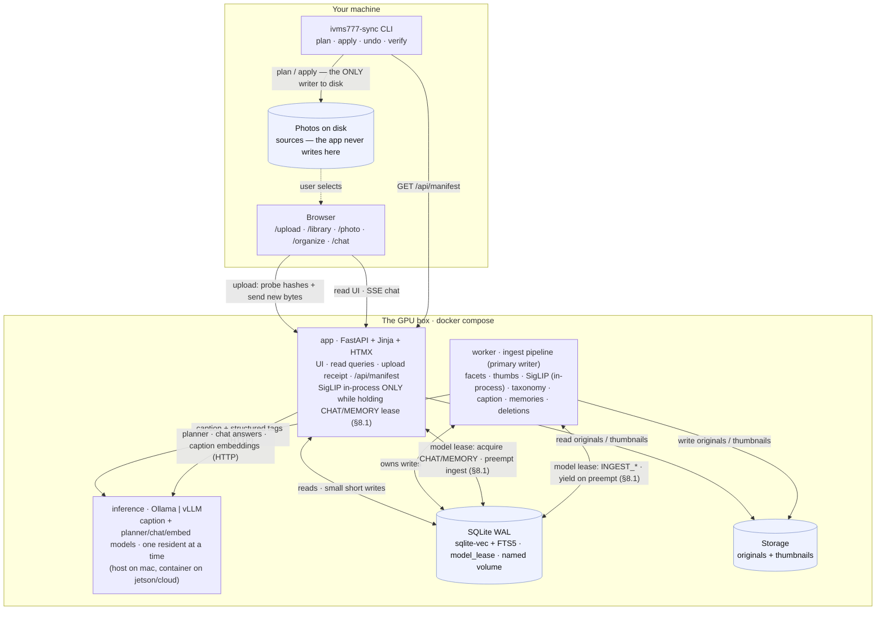
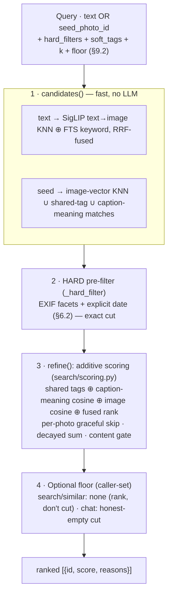
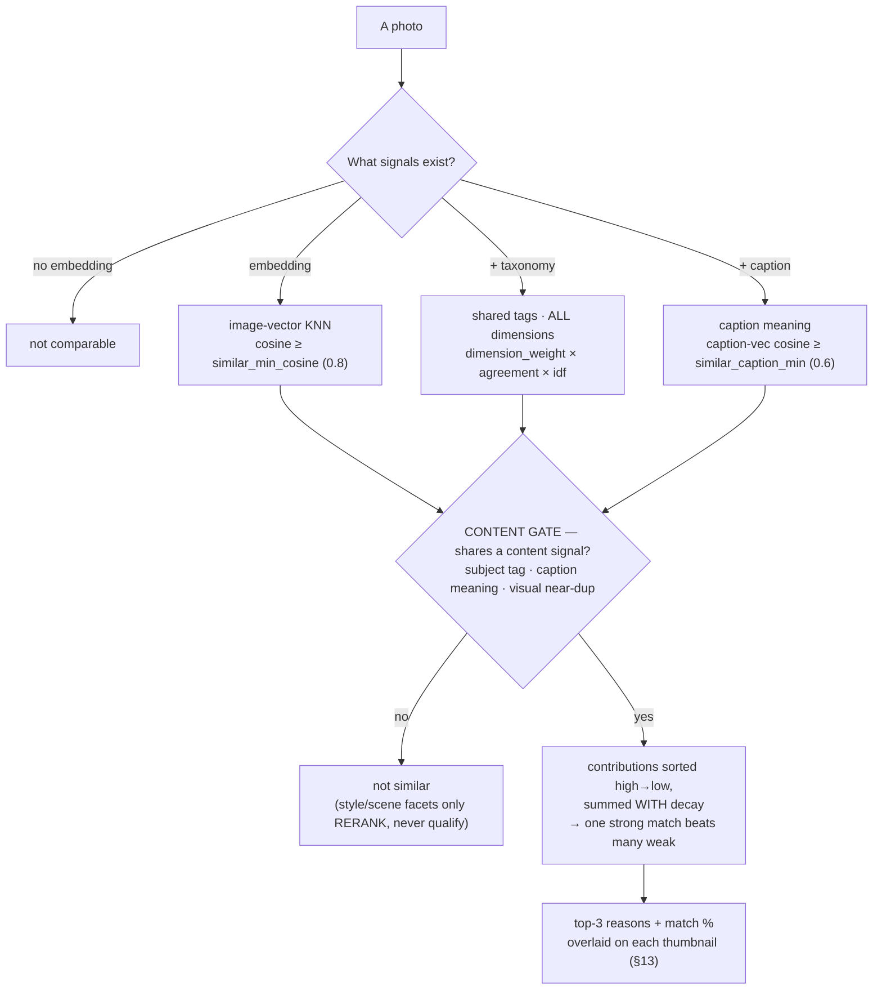
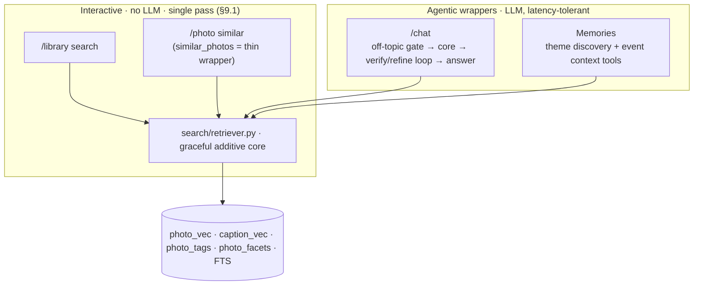
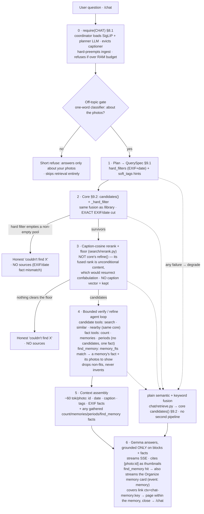
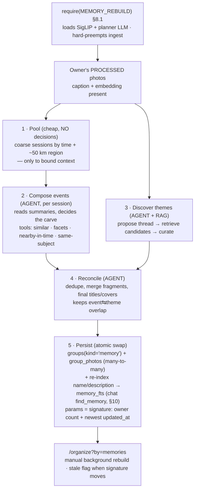

# Photo Library Organizer — Design

Status: approved design, ready for implementation planning
Date: 2026-08-13

## 1. Goal

A Python service with a simple web UI, deployed on a GPU box you control. It
works in two stages.

**Stage 1 — understand, in the cloud.** You select photos in the browser and
upload them. The service classifies every photo, writes a description and tags,
and lets you search, filter, find similar photos, browse suggested groups, and
ask questions about the collection in plain language.

**Stage 2 — reorganize, on your machine.** When the collection is fully
processed, `ivms777-sync` — a small standalone CLI that runs on the machine
holding the photos — downloads the collection state and applies it to disk: it
sorts files into a chosen folder layout, renames them consistently, and sweeps
redundant copies aside. It plans first and shows you every operation before it
touches anything.

The two stages share nothing but a manifest. The cloud never reaches into your
filesystem; the CLI never needs your library uploaded a second time.

All inference runs on hardware you control. Photos never go to a third-party
API.

## 2. Non-goals (v1)

- Face detection and person clustering. Deferred to v2.
- Authentication, signup, and per-user quotas. Deferred to v02; see section 3.2.
- Editing or rating photos in the cloud UI. The only thing that ever writes to
  your disk is `ivms777-sync`, and only on explicit confirmation.
- Cloud model APIs of any kind.
- Video files.

## 3. Constraints and targets

### 3.1 Deploy profiles

The same code runs in three places, selected by a base `compose.yaml` plus one
per-profile overlay (`compose.mac.yaml` / `compose.jetson.yaml` / `compose.cloud.yaml`).
The differences are which inference service is active, which model name is in
config, and — on `jetson` only — which app image is built (see "Jetson image"
below). Ingest is identical everywhere — photos always arrive by upload
(section 3.2b), so no profile depends on a host bind mount.

| Profile | Inference | Caption model | Planner / chat model | Embed device |
|---|---|---|---|---|
| `mac` | Ollama on the **host** | `qwen2.5vl:7b` | `qwen2.5:3b` | `cpu` |
| `jetson` | Ollama in a container | `qwen2.5vl:3b` | `qwen2.5:3b` | `cuda` |
| `cloud` | vLLM in a container, `--gpus all` | `qwen2.5vl:7b` | `qwen2.5:3b` | `cuda` |

The caption model must be **vision-capable**. The tags above are the shipping
defaults in `config.py` — real, currently-pullable Ollama models — overridable
with `IVMS777_CAPTION_MODEL` / `IVMS777_PLANNER_MODEL`. The "Gemma 4" family named
in the rationale below (§4) is the intended target once it is available on Ollama;
until then Qwen2.5-VL is the working default.

**Why Ollama runs on the host under `mac`.** Docker Desktop on macOS boots a
Linux VM, and Apple exposes no GPU to Linux guests — there is no Metal in a
container, and no configuration changes that. Apple's own `container` project
does not support GPU passthrough either. Containerised inference on a Mac falls
back to CPU and runs 3-6x slower. Ollama installed natively gets full Metal, and
the containerised app reaches it at `host.docker.internal:11434`.

On Linux this problem does not exist. Under `jetson` and `cloud` everything,
including inference, runs in containers with real GPU access via the NVIDIA
container runtime.

**Why Ollama and not vLLM on Mac and Jetson.** vLLM's Metal backend does not
support vision models, which is the entire workload here, and Docker's own
benchmarks put it 1.2-1.3x behind llama.cpp on Apple Silicon with far more
variance. On Jetson, vLLM's aarch64 build is a maintenance burden. vLLM earns
its place only under `cloud`, where continuous batching genuinely helps with
concurrent users.

**Jetson sizing.** The Orin Nano Super has 8 GB shared between CPU and GPU at
102 GB/s. After the OS, roughly 6 GB is usable, so the 26B A4B model does not
fit and a small (3–4B-class) model is used instead. This works only because
**at most one workload's models are resident at a time** — SigLIP and the
captioner are never both loaded, and neither is loaded while chat is answering.
That invariant is enforced by the **model coordinator (§8.1)**, not by luck of
stage ordering: every consumer (ingest, chat, memory rebuild) declares the
workload it needs, and the coordinator loads exactly those models, evicts the
rest, and refuses a set that would exceed the RAM budget. Expect roughly
6-8 s/photo, so about 8-11 hours for 5,000 photos at 25 W. The coordinator is
**profile-agnostic** — the same lease/preempt logic runs on mac and cloud; only
the per-profile RAM budget differs (§8.1).

The shipping default is `qwen2.5vl:3b` for captioning and `qwen2.5:3b` for the
planner — the `config.py` jetson defaults, a real, currently-pullable pair that
fits the 8 GB budget. `gemma4:e4b` is the intended captioner alternate once the
Gemma 4 family lands on Ollama (§4). Both are overridable per-deploy via
`IVMS777_CAPTION_MODEL` / `IVMS777_PLANNER_MODEL` (the `make run-jetson` target
passes the chosen tags to the `app` and `worker` containers **and** pulls them
into the in-container Ollama, so what runs matches what was pulled). Published
benchmark scores do not settle the captioner choice on their own — the phase 1
bake-off decides it on real photos.

**Jetson image.** `mac` and `cloud` build the app from the default `Dockerfile`
(`python:3.12-slim` + `torch` from PyPI). That does **not** work on Jetson:
SigLIP runs in-process in `app`/`worker` with `embed_device=cuda`, but the only
aarch64 `torch` on PyPI is CPU-only, so CUDA would be unavailable. `jetson`
therefore builds from a dedicated **`Dockerfile.jetson`** — which, on **JetPack 7**
(L4T r39, CUDA 13.2), is the *same* `python:3.12-slim` image as the default with
**one change: `torch` + `torchvision` come from the CUDA-13.2 index**
(`https://download.pytorch.org/whl/cu132`) instead of the CPU PyPI wheel. JetPack 7
exposes the Orin as **SBSA**, so those upstream CUDA-13.2 wheels run on the iGPU
directly, and the NVIDIA container runtime (`runtime: nvidia`) hands that iGPU to
all three containers — inference (Ollama), `app`, and `worker`. The `app`/`worker`
containers must also declare `NVIDIA_VISIBLE_DEVICES=all` +
`NVIDIA_DRIVER_CAPABILITIES=all`: unlike the Ollama image, the `python:3.12-slim`
base does not set them, and without them the runtime injects no driver libs, so
`libcuda` is absent and `torch.cuda.is_available()` is `False`. There is **no
jetson-containers, no dusty-nv base image, and no `autotag`**: JetPack 7 ships
system Python 3.12, matching `pyproject.toml`'s `>=3.12` floor, so the image runs
the normal `uv sync` from `pyproject.toml` and then reinstalls `torch`/`torchvision`
from the cu132 index over the CPU torch that `uv sync` brought. `numpy` stays on
`pyproject`'s `>=2.5.2` — the cu132 wheels are built against NumPy 2.x, so no
Jetson-specific numpy pin is needed. The captioner/planner still run in the
separate Ollama container, exactly as the table says — but on `jetson` that
container is **NVIDIA's JetPack-7 ollama build** (`ghcr.io/nvidia-ai-iot/ollama:*`),
not the generic `ollama/ollama:latest`: the generic image's vision/mtmd path
deadlocks on Orin/JP7 (text generation works, but any image request hangs at 0 %
CPU regardless of memory, swap, or `ipc:host`), so captioning never completes. The
NVIDIA build ships the CUDA-13 vision kernels the generic one lacks.

> **NOTE — Orin compute capability.** The generic upstream cu132 wheels may not
> ship a prebuilt cubin for Orin's `sm_87`; kernels then JIT from PTX (correct,
> possibly slower for SigLIP). If SigLIP throughput is a problem, swap the cu132
> index in `Dockerfile.jetson` for a JetPack-7 Orin-specific wheel index that
> carries `sm_87` cubins. Because the base is now Python 3.12 everywhere, the
> source no longer has a Python-3.10 compatibility constraint.

### 3.2 Multi-tenancy

v1 ships as a single-user product with multi-user bones. There is **no auth, no
login, no user table, no admin role, no signup, and no quotas**. There is one
implicit owner, and `owner_id` is a constant. Deploy it behind a private URL or
a reverse proxy that requires a password.

But three things are cheap now and expensive to retrofit, so they are in from
the start:

- `owner_id` on every user-scoped row and in every query.
- Photo bytes reached through a `Storage` interface (local filesystem now,
  object storage later).
- Inference reached through one HTTP client, so swapping Ollama for vLLM is a
  config change.

v02 adds accounts, signup, and quotas on top of this. Because upload is already
the only ingest path and every row is already owner-scoped, that is an additive
change: no data migration, no rewrite of every query.

### 3.2b Getting photos in — upload

Photos arrive by browser upload. There is no host bind mount, no server-side
folder picker, and no path the server walks. The server never sees your
filesystem; it sees the bytes you chose to send.

The upload screen accepts a whole directory (`<input webkitdirectory>`) or a
drag-and-drop selection, and runs in three steps:

1. **Hash locally.** A Web Worker computes each file's SHA-256, one file at a
   time, off the main thread. WebCrypto has no incremental digest, so a file is
   read whole — handling them one at a time bounds memory to the largest single
   photo rather than the size of the selection. Nothing is sent yet.
   `crypto.subtle` exists only in a *secure context* (HTTPS or `localhost`), but
   the app is normally reached over plain HTTP on the LAN (`http://<jetson>:8000`)
   where it is `undefined`; so the worker falls back to a pure-JS SHA-256 there.
   The fallback digest is byte-identical to the server's `hashlib.sha256`, which
   step 2's probe and step 3's server-side verification both depend on.
2. **Ask what is new.** The client POSTs each hash *with the path it came from*
   to `/api/upload/probe`, which answers with the subset whose bytes the server
   has never seen. Paths for content it already holds are recorded on the spot —
   that is what keeps duplicate detection correct when no bytes move.
   Re-uploading a folder you already sent transfers nothing.
3. **Send the new bytes.** Files upload in bounded concurrent batches with a
   per-file progress row. The relative path from the selected root travels
   alongside each file and is recorded, because that path is what stage 2 needs
   to find the file again on disk.

Interruptions are cheap: closing the tab loses only in-flight files, and
restarting the upload re-probes and resumes with what is still missing. The
server verifies the hash of every received file before storing it, so a
truncated transfer is rejected rather than indexed.

Originals are kept. They are written through the `Storage` interface under a
content-addressed key and are needed for full-resolution viewing and for
re-processing the library when a better model arrives.

**Why upload rather than a host mount.** A mounted folder is faster and copies
nothing, but it only works when the app runs on the same machine as the photos.
That constraint defeats the point of a hosted GPU. Upload costs disk and a first
transfer; in exchange, ingest is one code path on every profile, the container
boundary needs no holes, and the same deployment serves a user who is nowhere
near it.

**Why not have the browser reorganize files directly.** The File System Access
API can write to a user-picked directory, but only on Chromium desktop — Firefox
has no directory picker, Safari is read-only, and mobile has neither. Stage 2 is
a CLI instead, which works on every OS and has no browser to disagree with.

### 3.2c The upload folder list, and deleting a folder

The library is organised as a **list of folders** — one per distinct
`uploads.root_label` — persisted in the database, so it survives restarts (the
browser file picker cannot remember a selection). `/upload` shows every folder
with its live photo count; a directory-only picker adds a new one and uploads its
photos into the library.

**Deleting a folder removes it from the LIBRARY, never from disk.** The source
folder on the user's machine is a *source* and is never read, moved, or deleted by
the app (§3.2b) — deletion only removes the library's uploaded copies and their
derived state. It removes: the folder's `uploads` rows, every photo sourced only
from that folder, and *all* of each deleted photo's metadata — `photo_vec`,
`caption_vec`, tags, facets, FTS row, jobs, group memberships, thumbnails, and the
stored original. A photo whose identical bytes still belong to another folder is
kept; only that folder's `photo_sources` path is dropped.

**Deletion runs through an outbox + worker**, never inline. `POST
/upload/folder/delete` records the intent in `folder_deletions` and returns
immediately; the folder shows "deleting…". The worker drains the outbox each pass
(`process_folder_deletions`) and does the cascade, so a delete is reliable across
restarts and never blocks the UI. This is the Outbox pattern.

### 3.3 Scale

- Collection: 1,000-5,000 photos for the first user.
- First upload of 5,000 photos is a background transfer measured in tens of
  minutes; the first full index may run overnight. Both must be resumable and
  observable.
- The cloud never modifies an uploaded original. Only `ivms777-sync` writes to
  your disk, only after you confirm a plan, and every operation it performs is
  journaled and reversible (section 12).

## 4. Models

| Role | Model | Where it runs |
|---|---|---|
| Image and text embeddings, zero-shot tags | SigLIP 2 `so400m-patch14-384` | in-process in the worker (`transformers`) |
| Captions and structured tags | Gemma 4, size per profile | inference service over HTTP |
| Query planning, chat answers | Gemma 4 E4B | inference service over HTTP |
| Caption text embeddings (§9 similar) | the planner model, reused via `/v1/embeddings` (`text_embed_model` override) | inference service over HTTP |

The caption embedding reuses the **already-resident planner model** through the
inference service's `/embeddings` endpoint — no extra model to pull — because a
purpose-built embedder isn't required to tell whether two captions mean the same
thing, and a bigger generative LLM would be slower without being better at it.
Override with `IVMS777_TEXT_EMBED_MODEL` to use a dedicated embedder.

Gemma 4 is the default family on `mac` and `cloud`; the Jetson profile runs a
4B-class model that may be Qwen3-VL. Caption and planner prompts therefore live
in a per-model template registry in `inference/prompts.py`, keyed by model name,
with a shared JSON schema all templates must satisfy. Adding a model means
adding a template, not touching the pipeline.

Gemma 3 is dominated on every axis — Gemma 4 12B beats Gemma 3 27B by roughly 20
MMMU-Pro points at a third of the memory — and is not used.

SigLIP 2 outperforms OpenCLIP on zero-shot and retrieval. It stays in-process
rather than behind the inference service because neither Ollama nor vLLM exposes
an image-embedding endpoint. On `mac` it runs on CPU inside the container:
roughly 1 s/photo, so about 1.5 hours one-time for 5,000 photos, and about 30 ms
per search query. That one-time cost is the price of containerising the app on a
Mac.

**Model download.** Caption and planner models are pulled by the inference
service on first use (`ollama pull`, or vLLM's Hugging Face fetch) — nothing to
script. SigLIP is fetched from Hugging Face into a mounted cache volume by a
startup step that checks free disk first and reports progress. Both caches
survive container restarts.

**Bake-off gate.** Phase 1 includes a script that runs candidate caption models
over the same 50 real photos and reports seconds per photo, memory high-water
mark, and side-by-side captions. On `mac` that is `gemma4:26b-a4b` against
`gemma4:12b`; on `jetson`, `qwen3-vl:4b` against `gemma4:e4b`. Because published
benchmarks for these pairs are either close or not directly comparable, the
bake-off is how the default is actually chosen. The winner becomes the default
in config, not in code.

## 5. Architecture

Three containers and one SQLite file in the cloud. One standalone binary on your
machine.

This diagram is the **canonical architecture picture** — keep it in step with the
components and flows described in this section (CLAUDE.md § "docs/design.md is the
source of truth").



`app` serves the UI, read queries, upload receipt, and the manifest endpoint.
`worker` owns the ingest pipeline and is the primary writer. Both open the same
SQLite file in WAL mode with a busy timeout — SQLite permits one writer at a
time, and `app`'s writes are small and short (recording a received upload,
accepting a group, editing vocabulary), so contention stays negligible at this
scale. If public traffic ever makes that false, the fix is Postgres, and the
repository layer is the only thing that changes.

The same shared DB carries the **model lease** (`model_lease`) that lets `app`
and `worker` agree on who may hold the GPU: interactive work in `app` (chat,
memory rebuild) preempts the `worker`'s ingest, which yields its models and
resumes when the box is idle again. This is the cross-process half of the model
coordinator (§8.1); it needs no new component precisely because the two
processes already share this file.

`ivms777-sync` is not part of the deployment. It talks to `app` over HTTP,
reads one endpoint, and is the only component that ever writes to your disk.

Vector search uses `sqlite-vec`, which ships prebuilt wheels for arm64 and
x86_64, so the same code works on Mac, Jetson, and cloud. At 5,000 photos a
brute-force scan would also be fine; `sqlite-vec` is there so growth to 100k+
needs no new component.

## 6. Data model

```sql
-- one row per distinct image, keyed by its bytes
photos (
  id              INTEGER PRIMARY KEY,
  owner_id        INTEGER NOT NULL,
  content_hash    TEXT NOT NULL,      -- sha256 of file bytes; the identity
  storage_key     TEXT NOT NULL,      -- where the original lives in Storage
  phash           TEXT,               -- perceptual hash, near-duplicate groups
  bytes           INTEGER,
  width           INTEGER,
  height          INTEGER,
  shot_at         TEXT,               -- EXIF DateTimeOriginal, ISO-8601
  camera          TEXT,
  lens            TEXT,
  gps_lat         REAL,
  gps_lon         REAL,
  thumb_key       TEXT,
  caption         TEXT,
  caption_model   TEXT,
  caption_vec     BLOB,               -- caption text embedding, for §9 similarity
  embedding_model TEXT,
  exif_json       TEXT,               -- full EXIF as captured, for reference
  created_at      TEXT NOT NULL,
  updated_at      TEXT NOT NULL,
  UNIQUE(owner_id, content_hash)
);
CREATE INDEX photos_owner_shot ON photos(owner_id, shot_at);

-- every local path these bytes arrived from; >1 row means a duplicate on disk
photo_sources (
  id          INTEGER PRIMARY KEY,
  photo_id    INTEGER NOT NULL REFERENCES photos(id) ON DELETE CASCADE,
  upload_id   INTEGER NOT NULL REFERENCES uploads(id) ON DELETE CASCADE,
  rel_path    TEXT NOT NULL,          -- path relative to the selected root
  filename    TEXT NOT NULL,
  mtime       REAL,
  UNIQUE(photo_id, rel_path)
);
CREATE INDEX photo_sources_photo ON photo_sources(photo_id);

-- EXIF-derived facets: exact, queryable, never model-guessed
photo_facets (
  photo_id   INTEGER NOT NULL REFERENCES photos(id) ON DELETE CASCADE,
  key        TEXT NOT NULL,           -- camera_make, iso, year, time_of_day, ...
  value_text TEXT,                    -- set for categorical facets
  value_num  REAL,                    -- set for numeric facets, enables ranges
  PRIMARY KEY (photo_id, key)
);
CREATE INDEX photo_facets_lookup ON photo_facets(key, value_text);
CREATE INDEX photo_facets_range  ON photo_facets(key, value_num);

-- sqlite-vec virtual table; rowid joins to photos.id
CREATE VIRTUAL TABLE photo_vec USING vec0(
  embedding float[1152]
);

tags (
  id        INTEGER PRIMARY KEY,
  dimension TEXT NOT NULL,
  label     TEXT NOT NULL,
  UNIQUE(dimension, label)
);

photo_tags (
  photo_id INTEGER NOT NULL REFERENCES photos(id) ON DELETE CASCADE,
  tag_id   INTEGER NOT NULL REFERENCES tags(id),
  score    REAL NOT NULL,             -- 0..1
  source   TEXT NOT NULL,             -- siglip | vlm | exif | pixel | user
  PRIMARY KEY (photo_id, tag_id, source)
);
CREATE INDEX photo_tags_tag ON photo_tags(tag_id);

jobs (
  photo_id   INTEGER NOT NULL REFERENCES photos(id) ON DELETE CASCADE,
  stage      TEXT NOT NULL,           -- thumbnail | embed | taxonomy | caption
  status     TEXT NOT NULL,           -- pending | running | done | failed
  attempts   INTEGER NOT NULL DEFAULT 0,
  error      TEXT,
  updated_at TEXT NOT NULL,
  PRIMARY KEY (photo_id, stage)
);
CREATE INDEX jobs_pending ON jobs(stage, status);

groups (
  id          INTEGER PRIMARY KEY,
  owner_id    INTEGER NOT NULL,
  kind        TEXT NOT NULL,          -- event | cluster | duplicate | memory
  name        TEXT NOT NULL,          -- AI-written title for a memory
  description TEXT,                   -- AI-written story for a memory
  params      TEXT,                   -- JSON, how it was generated; carries the
                                      -- library signature a memory was built from
  status      TEXT NOT NULL,          -- suggested | accepted | dismissed
  created_at  TEXT NOT NULL
);

group_photos (
  group_id INTEGER NOT NULL REFERENCES groups(id) ON DELETE CASCADE,
  photo_id INTEGER NOT NULL REFERENCES photos(id) ON DELETE CASCADE,
  rank     REAL,
  PRIMARY KEY (group_id, photo_id)
);

uploads (
  id            INTEGER PRIMARY KEY,
  owner_id      INTEGER NOT NULL,
  root_label    TEXT NOT NULL,         -- the folder name the user picked
  started_at    TEXT NOT NULL,
  finished_at   TEXT,
  files_offered INTEGER DEFAULT 0,     -- hashes probed
  files_sent    INTEGER DEFAULT 0,     -- bytes actually transferred
  files_failed  INTEGER DEFAULT 0
);

-- Persisted chat transcript (§10). A session groups a conversation; "New
-- session" starts a fresh one. The current session is the owner's latest.
chat_sessions (
  id         INTEGER PRIMARY KEY,
  owner_id   INTEGER NOT NULL,
  created_at TEXT NOT NULL
);

chat_messages (
  id         INTEGER PRIMARY KEY,
  session_id INTEGER NOT NULL REFERENCES chat_sessions(id) ON DELETE CASCADE,
  question   TEXT NOT NULL,
  answer     TEXT NOT NULL,
  sources    TEXT,                     -- JSON array of cited photo ids
  created_at TEXT NOT NULL
);
```

Plus an FTS5 virtual table `photo_fts(caption, tags_text)`, its rows keyed by
`photos.id` and refreshed by the taxonomy and caption stages. Because `tags_text`
is derived from many `photo_tags` rows, the stage rebuilds the row explicitly
(delete-then-insert) rather than through per-row triggers.

`tags` is a shared vocabulary and deliberately has no `owner_id`; ownership
comes from the joined photo. Every user-scoped query filters on `owner_id`, and
a repository-layer helper makes omitting it awkward.

Storing every tag with a `score` and a `source` lets the UI show why a tag is
present, and lets thresholds be tuned per dimension without re-running models.

## 6.1 Exact duplicates

The same image bytes often sit in several folders under different names. Because
a photo is identified by its `content_hash`, this needs no detection pass at
all: the second copy simply adds a row to `photo_sources` against the photo that
already exists. An image stored in five places is one `photos` row with five
sources, so it is embedded, scored, and captioned exactly once, and its bytes
are stored once.

This is what makes upload the cheaper ingest model in practice. The client
probes hashes before sending (section 3.2b), so redundant copies cost one hash
comparison each and no transfer.

There is no separate duplicates screen. A photo with more than one source wears
an `×N` badge in the grid, and its detail page lists every path the bytes were
found at, with the disk space the redundant copies occupy on **your** machine.
Reclaiming that space is stage 2's job, and only after you approve a plan
(section 12).

The earlier design detected duplicates by walking a mounted filesystem, which
required a two-pass scan to tell a move from a copy. Nothing walks a filesystem
now, so that distinction disappears: the client sends what exists, and paths
that stop appearing in later uploads are simply stale sources, marked rather
than deleted.

This is exact, byte-level matching. Visually similar but not identical shots are
near-duplicates and are handled by perceptual hashing in section 11.

## 6.2 EXIF facets — external filters

Model output is a guess. EXIF is a fact. The two are kept in separate tables so
the UI can be honest about which is which, and so a filter on "shot at ISO 3200"
is never diluted by a model's opinion.

Every photo's full EXIF is stored verbatim in `exif_json`. From it, a fixed set
of **facets** is derived into `photo_facets`, each either categorical
(`value_text`) or numeric (`value_num`, so ranges work):

| Group | Facets |
|---|---|
| Camera | `camera_make`, `camera_model`, `lens`, `software` |
| Exposure | `iso`, `aperture`, `shutter_speed`, `focal_length`, `exposure_bias`, `flash`, `exposure_program`, `metering_mode`, `white_balance` |
| Time | `year`, `month`, `weekday`, `hour`, `time_of_day` (night/dawn/morning/afternoon/evening), `is_weekend` |
| Place | `has_gps`, `gps_lat`, `gps_lon`, `place_city`, `place_country` (reverse-geocoded, §11) |
| Image | `megapixels`, `orientation`, `aspect` (portrait/landscape/square) |

Facets are used four ways:

- **Filtering** — sidebar controls on `/library`, with counts. Categorical
  facets are checkboxes; numeric facets are ranges.
- **Sorting** — any numeric facet is a sort key, in addition to capture date.
- **Search** — facet predicates narrow the candidate set before semantic and
  keyword ranking (section 9).
- **Chat** — the query planner emits facet predicates, and retrieved photos
  carry their facts into the answer context, so "what lens did I use most in
  Italy?" is answered from data rather than from captions.

Facets are also a cheap quality signal the models never see: a photo at ISO
12800 with a 1/8 s shutter is probably a noisy handheld night shot, and that is
knowable without inference.

`time_of_day` uses local clock hour from EXIF, which is what a photographer
means by "evening shots". It is not recomputed from GPS and UTC.

## 7. Taxonomy

Ten dimensions, defined in an editable `vocab.yaml`. Users add or remove labels
without touching code. Re-scoring a changed dimension only re-runs the SigLIP
stage, which is cheap.

| Dimension | Example labels |
|---|---|
| `subject` | portrait, group of people, pet, food, architecture, nature, vehicle, document, artwork |
| `setting` | indoor, outdoor, beach, mountain, forest, city street, restaurant, home, office, water, snow |
| `vibe` | cozy, energetic, serene, moody, festive, nostalgic, dramatic, minimal, chaotic, romantic |
| `emotion` | joyful, sad, tense, affectionate, playful, contemplative, neutral |
| `light` | golden hour, blue hour, night, harsh midday, overcast, backlit, neon, candlelit |
| `season_weather` | summer, autumn, winter, spring, rain, snow, fog, clear sky |
| `composition` | close-up, wide shot, aerial, shallow depth of field, symmetry, silhouette, leading lines |
| `palette` | warm, cool, pastel, vivid, monochrome, dark, bright, high contrast |
| `occasion` | birthday, wedding, travel, hike, concert, holiday, everyday, work |
| `quality` | sharp, blurry, noisy, overexposed, underexposed |

Sources per dimension:

- `palette` and `quality` come from cheap pixel statistics first (mean
  saturation, Laplacian variance, histogram clipping). SigLIP refines them.
- All ten get SigLIP zero-shot scores against prompt templates
  (`"a photo with a {label} mood"`). SigLIP is a **per-dimension classifier**,
  not an absolute detector: its raw sigmoid probabilities are tiny (~1e-4) and
  the same across every label, so an absolute floor tags nothing. Instead each
  dimension is scored by a **softmax over its own labels**, and the winning
  label (plus any runner-up within `select_ratio` of it, capped at
  `max_per_dim`) is kept with that softmax probability as its score. Every
  dimension therefore contributes its best guess, and the stored score is a real
  0..1 confidence comparable within the dimension.
- Gemma 4 returns a JSON object with a caption plus its own picks from the same
  vocabulary, stored with `source='vlm'`.
- `shot_at`, `camera`, and GPS come from EXIF with `source='exif'`.

`max_per_dim` and `select_ratio` live in `vocab.yaml`. They start at permissive
defaults (top label always, runners-up within half the top's probability, three
labels max) and are tuned against a small hand-labeled dev set of ~100 photos
built during phase 2.

### 7.1 Vocabulary mining

The starting vocabulary cannot anticipate one particular library. A batch job
reads every caption, extracts recurring noun phrases, and drops any that an
existing label already covers (cosine similarity between SigLIP text embeddings
above a threshold). What remains is ranked by frequency and offered in the UI as
"suggested tags", each with the photos that triggered it.

Accepting a suggestion appends the label to `vocab.yaml` and queues a re-run of
the taxonomy stage for that dimension only. That stage is SigLIP-only, so a new
label costs seconds across the whole library, not hours. This is how the tag
vocabulary grows into the collection instead of being guessed up front.

## 8. Ingest pipeline

Stages run per photo, each recorded in `jobs`. The worker drains pending jobs
stage by stage. Killing the container and restarting resumes exactly where it
stopped.

0. **receive** — `app` accepts an uploaded file, verifies its SHA-256 against
   the hash the client declared, stores the original under a content-addressed
   key, reads EXIF, and inserts the `photos` row plus its `photo_sources` row.
   A hash that already exists adds only the source row and queues nothing. This
   stage runs in `app`, synchronously with the request, and is the only work not
   driven by the job queue — everything after it is.
1. **facets** — derive queryable facets from the stored EXIF (section 6.2).
2. **thumbnail** — two sizes (320 px grid, 1600 px detail) written to storage.
   HEIC via `pillow-heif`.
3. **embed** — SigLIP 2 image embedding, batched, written to `photo_vec`.
4. **taxonomy** — SigLIP zero-shot scoring against `vocab.yaml`, plus pixel
   statistics. Fast, runs immediately after embed.
5. **caption** — Gemma 4 produces a caption sentence and a JSON tag object over
   HTTP, and the caption text is **embedded in the same stage** (via the planner
   model's `/embeddings`) into `photos.caption_vec` for §9 caption-meaning
   similarity — computed while the caption is fresh. Slowest stage by two orders
   of magnitude, runs last. A library captioned before this column existed
   backfills its caption vectors a few per drain (`backfill_caption_vectors`), no
   re-caption needed.

**Stages are drained in order across the whole library, not per photo.** Every
photo is embedded and scored before any photo is captioned. This is what keeps
the Jetson profile viable: the SigLIP-using stages (`embed`, `taxonomy`) run
under the `INGEST_EMBED` workload, and the `caption` stage under `INGEST_CAPTION`
— two distinct workloads that **never hold the GPU at once**, so 8 GB never has to
hold both SigLIP and the captioner. Draining embed/taxonomy first means search
and "show similar" work across the entire collection within minutes of the upload
finishing, while captions fill in over the following hours. Which model is
resident when is no longer a property of *this* loop's ordering — it is decided by
the **model coordinator (§8.1)**, the single place that loads and unloads models.

### 8.1 Model coordinator — one workload owns the models

On a unified-memory box the shared RAM is one pool, and a still-resident model
pins it: a loaded SigLIP pins torch's CUDA allocator so Ollama reports almost no
free memory and silently offloads the vision captioner to the CPU (≈20× slower);
two 3–4B models at once simply don't fit 8 GB. The rule that prevents this is
blunt: **at any instant, only the models the current work needs are loaded.**

That rule lives in one component — `models/coordinator.py::ModelCoordinator` — the
**single decision point**. A consumer never loads a model directly; it declares
the *workload* it is about to run and the coordinator does the rest:

```python
with coordinator.require(Workload.CHAT):
    ...            # SigLIP + planner LLM are resident; captioner is not
```

**Workloads and their model-sets** (the declaration — adding a workload is a table
row, not new load/unload logic):

| Workload | Priority | Models it needs |
|---|---|---|
| `CHAT`, `MEMORY_REBUILD` | interactive (high) | SigLIP · planner/chat LLM (`qwen2.5:3b`) |
| `INGEST_EMBED` (embed, taxonomy) | background (low) | SigLIP |
| `INGEST_CAPTION` (caption) | background (low) | caption LLM (`qwen2.5vl:3b`) |

`require()` does three things, in order:

1. **RAM guard.** Sum the declared set's footprints against the profile's budget
   (`ram_budget_mb`, ≈6 GB on jetson, larger on mac/cloud). A set that would
   exceed it is **refused and logged** — never loaded blindly. This is the
   "reselect the models" signal: a workload that cannot fit is a config problem,
   surfaced loudly, not a runtime OOM.
2. **Acquire the lease.** `app` (chat, memory rebuild) and `worker` (ingest) are
   **separate processes**, and Ollama is a third; their only shared truth is the
   SQLite DB, so the lease is a **row in the DB** (`model_lease`: holder, workload,
   priority, heartbeat, `preempt_requested`). Interactive priority beats
   background: a `CHAT`/`MEMORY_REBUILD` request sets `preempt_requested` on a
   held background lease and waits (bounded) for it to clear.
3. **Reconcile residency.** Unload every model not in the set, load every model
   that is. SigLIP is in-process torch, so **each process loads/releases its own**
   (`get_siglip_embedder` / `release_siglip_embedder`); the lease guarantees only
   one process holds it at a time — this is why `app` may run SigLIP in-process
   for a chat query's text-embed, even though §5 shows SigLIP as the worker's:
   it does so **only while holding the CHAT lease**, with the worker's SigLIP
   released. The LLMs live in the shared Ollama container, kept to one resident
   model (`OLLAMA_MAX_LOADED_MODELS=1`) and evicted on demand (`keep_alive=0`).

**Hard preemption.** When an interactive workload preempts ingest, the worker does
not wait for the current photo. It checks `preempt_requested` at stage/batch
boundaries **and immediately before the slow caption call**, and on seeing it set
it **aborts the in-flight stage, requeues that photo's job to `pending`**,
releases its models, and drops the lease — so the interactive request waits only
for the model swap, not for a photo, and the aborted photo is simply re-drained
later (every stage is idempotent, §8). A true mid-CUDA-op kill isn't clean, so
those checkpoints are the abort points; in practice the yield is sub-photo.

**Idle → resume.** When no interactive lease is held or waiting, the worker
re-acquires `INGEST_*` and continues draining exactly as before. Releasing is
still gated on there being pending work, so an idle poll never reloads a model.

The coordinator's current holder, workload, and resident set are exposed for the
**resource bar (§13)** so the whole mechanism is observable live.

Failed jobs retry up to 3 times with the error recorded, then stay `failed` and
are listed in the UI. One bad file never stalls the queue.

**A backend outage never blocks the GPU-free stages, and never fails an upload.**
A drain pass (`ingest/pipeline.py::drain_pass`, shared by the `worker` loop and the
app's inline drain) runs in two groups: first the **GPU/inference-free** stages —
thumbnail, EXIF place facets, folder deletions — then the **embedder/inference**
stages (embed, taxonomy, caption). The embedder is built **inside the pass**, not
eagerly at process start; if it can't be built — e.g. the container can't init
CUDA (the observed jetson `RuntimeError 801`) — the model group is skipped for that
pass and retried on the next, while thumbnails still run. So an uploaded photo
**appears in the library** (the grid shows photos with a `thumb_key`) even while the
GPU is down, and the `worker` keeps looping instead of crashing on startup. For the
same reason the **upload receipt is decoupled from processing**: `/api/upload/finish`
records the upload and returns even if its best-effort inline drain fails — the
bytes are stored, the jobs are queued, and the `worker` drains them regardless
(§5). The receipt succeeding is not a claim that processing is done.

A file rejected at **receive** — hash mismatch, unreadable image, unsupported
format — never becomes a `photos` row. It is counted in `uploads.files_failed`
and reported to the client, which lists it on the upload screen so a failed
transfer is visible rather than silently missing.

**Reprocessing.** Originals are kept (§3.2b), so the derived state — thumbnails,
embeddings, tags, captions — can be rebuilt without re-uploading. `POST
/reprocess` resets a **range** of stages (`from_stage` through an optional
`to_stage`, inclusive) to `pending` for the owner's photos; the `worker` re-runs
them in `STAGES` order on its next poll. The `/upload` UI puts a **Reprocess**
button on **every stage row** — `thumbnail`, `embed`, `taxonomy`, `caption` —
and each re-runs **only that one stage** (`from=to=stage`). So re-tagging after a
`vocab.yaml` change never rebuilds thumbnails, and re-embedding never
re-captions; each stage is re-run in isolation, exactly when it is the one that
changed. The `caption` button is styled as a destructive action and confirms
first ("can take hours"), since it alone re-runs the slow vision model.

The endpoint still accepts any range, so a multi-stage re-run — `from=embed`
`to=taxonomy` for a new embedding model — is one POST away.

**Per-photo reprocess.** `POST /photo/{id}/reprocess` re-runs a single model
stage for one photo — `taxonomy` (re-tag) or `caption` (re-caption) — resetting
just that photo's job to `pending`. It is exposed on the `/photo` page (§13) so a
single bad tagging or caption can be redone without touching the rest of the
library. Only the model-derived stages are offered; `thumbnail` and `embed` are
static (the bytes never change) and are not re-runnable per photo. It redirects
back to the photo with its collection query intact.
Every stage handler is idempotent — it
overwrites its own output — so a reprocess is safe to trigger at any time.
Self-healing backfills run automatically each drain: they queue `thumbnail` for a
photo still without one, `embed` for one missing a vector, `taxonomy` for an
embedded-but-untagged photo, and `caption` for a thumbnailed-but-uncaptioned one —
so a library predating a stage, or a photo whose thumbnail once failed, heals with
no manual action. A photo that genuinely can't be thumbnailed is skipped by the
later stages rather than crashing them.

**The manifest gate.** Stage 2 must not run against a half-processed library, so
`/api/manifest` reports the collection as `complete` only when no `pending` or
`running` job rows remain for the owner. It still serves a manifest while
incomplete, marked as such, and `ivms777-sync` refuses to `apply` one unless
`--allow-incomplete` is passed.

## 9. Retrieval

Retrieval is **one core, two stages** (`search/retriever.py`, plan 12 — see
§9.2 for the full interface). **`candidates()`** is fast and has no LLM: for a
seed photo it is the image-vector KNN unioned with shared-tag and
caption-meaning matches (the same union `similar_photos` has always used); for
text it is SigLIP semantic KNN fused with FTS5 keyword search. **`refine()`**
then applies the rule that governs the whole core:

**The ADR — hard filters gate, everything else scores.** EXIF facets and
explicit user/planner *facet*/*date* predicates (section 6.2) are **hard**: an
exact cut applied before ranking, and a photo that fails one is **out**, no
matter how well it would otherwise score. Every model-derived signal — shared
tags, caption-meaning cosine, image-vector cosine, the semantic/keyword fusion
rank — is **soft**: an additive **contribution**. A missing signal (no caption
vector yet, no tag) is *unavailable*, not zero, so it is skipped for that one
photo, never a kill switch. This is the rule `similar` always followed; §10
explains why chat needed it made structural too.

What used to be described as four separate mechanisms are now candidate
generation and contributions of the one core:

- **Semantic** — query text through the SigLIP text encoder, KNN via
  `sqlite-vec`, inside `candidates()`. Handles "dogs playing in snow" with no
  matching caption.
- **Keyword** — FTS5 BM25 over captions and tag text, fused into `candidates()`
  alongside semantic. Catches proper nouns, OCR'd text, and exact words
  embeddings smear over.
- **EXIF facets** — exact filters over `photo_facets` (section 6.2), now the
  core's hard pre-filter (`_hard_filter`, §9.2): applied to the candidate list
  before any scoring, since they are cheap and exact.
- **Tag facets** — model-derived tag filters are no longer a pre-ranking SQL
  narrow; a sidebar/planner tag hint is a **soft** contribution
  (`_soft_tag_contributions`, §9.2) scored by `refine()`, never a gate.

`/library` search calls `candidates()` directly for the fused ranking, then
narrows that list by the sidebar's EXIF/tag filters — the same
candidate-then-filter order the pre-core fusion always used, just generated by
the shared core now, with no per-click LLM latency (§9.1). `similar`, chat, and
memory call the fuller `refine(candidates())` for the graceful additive score.

**Retriever core flow.** Keep this diagram in step with `search/retriever.py`.



The query planner (§9.1) sits **outside** this core — it is an **input
adapter** that turns free text into `hard_filters` + `soft_tags` once, then
hands the core a `Query`. It is not part of the core itself: keeping it outside
is what keeps the core LLM-free and single-pass, honouring §9.1's
interactive-latency rule.

**Similar photos** — a photo's whole character, from three signals fused, and it
**degrades gracefully with the pipeline** so it is useful the moment a photo is
embedded and richer once it is tagged and captioned. This scorer now *is* the
core's `refine()` (§9.2) — `similar_photos` is a thin wrapper over
`refine(candidates(Query(seed_photo_id=...)))` — so what follows describes the
core's seed-query scoring, not a separate mechanism:

| A photo has… | Similar is computed from… |
|---|---|
| no embedding yet | nothing — it can't be compared |
| embedding only | image-vector KNN (cosine ≥ `similar_min_cosine`, default 0.8) |
| + taxonomy | ⊕ shared **tags across every dimension**, each weighted by that dimension's importance |
| + captions | ⊕ **caption meaning** (caption text-embedding cosine) |

Every matching facet is a scored **contribution**:

1. **Shared tags — all dimensions, per-dimension weighted.** A photo is more than
   its subject, so `vibe`/`emotion`/`setting` all count — but not equally. Each
   shared tag contributes `dimension_weight × agreement × idf`, where the
   **per-dimension weight** lives in `vocab.yaml` (`similar_dimension_weights`:
   `subject` 3.0, `setting`/`occasion` 1.5, mood/light ~1.0, `palette` 0.5,
   `quality` **0 — ignored**). `agreement` is the weaker of the two confidences and
   `idf` (0–1) damps common tags. This is what stops a rare `palette=earthy` from
   outweighing the actual subject.
2. **Caption meaning.** SigLIP tagging is single-label and picks the *dominant*
   subject, so a dog riding in a car is tagged `vehicle` and never shares
   `subject=dog` with a dog on a rooftop. So each caption is embedded with a text
   model (§4) when it is written, and similarity is the **cosine between caption
   embeddings** — the *whole sentence's* meaning: "a dog on a rooftop" ≈ "a dog in
   a car", while "a small teddy bear" ≠ "a small domino tile". This replaced a
   crude single-shared-word match that let a generic word like "small" fake a
   match. Contributes above `similar_caption_min` (default 0.6) at a high weight.
3. **Image-vector cosine.** Contributes a mild look-alike signal (cosine ≥
   `similar_min_cosine`, default **0.8**) — how alike the two photos *look*
   (scene/colour/framing), not what they are — and is the sole signal before
   taxonomy exists. The floor is high because SigLIP image cosines have a high
   baseline: any two photos sit ~0.5–0.65, so a lower floor admits noise (a teddy
   bear "looks alike" a selfie at 0.63 — both warm, indoor, close-up), while
   genuinely-alike photos are 0.85–0.98.

**Content gate.** A candidate is "similar" ONLY if it shares a **content** signal:
a `subject` tag, a caption that means the same, or a genuine visual near-dup.
Style/scene facets (composition, vibe, palette, light, season, occasion, setting,
emotion, quality) **only rerank** content matches — they never make two photos
similar on their own. Two photos both shot top-down in cool overcast light are not
"the same thing".

A candidate's score is its contributions **sorted high-to-low and summed with a
decay** (each further facet counts less), so **one strong match — a shared
`subject` — beats a pile of weak ones**. This replaced an earlier flat sum that
let quantity of weak facets win, and a `caption × 3` hack that papered over it.
Each result carries the **reasons** it was chosen, each with a match percentage
(the *weaker* of the two photos' confidences — a 0.71 close-up matching a 1.00
close-up agree at 71%, never the candidate's raw score). The UI shows the **top 3**
reasons **sorted by relevance** (contribution = importance × rarity × match, so a
generic `composition: top-down` sinks below a subject/caption match even at a
higher raw %), overlaid on each enlarged thumbnail (§13). Pure image-vector KNN as
the *primary* signal was rejected: it matches overall scene/composition, so a dog
on a rooftop returned other rooftops rather than the other dog. An LLM reranker
was also rejected for this interactive path — it reintroduces per-click latency
that §9.1 forbids.

**Similar-photo flow.** Degrades with the pipeline; the content gate is mandatory.



### 9.1 Query planner

Gemma 4 E4B converts a natural-language query into a `QuerySpec` in one call:

```
"moody shots of the dog at the beach last summer, shot wide open at night"
  -> {"semantic": "dog on a beach",
      "date_from": "2025-06-01", "date_to": "2025-08-31",
      "tags": {"vibe": ["moody"], "setting": ["beach"]},
      "facets": {"time_of_day": ["night"], "aperture": {"lte": 2.0}}}
```

The `facets` block maps directly onto `photo_facets` — categorical keys take a
list of accepted values, numeric keys take `gte`/`lte` bounds. Because these are
exact, a wrong facet guess is visible and removable as a chip rather than
silently skewing the ranking.

Concretely, a free-text query is planned once and its predicates are
materialized into the same filter params the sidebar uses (`f_`/`n_`/`t_`, plus
`date_from`/`date_to` over `shot_at`); the chips are those params, so removing a
chip simply drops a predicate and re-runs the ordinary filtered search — the
planner does not run again until a new query is typed.

A single structured-output call, not an agent loop. A multi-step tool-calling
agent would cost seconds per step to query one SQLite table, which is a bad
trade. This applies to *interactive* retrieval only. The Memories organizer
(section 11) does run an agent loop, because it is a batch, offline job whose
per-step latency is paid once at build time, not on every keystroke.

**Chat is the one interactive exception (§10).** The user accepted the latency of
an agent loop for chat specifically — a wrong answer there is worse than a slow
one — so chat may run a bounded multi-round retrieval loop. `/library` search
stays a single call; chat does not.

The planner is strictly an enhancement. If it fails, times out, or returns
invalid JSON, the raw query goes straight to semantic + keyword fusion. The UI
shows the parsed filters as removable chips, so the interpretation is always
visible and correctable.

### 9.2 The retriever core

`search/retriever.py` is the **one** retrieval pipeline (plan 12). Every
consumer — `/library` search, `/photo` similar, chat, memory — is a caller of
it; nothing else in the codebase scores, fuses, narrows, or floors photos.

```python
Query = {
  text: str | None            # NL query — search, chat, theme discovery
  seed_photo_id: int | None   # a photo — similar, memory "more like this"
  hard_filters: dict          # EXIF facets + explicit date — EXACT, gates (§6.2)
  soft_tags: dict             # {dimension: [label, ...]} — planner hints, SCORE only
  k: int
  weights: dict[str, float] | None   # per-dimension importance, vocab.yaml
  floor: float | None         # caller-set relevance floor; None = rank, don't cut
}
```

Exactly one of `text` / `seed_photo_id` is set. The core exposes its two
stages separately so an interactive caller can paint fast, then refine:

```python
candidates(conn, embedder, owner_id, query) -> [id]                 # phase 1 — FAST
refine(conn, embedder, client, owner_id, query, ids) -> [{id, score, reasons}]  # phase 2 — graceful
retrieve(...) = refine(candidates(...))                              # synchronous convenience
```

**Two tiers, one core.** The **fast tier** — `/library` search and `/photo`
similar — calls the core directly, no agent, no per-click latency (§9.1): search
uses `candidates()`'s fused ranking, similar uses the full `refine(candidates())`.
The **agentic-RAG tier** — chat (§10) and memory (§11) — is layered *on top* of
the same core: it calls `candidates()`/`refine()` as its retrieval tool (to seed
the loop, and again mid-loop for `search`/`similar`/`nearby`), then adds
judgement (verify, curate, decide membership) that the core itself never
performs. Neither tier re-implements ranking, fusion, or a floor — the agent
loop's job is judgement over what the core already returned, not a second
retrieval pass.



**The single-pipeline invariant.** If a code review ever finds a second place
that scores, fuses, narrows, or floors photos, that is a bug against this
design — `candidates()`/`refine()` are the only two stages, everywhere.

**Shipped: `/photo` paints instantly, the similar strip loads async (plan 12,
task 3b).** `/photo/{id}` no longer waits on `similar_photos` to render — the
image, EXIF, tags, sources, and collection collage are all cheap and render on
the first response. The "Similar photos" section ships as an HTMX placeholder
(`hx-trigger="load"`) that fires a follow-up `GET /photo/{id}/similar` the
moment the page loads; that route runs the full `similar_photos` (i.e.
`refine(candidates())`, with the same collection-member exclusion as the main
route) and returns the strip as a fragment, which swaps into place. First paint
never waits on the full-library scan.

**Still future: splitting that fragment into KNN-paint-then-refine.** The
`/photo/{id}/similar` route above still runs the *whole* `refine(candidates())`
in one call — it does not yet separate phase-1 instant KNN order from a
phase-2 reasoned reorder. The core's `candidates()`/`refine()` split exists to
make that finer two-phase (KNN list first, reasons swapped in a second later
request) possible without a new code path; that split has not landed.

## 10. Ask-your-library chat

Retrieval is **agentic RAG**, not a one-shot dump. The old path fused the top-30
neighbours and force-fed them to the model, which then invented matches ("a dog
on the dashboard" with no dog) because a semantic KNN always returns *k*
neighbours — there was no "nothing matches". The path is now precise, cheapest
layer first:

1. **Plan** the question into a `QuerySpec` (§9.1): a `hard_filters` dict (EXIF
   facets + explicit date, §6.2) and `soft_tags` hints, the same split the core
   uses everywhere. "a photo with a dog" becomes a `subject: dog` tag hint, not
   a vibe.
2. **Generate candidates via the core, then hard-filter.** `search/retriever.py`'s
   `candidates()` (§9.2) — the same semantic+keyword fusion `/library` search
   uses — produces the pool; `_hard_filter` then cuts it **exactly** by the
   planner's EXIF/date predicates (a photo failing one is out, no exceptions).
   If that empties a non-empty pool, chat answers honest-empty right there — an
   EXIF/date mismatch is a fact, not something to second-guess.
3. **Rerank, degrading per photo — deliberately *not* the core's `refine()`.**
   Candidates are reranked by caption-meaning cosine (`search/rerank.py`) — the
   question, embedded in the caption space, against each photo's caption vector.
   A caption below the floor is dropped, **but a photo whose caption vector is
   not computed yet is kept** (sunk below the scored matches): the caption
   signal is *unavailable*, not *weak*, exactly as `similar` degrades (§9). Chat
   calls `candidates()` + `_hard_filter` directly and does its own caption-cosine
   floor instead of calling the core's `refine()`, because `refine()` folds the
   fusion/KNN rank in as an **unconditional** content contribution
   (`fusion_rank_contribution`, §9.2) — correct for `/library` search, where a
   semantic neighbour *is* a result, but wrong for chat: a KNN always returns
   *k* neighbours, so if fusion proximity alone could clear the content gate,
   chat would always answer *something* — the exact confabulation this section
   killed. The caption-cosine floor keeps chat's honest-empty structurally
   intact: only a genuine caption match clears it. Planner `soft_tags` travel on
   the `Query` for parity but, since chat doesn't call `refine()`, never score
   here either — they stay strictly informational, never a gate. So chat works
   from the moment photos are embedded and sharpens as caption vectors backfill
   (§8); "nothing clears the floor" means *the candidate pool truly has no
   caption match* (an honest "I couldn't find photos of X", **no sources**), not
   *the floor ate a photo the library simply hasn't captioned yet*. The floor is
   tuned on a hand-labelled dev set (§17).
4. **Bounded verify/refine loop** (the §9.1 interactive exception). Seeded with
   those candidates, an agent verifies each match and, for questions one
   retrieval cannot answer, pulls more via read-only tools (`search`, `similar`,
   `nearby`) over a few rounds before returning the **verified** id set — these
   tools call the same core (`search_photos`/`similar_photos`, §9.2), never a
   private fetch. It never invents a match; a candidate that does not fit is
   dropped, not narrated.

   The same loop also has **fact tools** for a count, total, or organization
   question the candidates alone cannot answer — `count(query)` (an FTS keyword
   count over captions/tags; an empty query or `"all"` gives the real total photo
   count), `memories()` (this owner's memories — name, date, size, from
   `groups`/`group_photos` where `kind='memory'`), and `periods(grain)`
   (`"month"` or `"year"` — the count of distinct calendar buckets that have
   photos). Unlike `search`/`similar`/`nearby`, these fact tools return no
   candidate photos — one FACT line (`chat/agent.py::_tool`), which the loop both
   feeds back to the agent and collects. One more tool, `find_memory(query)`, is
   the exception that returns **both**: it FTS-searches the memory index
   (`memory_fts` over each memory's name/description, kept in lockstep with the
   memories, §11) and returns the best-matching memory's fact line **and its cover
   photo ids to show** — so "find the memory in Borjomi" or "show me a memory"
   works even though a memory's place/name is in no photo caption. A specific
   query that matches nothing returns honest-empty; an empty query ("show me a
   memory") returns the largest. `agent_retrieve` returns
   `(verified_ids, facts)`; the chat route appends any gathered facts to the
   grounding context before the final answer streams, so "how many photos do I
   have in total?" is answered from the real count (897), never by counting the
   handful of candidate photos the model happens to see — the bug this closes.
   Because a small planner model is unreliable at *choosing* a fact tool,
   `agent_retrieve` also routes **deterministically**: an aggregate question
   (`is_aggregate_question` — "how many …", "number of …") fires the matching fact
   itself (`_auto_facts`) even if the model never calls the tool, and the chat
   route grounds such a question **on the fact alone** (dropping the candidate
   photos), so a weak model cannot miscount the few photos shown. A "find/show me
   a memory" question (`is_memory_show` — mentions a memory but is not a count) is
   likewise routed to `find_memory` before any photo retrieval (`_auto_memory`),
   returning the matched memory's photos to show grounded on its fact line — so
   the answer is the memory itself, not a photo search that finds nothing. The UI
   then renders that memory as the **same Organize memory card** (mosaic cover,
   title, story — the shared `_album_card.html`), streamed to the client as an
   `event: memory` after the answer text and re-derived server-side on history
   reload (deterministic, so it needs no extra stored state). Its covers link with
   `ctx=chat-memory:<key>` (§13.1), so opening one pages **within that memory**
   exactly like the Organize leaf, while "close" returns to the conversation.
5. **Context assembly** builds a compact block per verified photo: id, date,
   caption, top tags, and its EXIF facts — camera, lens, ISO, aperture, shutter,
   focal length, coordinates when present. ~60 tokens each. The facts let "what
   lens did I use most on that trip?" be answered from data, not captions.
6. **Gemma 4 answers**, grounded only on those blocks, citing photos as
   `[photo:123]`. The UI **streams** tokens over SSE and renders each citation
   inline as a clickable thumbnail. The loop drives *retrieval* only; the answer
   still streams — it is not produced inside the loop.

**Agentic RAG flow.** Cheapest layer first; every stage degrades to plain fusion.



**Off-topic guard.** Before retrieving anything, a one-word classifier
(`chat/retrieve.py::is_photo_question`, prompt in `inference/prompts.py`)
decides whether the question is actually about the photo collection — broadly:
any question about the photos, the collection's totals/counts, its memories or
other organizers, dates/periods, cameras, places, or a follow-up about a number
the app already showed ("why do I see over 800?"). Only a question that is
clearly unrelated to the library — general life advice, math, coding, world
trivia, chit-chat — is refused with a short "I can only answer questions about
your photos" reply, skipping retrieval entirely so unrelated questions never
dump the library as false evidence. Any classifier error, or an unexpected
reply, defaults to on-topic — a gate that occasionally lets an off-topic
question through is far better than one that blocks a real question. Only
questions that pass the gate reach retrieval.

The answer is grounded only in the verified matches' captions and tags. When
nothing clears the relevance floor, the model is instructed to say so rather than
invent an answer, and no sources are shown. Captions are model-generated and
imperfect, so the chat view always shows its sources — the thumbnails are the
evidence. Shown and stored sources are the ids the answer actually **cites** (a
subset of the verified matches), never the raw candidate set.

**Degrade, never crash.** Any planner, rerank, embed, or loop failure falls back
to the plain semantic + keyword fusion, so chat always answers. That fallback is
itself the core's `candidates()` stage (§9.2) — it re-implements no ranking of its
own, so fusion lives in exactly one place (plan 12 single-pipeline invariant).

The view reads like a normal chat: each question and its grounded answer are kept
on the page as a running conversation, a processing indicator shows while the
model works, and the input stays pinned at the bottom.

**History is persisted.** Each answered turn (question, full answer, cited photo
ids) is written to `chat_messages` under the owner's current `chat_sessions` row
(§6). On load, `/chat` renders the current session's turns server-side as static
history, so switching away and back — or restarting the app — keeps the
conversation. A **New session** button opens a fresh, empty session; older
sessions stay in the database. Persistence is the visible transcript only: each
question is still answered independently against freshly retrieved photos, not
against prior turns — there is no multi-turn model memory.

Chat and indexing share one inference service. The chat route calls the planner
model directly, which is small and stays loaded, so a question during indexing
does not evict the captioner.

## 11. Organize — albums by principle

The **Organize** tab groups the library into albums by a principle the user
picks from a dropdown. Most organizers recompute their albums live — the grouping
is a view over the current data, so it is always up to date, with no
accept/dismiss step and nothing persisted. **Memories** is the one exception: it
runs an agent, is far too slow to recompute per view, so it is built in the
background and stored (below).

An **organizer** is a function from the library to a list of albums. Each album
has a title, a description, a cover, and its photos. The organizers live in
`albums/` behind an `Organizer` protocol, so a new principle is one module and
one dropdown entry.

**By date.** A `grain` sub-selector picks the calendar bucket — `day`, `month`
(default), or `year`. It is a query parameter on `/organize` alongside the
organizer name and needs only EXIF, no model. Title is the period ("14 Jun 2025",
"June 2025", "2025"); description is the photo count and dominant camera — "140
photos, mostly Canon EOS R6."

Day, month, and year are the **same axis at three zooms** — a real hierarchy. There
is deliberately no "events" grouping here: time-gap clustering is a different
principle, not a zoom level of the calendar, so it never sits in this sub-selector.
It lives on only as an internal seeding step for Memories (below).

**By camera / device.** Group by EXIF camera model. Exact, trivial.

**By place.** Group photos by where they were taken and title each album with a
**real place name** — "Kyiv", "Rome", "Toronto" — from offline reverse geocoding
of the GPS, **never raw coordinates**. A bundled GeoNames dataset (`reverse_geocoder`)
resolves each point on the box, with no network, so one city is one album. Only
photos carrying GPS appear. Coordinates are a technical detail, shown only on
`/photo` (§13) and never in Organize — bare lat/long is not a place a person
recognizes. The library also filters by place: the facets stage reverse-geocodes
GPS into `place_city`/`place_country` facets (§6.2), shown as a "Place" group in
the `/library` sidebar.

**Memories.** The interesting one, and the reason the Organize tab needs the LLM.
It composes the library into named, described *memories* — "A day at Borjomi",
"Family night in Ontario" — not sets of look-alike photos.

**The governing principle: the LLM decides every membership; heuristics only make
the problem tractable.** How photos combine into a memory is a judgement call — it
needs a model that has read what is *in* the photos, not a distance formula. So no
heuristic ever decides a memory's contents. Time/place/retrieval are used *only*
to hand the agent a small, relevant working set (897 photos will never fit one
context); within and across those sets the **agent alone** decides what is one
memory, what splits, what merges, and which photos belong — including the **same
photo in several memories**.

**Two kinds of memory, and why overlap is the point.**

- **Event** — a time-and-place-bounded happening: "A day at Borjomi, 1 Dec 2023."
- **Theme** — a thread across time: "Waterfalls", "With grandma", "Autumn 2023".

A single photo naturally belongs to **one event and several themes** — the
waterfall shot is in "A day at Borjomi" *and* "Waterfalls" *and* "2023 in
Georgia". Memories are therefore **overlapping sets, not a partition**. The data
model already supports this for free: `group_photos` is a many-to-many junction, so
a photo id may appear in any number of `groups(kind='memory')` — **no schema
change**. Overlap is a feature to embrace, not a conflict to resolve.

**The composition pipeline (all decisions are the agent's):**

1. **Pool (cheap, no decisions).** Group the owner's **processed** photos (caption
   + embedding present) into coarse *sessions* by time and ~50 km region purely to
   bound context size — this is not the memory boundary, just a tractable batch the
   agent can read at once. Only processed photos participate, so composition is run
   **after** captioning/embedding.
2. **Compose events (agent, per session).** For each session the agent reads
   compact per-photo summaries (date, place, caption, tags) and **decides the
   carve** — one memory, or several chapters, or skip — pulling extra context on
   demand via bounded tools (similar photos, facet lookups, photos nearby in time,
   same-subject retrieval) so it can reach *across* sessions when an event spans a
   pool boundary. It returns each memory as `{title, description, photo_ids[]}`,
   grounded only in the data.
3. **Discover themes (agent + RAG).** Separately, an agent proposes recurring
   threads — a subject that appears often (the dog), a place, an occasion, a season
   — and for each **retrieves** candidate photos (semantic + tag + facet) then
   curates the set. This is retrieval-augmented: the theme is the query, the agent
   judges membership. Themes deliberately pull photos already in events → overlap.
4. **Reconcile (agent).** A final pass dedupes near-identical memories, merges
   fragments the pooling split, and writes final titles/covers. It merges
   *memories*, never collapses the overlap between an event and a theme.
5. **Persist.** Each memory → `groups(kind='memory')` + `group_photos`; a photo may
   land in many. `params` records how it was built (kind, seed, model). The swap
   is atomic (`albums/memory_store.py::replace_memories`) and, in the same
   transaction, re-indexes each memory's name/description into `memory_fts` — the
   index chat's `find_memory` searches (§10). Rebuilding memories rebuilds that
   index in lockstep, so a memory is findable in chat the moment it exists and a
   dropped memory disappears from search with it.

The event-composition agent's `similar` expand tool (`albums/compose.py`) now
goes through the one retriever core — `similar_photos` is a core wrapper (§9.2)
— so how candidates reach the agent changed, but the agent still decides every
membership itself, unchanged.

**Memory composition flow.** The agent decides every membership; heuristics only
bound context. Runs only over processed photos.



**Cost is bounded, per §9.1** (this is the batch, offline exception to the
one-call rule): per-session and per-theme agent loops are capped at a few rounds
and tool calls; the whole build is signature-guarded and run only on demand.

**Rebuilding.** Manual only ("Rebuild memories"), on a **background thread**, one
build at a time per process, signature-guarded (owner photo count + newest
`updated_at`, stored in each memory's `params`) so opening the tab never silently
re-runs the agent; the tab flags **stale** when the signature moves. Because only
processed photos participate, **rebuild after captioning/embedding completes**.

> The earlier heuristic seed→curate (one time/place run → one memory, minus
> outliers) is superseded by the above: it let a distance rule, not the model,
> decide contents, could not produce overlapping or thematic memories, and
> fragmented one outing across nearby spots. The coarse time/region seeder is kept
> **only** as the step-1 pooling that bounds context — never as the decider.

The `groups`/`group_photos` tables — reserved and unused in the earlier design —
now back Memories. They remain available for a future "save this album" action on
the live organizers.

## 12. Stage 2 — the local sync tool

Stage 1 learns what the photos are. Stage 2 acts on it, on the machine that
holds them. The whole contract between the two is one JSON document.

### 12.1 The manifest

`GET /api/manifest?layout=date` returns, for every photo the owner has, its
content hash, the path the chosen layout says it belongs at, and every local
path it was uploaded from.

```json
{
  "manifest_version": 1,
  "generated_at": "2026-08-13T09:12:44Z",
  "layout": "date",
  "complete": true,
  "photo_count": 4812,
  "files": [
    {
      "hash": "9f2c1a…",
      "target": "2024/2024-06 June/2024-06-14_183012_IMG_4471.jpg",
      "sources": ["Pictures/iphone dump/IMG_4471.jpg",
                  "Desktop/to sort/IMG_4471 copy.jpg"],
      "bytes": 3841122
    }
  ]
}
```

`complete` is false while any job row is still pending or running (section 8).
`sources` carries every path this content arrived from; the first entry is the
copy the plan will keep, chosen as the shallowest path and then the
lexicographically smallest, so the result is stable across runs.

The manifest is derived state. Regenerating it with a different layout produces
a different `target` for every file and nothing else changes.

### 12.2 Layouts

A layout is a pure function from a photo's facts to a relative path. It sees
EXIF facets, tags, captions, and group membership, and it may use none of them.

```python
class Layout(Protocol):
    name: str
    def target(self, photo: PhotoView) -> PurePosixPath: ...
```

Three ship in v1. `date` is the default.

**`date`** — a year/month tree, filenames prefixed with capture time.
Depends only on EXIF, so it is completely stable: re-running it after new
captions or a retrained model produces byte-identical output.

```
2024/2024-06 June/2024-06-14_183012_IMG_4471.jpg
2025/2025-01 January/2025-01-03_101533_DSC_0088.jpg
_undated/9f2c1a3e_scan012.jpg
```

**`date-tags`** — the same tree holds every real file, plus an `_albums/`
directory of symlinks grouped by the strongest tags. One copy of the bytes,
many ways in. Where symlinks are unavailable the tool reports it and writes the
date tree alone rather than duplicating files.

```
2024/2024-06 June/2024-06-14_183012_IMG_4471.jpg
_albums/beach/2024-06-14_183012_IMG_4471.jpg -> ../../2024/2024-06 June/…
```

**`flat`** — one directory, every file named by capture time. For people who
search rather than browse and want no tree at all.

Photos with no usable capture date go to `_undated/`, named by a short hash
prefix so the name is stable. When two photos would land on the same path, the
later one gains an `_<hash8>` suffix; the choice is deterministic, so a re-run
does not shuffle names.

Layouts live server-side in `ivms777/organize/`. Adding one is a new module
and a new option on `/export` — the CLI needs no change, because it only
executes paths it is handed.

### 12.3 The CLI

```
ivms777-sync plan   --url https://photos.example --root ~/Pictures \
                      --layout date -o plan.json
ivms777-sync apply  plan.json
ivms777-sync undo   .ivms777-sync/journal-20260813T091244Z.jsonl
ivms777-sync verify --url https://photos.example --root ~/Pictures
```

**`plan`** fetches the manifest, walks `--root`, hashes every file it finds, and
matches by hash — never by path or filename, so a library reorganized since
upload still matches perfectly. It writes `plan.json` and prints a summary:

```
  4,812 photos in manifest
  4,796 matched on disk
     16 in manifest but not found locally      (left alone)
    241 files on disk not in manifest          (left alone)

  3,104 to move          e.g. Pictures/iphone dump/IMG_4471.jpg
                           -> 2024/2024-06 June/2024-06-14_183012_IMG_4471.jpg
  1,692 already in place
    387 redundant copies -> _duplicates/       (reclaims 4.1 GB)
      0 conflicts

  nothing has been changed. run: ivms777-sync apply plan.json
```

**`apply`** executes that plan and nothing else. It re-hashes each file
immediately before touching it and skips any that changed since planning.

**`undo`** replays the journal backwards, returning every file to where it was.

**`verify`** hashes the root and reports how it differs from the manifest,
changing nothing. It is `plan` without the output file.

### 12.4 Safety

The tool moves other people's photographs, so its defaults are paranoid.

- **Nothing is deleted, ever.** Redundant copies move to `_duplicates/` under
  their original relative path. Reclaiming the space is a folder the user
  deletes when they are satisfied.
- **Nothing outside the manifest is touched.** Files the manifest does not know
  are counted and reported, never moved.
- **Every operation is journaled before it runs.** `.ivms777-sync/journal-<ts>.jsonl`
  gets one record per operation with its status updated after. A crash mid-run
  leaves a journal that `undo` can replay.
- **Moves prefer `os.rename`.** Within one filesystem a move is atomic. Across
  filesystems it is copy, fsync, verify the hash, then unlink — the original
  goes only after the copy is proven good.
- **Conflicts stop the plan, not the apply.** If a target path is occupied by a
  file that belongs elsewhere, `plan` orders the moves so the occupant leaves
  first, routing through a temporary name when the moves form a cycle. A
  conflict it cannot order is reported and that file is skipped.
- **Plans expire.** A plan records the manifest's `generated_at` and the root it
  was built against. `apply` refuses a plan built for a different root, and
  warns when the manifest has since changed.

## 13. UI

- **Resource bar** — a thin strip pinned to the top of **every** page. It polls
  `GET /api/resources` (~2 s) and shows **RAM used / total**, **CPU load %**, and
  the model coordinator's **current lease**: the active workload and its resident
  model-set (e.g. `chat · SigLIP+qwen2.5:3b · 3.1/6.0 GB`), or `idle` when nothing
  holds it. On the unified-memory Jetson system RAM *is* the GPU pool, so
  used/total is the honest budget figure; a set refused for exceeding the budget
  (§8.1) shows here too. It makes the whole load/unload/preempt mechanism
  observable — you watch the captioner unload the instant chat takes the lease.
  Backed by `psutil`; profile-agnostic. (GPU-specific `tegrastats` metrics are
  future work — §18.)
- `/upload` — leads with the **folder list**: every folder in the library
  (§3.2c) with its photo count and a confirm-guarded **Delete from library**
  button (a folder mid-deletion shows "deleting…"). Below it, a **directory-only**
  picker adds a new folder; watch client-side hashing, the transfer, then live
  processing progress per stage with counts, **per-stage throughput** (`done/sec`,
  measured from recent `jobs.updated_at` so it is derived — not stored — and the
  last speed **survives a restart**), and failed files (Web Worker for
  hashing/upload, HTMX polling for processing). Every stage row
  carries its own **Reprocess** button that re-runs just that stage over the
  already-uploaded library without re-uploading — `thumbnail`, `embed`, `taxonomy`
  (re-tag), and a confirm-guarded `caption` (re-caption, the slow one); the worker
  drains the reset jobs.
- `/export` — choose a layout, preview the folder tree it would produce, and
  download the manifest. Shows whether the collection is fully processed, and
  the exact `ivms777-sync` command line to run next.
- `/library` — infinite-scroll thumbnail grid. Hover shows caption and top
  tags; an `×N` badge marks photos with exact duplicates. Left sidebar has two
  filter groups with counts: model-derived tags per dimension, and EXIF facets
  (camera, lens, ISO and aperture ranges, year, time of day, orientation). A
  sort control offers capture date or any numeric facet. Filters and sort
  **apply on change** — no Apply button — swapping only the grid via HTMX so the
  sidebar and its scroll position stay put; a single **Clear all filters** button
  at the top resets them. Top bar has the search box and parsed-filter chips.
- `/photo/{id}` — a full-screen view of one photo, always shown **inside the
  collection it was opened from** (the library with its filters/search/sort, an
  Organize album, or a memory). `‹`/`›` buttons and the ← / → arrow keys page to
  the previous/next photo **within that collection**, in its order (owner-scoped;
  the arrows are absent at the ends) — never leaking into another album or the
  wider library. The collection travels in a `ctx` URL parameter, which the route
  resolves to the ordered id list. The panel leads with the **collection's
  identity** — its title, description, and `N / M` position — shown on every photo
  of it, and only then the photo's own data. Closing returns to the collection's
  top-level grid (the album/memory/filtered library) with state and scroll intact
  via the browser's history; every in-photo nav (paging, similar) uses replace, so
  close always lands on the grid, never on a prior photo. The per-photo panel
  carries everything known about it: an **AI-written title and
  description**, the caption, tags grouped by dimension with scores and source
  badges (the "AI data"), the full EXIF panel — including GPS **coordinates**,
  which live here as a technical detail and nowhere else — every local path the
  file arrived from with the wasted-space total when there is more than one, and a
  "similar photos" strip. The photo itself and everything above render on first
  paint; the similar strip is the one expensive part (a full-library scan), so it
  loads **asynchronously** — the page ships a placeholder that fires
  `GET /photo/{id}/similar` on load and swaps in the finished strip (§9.2) — so
  opening a photo is never delayed by it. When the photo was opened within an album or memory, a
  **collage of that whole collection** — every photo in it, the current one
  highlighted — sits between the photo and the similar strip; each thumbnail opens
  in place (`replace`, §13.1) so paging stays within the collection, and the
  collage uses the **same tile size as the similar strip** so the two read as one
  gallery. The similar strip then **excludes any photo already in that collection**,
  so a member never appears twice. Each similar
  thumbnail is **enlarged and labelled with
  why it matched** — its top-3 reasons (shared tags / caption words / "looks
  alike") with confidence percentages, one per line, sorted highest-confidence
  first, overlaid on the image — so similarity is never a black box (§9). Opening a
  similar photo opens in a **"Similar to <this photo>"** layer (`ctx=similar:<id>`)
  that shows the base photo's thumbnail (clickable, to jump back to it) and pages
  within this photo's similar set. **A photo is always exactly one level below a
  grid** (CLAUDE.md navigation rules): every photo→photo move — prev/next, opening
  a similar, the origin thumbnail — **replaces** history, so it stays `[grid,
  photo]` and **close always goes up to the grid** (the library for `library`/`q`/
  `similar:*`, the album for `album:*`), never replaying the chain of photos
  visited. The layer panel leads with a **"Why similar — base vs this"** table:
  every shared facet (tag, caption meaning, visual), both photos' values side by
  side and their match %, sorted high-to-low — so a weak match is visibly weak
  (mostly "visual" with faint generic tags) rather than a mystery. The panel also offers **per-photo reprocess** — *Re-tag* and a
  confirm-guarded *Re-caption* — that re-run just this photo's model stages (§8);
  thumbnails and embeddings are static and are not offered. The AI title/description and tags fill
  in with the caption and planner phases (3–4); until then the panel shows EXIF,
  sources, and embedding status. This is where duplicate paths are seen, since
  there is no separate duplicates screen.
- `/organize` — a dropdown of organization principles (date, memories, camera,
  place) over a list of album cards, each with a cover, title, description, and a
  strip of its photos. `date` shows a grain sub-selector (day / month / year,
  default month). Live principles recompute on selection; `memories` reads stored rows and
  offers a "Rebuild memories" control that queues the background build, showing a
  live `done/total (%)` indicator (HTMX polling) while it runs and reloading to the
  finished albums when it completes. The **last-opened organizer and grain are
  remembered** (a per-owner cookie), so loading `/organize` from the nav returns to
  the view you last used — memories, place, or a specific date grain — rather than
  snapping back to the default date view ("never lose the user's place").
- `/chat` — a normal chat view: a running **conversation history** of questions
  and their grounded answers, a text **input** at the bottom, a **processing
  indicator** while the model works, streamed answer tokens, and inline thumbnail
  citations. History is **persisted** (`chat_sessions`/`chat_messages`, §6) and
  re-rendered server-side on load, so it survives navigation and restarts; a **New
  session** button starts a fresh conversation. Each question is grounded
  independently — retrieval runs per question, and the persisted history is the
  transcript, not multi-turn model memory. A cited thumbnail opens the photo as a
  **leaf of the chat grid** (`ctx=chat`, §13.1), so closing it returns to the
  conversation, not the library. A **"show me a memory"** answer additionally
  renders that memory as the **same Organize memory card** below the reply; opening
  a photo from it pages **within the memory** (`ctx=chat-memory:<key>`) and closes
  back to the conversation (§10, §13.1).

The nav order is **Upload → Library → Chat → Organize**: bring photos in, browse
and search them, ask about them to understand the collection, then — last, once
you know what you have — group and reorganize them. Organize is the final stage
of the process (it feeds stage 2, the on-disk reorg); chat is a
review-and-understand tool, so it sits before it.

### 13.1 Navigation model (STRICT — every drill-down obeys this)

The UI is **grids** and **leaves**. A *grid* is a browsable list — the library
(with its filters/search/sort), an Organize album, a memory. A *leaf* is a detail
view (`/photo/{id}`). The rules below are absolute; every current and future
drill-down follows them exactly.

1. **A leaf is always exactly ONE level below a grid.** There is no photo-inside-a-
   photo nesting. A "similar" photo is still just a leaf one level under a grid.

2. **The leaf records its grid in a `ctx` URL parameter** — never guessed:
   - `ctx=library` (plus `q`/`f_`/`n_`/`t_`/`sort`/`date_*`) → the library grid.
   - `ctx=album:<by>:<grain>:<key>` → an Organize album grid.
   - `ctx=similar:<id>` → the library grid; the origin photo `<id>` is shown as
     clickable **context** (a thumbnail in the header), but it is **not** the
     parent — close still goes up to the library.
   - `ctx=chat` → the grid is the **conversation**; close returns to `/chat`. A
     cited thumbnail carries this ctx, and it pages within the photos the current
     chat session cited (its evidence set), never the wider library.
   - `ctx=chat-memory:<key>` → a **memory shown in chat**. The grid is that memory
     (resolved by the Organize album `<key>`), so it pages within the memory's
     photos and shows the whole-memory collage exactly like the Organize leaf — but
     close returns UP to `/chat`, the conversation it was surfaced in, not to
     `/organize`. It is the one ctx whose grid (a memory) and close-target (the
     chat) differ, because the memory is browsed *through* the conversation.

3. **History invariant: `[grid, leaf]` — depth two, always.** Grid→leaf (clicking
   a photo in a grid) is the ONE `push`. Every move at the leaf level —
   **prev/next paging, opening a similar photo, clicking the origin thumbnail** —
   uses `location.replace`, never a push. History therefore never accumulates a
   chain of visited photos.

4. **Close / Esc goes UP to the grid, once.** It is `history.back()` (so the grid's
   scroll and filter state restore via bfcache), with the computed grid URL
   (`origin_url`) as the deep-link fallback. Because history is `[grid, leaf]`, back
   always lands on the grid — it can never "replay" photos, because none are in
   history.

5. **Prev/next move only *within* the current layer's order** (owner-scoped),
   carrying `ctx` forward — never leaking into a sibling album/memory or the wider
   library.

6. **The grid keeps the user's place.** Filters, search, sort, and scroll survive
   the round trip (the "never lose the user's place" rule).

The recurring bug this prevents: pushing on a photo→photo move makes
`history.back()` walk backwards through every photo visited instead of returning
to the grid. If a drill-down ever "replays" photos on close, it pushed where it
must replace.

## 14. Code layout

The source uses a **flat layout**: each top-level package sits at the repo root,
so imports are `from web.app import ...`, `from ingest.receive import ...`. There
is no wrapping package directory — the repo is `ivms777`, the code is the root.

```
config.py              # pydantic settings, profile selection
db/
  schema.sql
  connection.py        # connect + versioned migrate
storage/
  base.py              # Storage protocol
  local.py
  keys.py              # content-addressed storage keys
inference/
  client.py            # OpenAI-compatible HTTP client (Ollama and vLLM)
  prompts.py           # caption, planner, chat templates
  fakes.py
embedding/
  base.py              # Embedder protocol, EMBED_DIM
  vectors.py           # (de)serialize + L2-normalize
  store.py             # photo_vec read/write + KNN
  siglip.py            # real SigLIP 2 (torch, runtime only)
  fakes.py             # deterministic hash-derived vectors for tests
ingest/
  receive.py           # verify hash, store original, create photo + source rows
  exif.py              # full EXIF capture
  facets.py            # EXIF -> queryable facets
  geocode.py           # offline reverse geocoding: GPS -> city/country

  thumbs.py
  embed.py             # embed stage + backfill
  taxonomy.py          # zero-shot + pixel stats           (plan 04)
  caption.py           #                                    (plan 05)
  worker.py            # job queue driver
  cli.py               # worker entrypoint (python -m ingest.cli)
organize/              # stage 2, server side                (plan 09)
  base.py              # Layout protocol
  date.py / date_tags.py / flat.py
  manifest.py
search/
  semantic.py          # text->vector KNN, similar photos
  facets.py            # EXIF facet filters + sidebar counts
  tags.py              # model-tag filters + sidebar counts   (plan 04)
  keyword.py / fusion.py                                       (plan 04)
  planner.py                                                   (plan 06)
albums/                # Organize tab — grouping into described albums
  base.py              # Album, Organizer protocol
  by_date.py           # day / month / year grains
  by_camera.py / by_place.py
  memories.py          # organizer: reads stored memory groups        (plan 07)
  memories_build.py    # agentic RAG builder + owner-level worker job  (plan 07)
  registry.py
chat/                  #                                     (plan 06)
  retrieve.py          # off-topic gate + fusion fallback (via core candidates)
  context.py           # photo ids -> compact grounding block
  history.py           # persisted chat sessions/messages + answer HTML render
web/
  app.py
  deps.py              # AppContext
  upload_api.py        # /api/upload/*
  templates/
  static/
    upload.js          # picker, batching, progress
    hash-worker.js     # Web Worker: SHA-256, one file at a time
vocab.yaml                                                    (plan 04)
ivms777_sync/          # stage 2 — separate package, separate entry point (plan 09)
  cli.py               # plan | apply | undo | verify
  client.py / scan.py / plan.py / apply.py / journal.py
compose.yaml
compose.mac.yaml       # profile overrides
compose.jetson.yaml
compose.cloud.yaml
tests/
docs/
```

Both Ollama and vLLM expose an OpenAI-compatible API, so one HTTP client covers
every profile. Only `base_url` and the model name differ.

`ivms777_sync` imports nothing from `ivms777`. It has no database, no
Pillow, no models — only the standard library plus `httpx` — so it installs on a
user's machine in seconds and runs anywhere Python does. The layouts in
`ivms777/organize/` run server-side to build the manifest; the CLI only
executes the paths it is given.

## 15. Testing

- Inference and embedding sit behind protocols with deterministic fakes. The
  fake embedder returns a hash-derived unit vector, so similarity is
  reproducible. The whole pipeline, search, grouping, and chat context assembly
  test in milliseconds with no model weights and no network.
- Fixture images are generated with PIL at test time, including EXIF, so the
  repository carries no binary test data.
- Integration tests run the full pipeline over ~20 generated images against a
  temporary SQLite file with `sqlite-vec` loaded.
- Repository tests assert that every user-scoped query filters on `owner_id`,
  including a test that a second owner's photos never appear in the first
  owner's results.
- One optional, explicitly-marked test loads the real SigLIP model and asserts
  that a picture of a beach ranks above a picture of a keyboard for the query
  "beach". Skipped by default.
- Route tests use FastAPI's `TestClient` and assert on rendered HTML fragments.
- Upload is tested end to end through `TestClient`: probe returns only unknown
  hashes, a body whose bytes do not match the declared hash is rejected, the
  same file sent twice creates one `photos` row and two `photo_sources` rows.
- Layouts are pure functions and test as such — a `PhotoView` in, a path out —
  including collision suffixes, undated photos, and characters illegal on
  Windows.
- `ivms777_sync` tests build a real directory tree in `tmp_path` and run
  `plan` and `apply` against a manifest fixture, then assert the tree matches
  the expected layout exactly. Every such test also runs `undo` and asserts the
  tree is byte-identical to how it started.
- Failure injection covers the paths that can lose data: a crash between
  journal write and rename, a target that already exists, a file modified
  between plan and apply, and a cross-filesystem move whose copy is truncated.

## 16. Phases

| Phase | Delivers |
|---|---|
| 0 | Skeleton, config and profiles, compose files, SQLite schema with `sqlite-vec` and FTS5, storage and inference interfaces, fakes, test harness |
| 1 | Upload — client-side hashing worker, probe endpoint, receive stage, full EXIF capture and facet derivation, thumbnails, `/upload` progress, `/library` grid with EXIF facet filters and sorting, `/duplicates`, caption model bake-off script |
| 2 | SigLIP embeddings, taxonomy scoring, semantic + facet + keyword + fusion search, similar photos, `/photo` detail |
| 3 | Captioning stage against the inference service, captions in the UI; the caption stage also emits a per-photo **AI title + description**, and `/photo` renders the full AI panel (title, description, caption, tags) |
| 4 | Query planner, parsed-filter chips, caption vocabulary mining with tag suggestions |
| 5 | Memories organizer — agentic RAG builder, persisted `groups(kind='memory')`, `/organize?by=memories` with rebuild (plan 07, done) |
| 6 | Ask-your-library chat with streaming and citations |
| 7 | Stage 2 — layouts, `/api/manifest`, `/export` preview, and the `ivms777-sync` CLI with plan, apply, undo, and verify |

Each phase leaves a working, useful application.

Phase 7 is last because the manifest is richer the more the library knows —
the `date-tags` layout needs taxonomy from phase 2 and captions from phase 3.
But it depends on nothing after phase 3, so it can be pulled forward if
reorganizing the disk matters more than chat does.

## 17. Risks

| Risk | Mitigation |
|---|---|
| SQLite single-writer contention under real multi-user load | WAL plus busy timeout is ample at v1 scale; the repository layer is the only thing that changes if Postgres becomes necessary |
| SigLIP on CPU makes the `mac` embed pass slow | ~1.5 h one-time for 5,000 photos, and it is a background stage; `cuda` on the other profiles |
| Jetson 8 GB cannot hold SigLIP and the captioner together | Stages drain library-wide in order, so the two are never resident at once |
| SigLIP zero-shot scores are poorly calibrated across dimensions | Per-dimension thresholds tuned against a ~100-photo hand-labeled dev set in phase 2 |
| Chat rerank floor set too high hides real matches, too low lets confabulation back in | The floor is tuned by F1 on a ~100-photo hand-labelled query/relevance dev set (§10, plan 10), the same way the SigLIP thresholds are |
| Overnight indexing fails silently partway | Per-photo, per-stage job rows; resume on restart; failed files surfaced in the UI |
| HEIC and RAW files fail to open | `pillow-heif` for HEIC; RAW files are skipped in v1 and logged, not silently dropped |
| Captions are wrong and mislead chat answers | Chat always renders source thumbnails; captions display their model name |
| `sqlite-vec` behaves differently across arm64 and x86_64 | Integration tests run the real extension; it ships prebuilt wheels for both |
| Uploading 5,000 photos is slow and a tab close loses the transfer | Hashes are probed before bytes are sent, so a restart resumes with only what is missing; nothing already received is re-sent |
| Hashing thousands of files freezes the browser tab | Hashing runs in a Web Worker, one file at a time, never on the main thread |
| Storing every original fills the disk | Free space is checked before an upload is accepted and the upload is refused with a clear message rather than failing halfway |
| `ivms777-sync` corrupts or loses photos | Every operation is journaled before it runs and reversed by `undo`; moves are same-filesystem renames where possible and copy-verify-unlink otherwise; nothing is ever deleted, only moved to `_duplicates/` |
| The library changed on disk since upload, so the plan is stale | `plan` matches by content hash, not path; files whose hash is unknown to the manifest are reported and left untouched |
| Stage 2 runs against a half-processed library | The manifest carries a `complete` flag; `apply` refuses an incomplete manifest without `--allow-incomplete` |

## 18. Future work

- Authentication, signup, and per-user quotas for public access (v02).
- Face detection and person clustering.
- Object storage backend behind the existing `Storage` interface.
- Optional XMP sidecar export so other tools see the tags.
- Offline reverse geocoding place names — the "By place" organizer names albums
  by city and a `place_city`/`place_country` sidebar facet filters the library by
  place (plan 08, done). Future: sub-city neighbourhoods and user-editable labels.
- Agentic RAG + reranking for chat retrieval (plan 10, **done**). Chat routes the
  question through the query planner, reranks candidates by caption-meaning cosine,
  applies a relevance floor (honest "nothing found" instead of 30 neighbours), and
  runs a bounded verify-before-answer agent loop — the documented interactive
  exception to §9.1's "one call" rule (see §10). Still future here: multi-turn
  conversational memory and a learned reranker model.
- Postgres and pgvector if concurrent writes become a real constraint.
- Video support.
- A watch mode for `ivms777-sync` that uploads new files as they appear.
- **MCP server exposing the organized library, read-only (plan 11).** The
  counterpart to stage 2: instead of exporting a change plan to reshape the disk,
  expose the *organized* library over the Model Context Protocol so an external
  agent (Claude Desktop, a local agent) reads it live — `search`, ask-your-library,
  list memories/albums, get a photo with its metadata, get the export plan as a
  resource. Read-only and single-owner over stdio (no auth, matching §3.2); it
  goes through the app's read layer only (`app` serves reads, §5) and never writes
  disk or DB, so "source folders are sacred" (§3.2c) still holds. Hosted,
  multi-tenant MCP with per-owner tokens waits on the auth work above (v02).
- User-defined layouts, expressed as a path template over facets and tags.
- **Chat degradation now covers empty results, not only exceptions (done).** §10's
  rerank keeps a candidate whose `caption_vec` is not computed yet (signal-unavailable,
  not floored), so a partially-processed library no longer answers a false "no photos
  matching". An honest "no sources" now means the candidate pool truly has no caption
  match. The soft `_narrow` predicate this bullet originally shipped was superseded by
  plan 12's `hard_filters`/`soft_tags` split (§9.2) — see §10 steps 2–3.
- **One graceful retriever core shared by search, similar, chat, and memory
  (done, plan 12).** Retrieval used to be duplicated and inconsistent: similar
  degraded gracefully by scoring additively; chat's `_narrow` and rerank floor were
  hard gates that wiped everything when one signal was absent; `/library` search and
  memory each rolled their own fusion/retrieval calls. All four now sit on **one
  core**, `search/retriever.py` (§9.2): `candidates()` (fast, no LLM) then `refine()`
  (hard EXIF/date filter → additive graceful scoring, `search/scoring.py`). `/library`
  search and `/photo` similar call it directly, no agent, no per-click latency
  (§9.1) — `similar_photos` is now a thin wrapper over `refine(candidates())`. Chat's
  `retrieve()` (§10) calls the core's `candidates()` + hard-filter, then keeps its own
  caption-cosine floor rather than `refine()`, for the reason §10 explains (the core's
  fused rank is unconditional content, which would resurrect confabulation); its outer
  "degrade, never crash" fallback (`chat/retrieve.py`) now also routes through the core's
  `candidates()`, so the last stray fusion is gone — fusion lives in exactly one place.
  Memory's event-composition `similar` tool (§11) also routes through the core. `/photo` (task
  3b, **done**) now paints instantly and loads the similar strip asynchronously via
  `GET /photo/{id}/similar` (§9.2, §13) — first paint never waits on the full-library
  scan. Still open: splitting that async fragment itself into **phase-1 KNN paint,
  phase-2 `refine()` swap** (§9.2) — today the fragment runs the whole
  `refine(candidates())` in one call; the finer two-stage split remains a follow-up.
