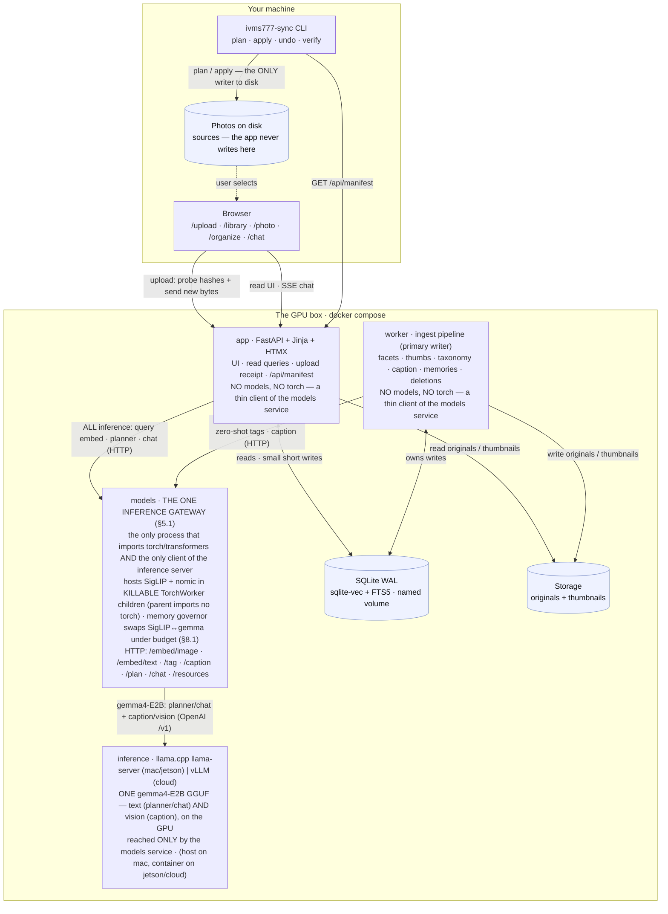
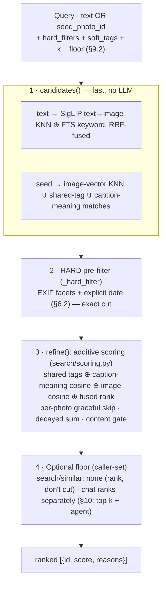
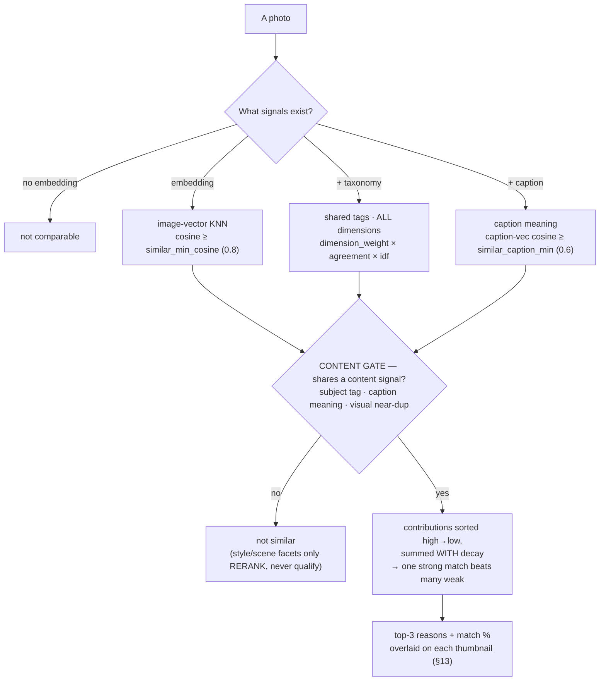
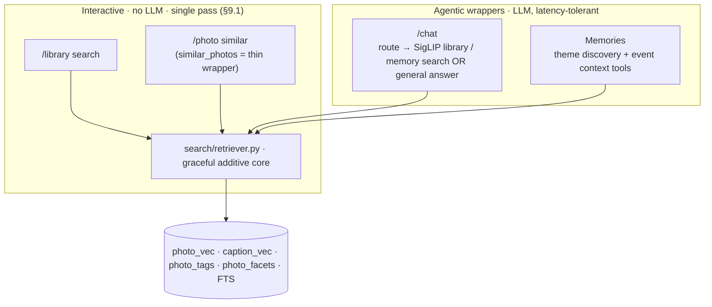
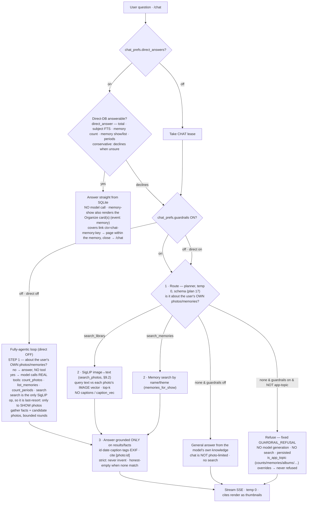
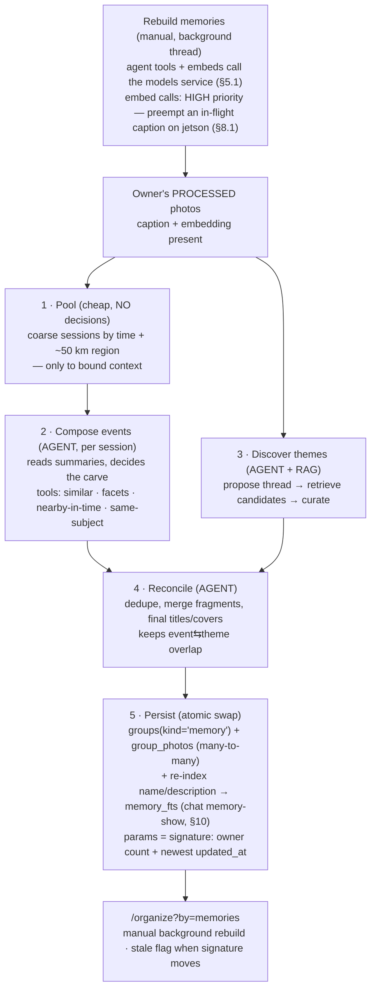

# Photo Library Organizer — Design

Status: approved design, ready for implementation planning
Date: 2026-08-13

## 1. Goal

A Python service with a simple web UI, deployed on a GPU box you control. It
works in two stages.

**Stage 1 — understand, in the cloud.** You select photos in the browser and
upload them. The service classifies every photo, writes a description and tags,
and lets you search, filter, find similar photos, browse suggested groups, and
ask questions about the collection in plain language.

**Stage 2 — reorganize, on your machine.** When the collection is fully
processed, `ivms777-sync` — a small standalone CLI that runs on the machine
holding the photos — downloads the collection state and applies it to disk: it
sorts files into a chosen folder layout, renames them consistently, and sweeps
redundant copies aside. It plans first and shows you every operation before it
touches anything.

The two stages share nothing but a manifest. The cloud never reaches into your
filesystem; the CLI never needs your library uploaded a second time.

All inference runs on hardware you control. Photos never go to a third-party
API.

## 2. Non-goals (v1)

- Face detection and person clustering. Deferred to v2.
- Authentication, signup, and per-user quotas. Deferred to v02; see section 3.2.
- Editing or rating photos in the cloud UI. The only thing that ever writes to
  your disk is `ivms777-sync`, and only on explicit confirmation.
- Cloud model APIs of any kind.
- Video files.

## 3. Constraints and targets

### 3.1 Deploy profiles

The same code runs in three places, selected by a base `compose.yaml` plus one
per-profile overlay (`compose.mac.yaml` / `compose.jetson.yaml` / `compose.cloud.yaml`).
The differences are which inference service is active, which model name is in
config, and — on `jetson` only — which app image is built (see "Jetson image"
below). Ingest is identical everywhere — photos always arrive by upload
(section 3.2b), so no profile depends on a host bind mount.

| Profile | Inference | Caption model | Planner / chat model | Embed device |
|---|---|---|---|---|
| `mac` | `llama-server` on the **host** (Metal) | `gemma4-E2B` | `gemma4-E2B` | `cpu` |
| `jetson` | `llama-server` in a container (sm_87 CUDA) | `gemma4-E2B` | `gemma4-E2B` | `cuda` |
| `cloud` | vLLM in a container, `--gpus all` | `qwen2.5vl:7b` | `qwen2.5:3b` | `cuda` |

Since plan 16, `mac` and `jetson` run **one gemma4-E2B GGUF on llama.cpp
`llama-server`**, which serves **both** the caption (vision) and planner/chat
(text) roles over the OpenAI `/v1` API — so both model-name columns are the same
`gemma4-E2B` (the name is for storage/display; `llama-server` serves whatever
`-m` GGUF it loaded). Override with `IVMS777_CAPTION_MODEL` /
`IVMS777_PLANNER_MODEL`. There is **no Ollama** on either profile, and **no
in-process caption VLM** — captioning is a plain OpenAI call to `llama-server`
with the image as an `image_url` data-URI. `cloud` is unchanged by plan 16 (still
vLLM; an open item).

**Why `llama-server` runs on the host under `mac`.** Docker Desktop on macOS boots
a Linux VM, and Apple exposes no GPU to Linux guests — there is no Metal in a
container, and no configuration changes that. Apple's own `container` project
does not support GPU passthrough either. Containerised inference on a Mac falls
back to CPU and runs 3-6x slower. `llama-server` built natively with Metal
(`-DGGML_METAL=ON`) gets full GPU, and the containerised app reaches it at
`host.docker.internal:8080`.

On Linux this problem does not exist. Under `jetson` and `cloud` everything,
including inference, runs in containers with real GPU access via the NVIDIA
container runtime.

**Why llama.cpp and not vLLM on Mac and Jetson.** vLLM's Metal backend does not
support vision models, which is a core workload here, and Docker's own benchmarks
put it 1.2-1.3x behind llama.cpp on Apple Silicon with far more variance. On
Jetson, vLLM's aarch64 build is a maintenance burden — and crucially only a
source-built `sm_87` llama.cpp runs the gemma vision projector on the GPU (§4).
vLLM earns its place only under `cloud`, where continuous batching genuinely helps
with concurrent users.

**Jetson sizing.** After the real, non-reclaimable baseline (kernel + firmware
carveout + system daemons **plus the `app`/`worker`/`models` Python containers**,
~3 GB in practice — higher than the ~1.5 GB kernel-only figure), only **~4.3 GB**
is free for models. gemma4-E2B on the `llama-server` child measures **~5.0 GB**
resident — Q4_K_M weights (~3.1 GB) + the F16 mmproj (~1 GB) + KV/compute buffers +
its own CUDA context — far larger than the SigLIP (~1.6 GB) + nomic (~0.3 GB) torch
models the `models` service hosts in its `TorchWorker` children (§8.1). So **gemma and SigLIP CANNOT be
resident together**: the memory governor (§8.1) evicts SigLIP before it loads gemma
and reloads it afterwards — they **swap** across the embed↔caption stage boundary.
The governor's per-model cost estimates (`IVMS777_MODEL_COST_MB`) must track these
real figures: an under-estimate for gemma makes it skip the eviction and load gemma
on top of SigLIP → OOM.

Everything model-related runs **on the GPU — never the CPU. There is no CPU
offload, on any profile.** gemma must therefore fit **entirely** in GPU RAM:
`llama-server` is launched with **`-ngl 99` (every layer on the GPU)**, and the
conveyor makes room by evicting SigLIP + nomic first (§8.1).

**gemma has two spawn modes, and the vision projector is loaded ONLY for
captioning** — it is the model's vision half, useless to a text turn:

| mode | registry name | spawn | used by |
|---|---|---|---|
| text | `gemma` | `-m gemma.gguf -ngl 99` | chat, planner |
| vision | `gemma-vision` | text **+ `--mmproj`** | captioning |

The two are **mutually exclusive** — one `llama-server` child, one port — so loading
either frees the other. Chat therefore never pays the projector's ~531 MB, which on
the 8 GB board is the difference between ~170 MB and ~700 MB of headroom.

The projector is the **Q8_0** build — `mmproj-gemma-4-E2B-it-Q8_0.gguf` (531 MB) from
`ggml-org/gemma-4-E2B-it-GGUF`, the default since the F16 projector (985 MB) is what
OOM-aborted `llama-server`: its CLIP tensor buffer (589 MiB) was the allocation that
failed. The weights still come from `unsloth/…`, so the projector has its own repo
var (`LLAMA_MMPROJ_REPO`). A small KV context (`IVMS777_LLM_CTX`, jetson 2048) keeps
the rest down. If a pinned all-GPU load still does not fit, `llama-server` aborts at
model load (`failed to fit params to free device memory … abort`) — that is a **hard,
surfaced error** (`app` streams an error turn to the chat UI), and the only fix is
to **shrink the GPU footprint** (smaller KV context, Q8 projector, smaller model
weights), **never** to spill layers to the CPU. mac keeps `-ngl 99` (Metal, ample
RAM). At MAXN_SUPER expect ~5–6 s/photo for captioning with gemma fully on the GPU.

**The empirical reference — device facts, the MAXN_SUPER power-mode lever, the
single-stream decode benchmark, and the GPU-vision benchmark that proved a
source-built `sm_87` `llama.cpp` runs the gemma projector on the GPU (0.57 s/img)
— lives in [`docs/jetson-tuning.md`](jetson-tuning.md).** That measurement is the
basis of plan 16: one gemma4-E2B GGUF on `llama-server` doing text (~30 tok/s) and
vision on the GPU, replacing qwen-text + the in-process VLM, and dropping Ollama
on jetson.

The shipping default on both `mac` and `jetson` is the single **`gemma4-E2B`
GGUF** served by `llama-server` for both roles. It is not an Ollama tag or an HF
`transformers` load any more — `llama-server` loads the GGUF (`-m` + `--mmproj`)
that the entrypoint fetches into the mounted volume on first run (jetson) or
`make llama-mac` downloads to `$HOME/.llama/models` (mac) — a persistent cache
outside the library dir, so `make clean` keeps both the GGUF and the built
`llama.cpp`; only `make llama-rebuild` wipes them. `IVMS777_CAPTION_MODEL`
/ `IVMS777_PLANNER_MODEL` override the name used for storage/display; the actual
weights are whichever GGUF `llama-server` was pointed at. Published benchmark
scores do not settle the captioner choice on their own — the phase 1 bake-off
decides it on real photos.

**Jetson image.** Only the `models` service needs GPU/torch on Jetson —
`app`/`worker` build from the same generic `Dockerfile` as every other profile
(`python:3.12-slim`, CPU-only PyPI `torch`), and never import it: they are thin
HTTP clients (§5.1). The `models` service instead builds from a dedicated
**`Dockerfile.models.jetson`** (repurposed from the old `Dockerfile.jetson`,
which used to build `app`/`worker` directly, back when SigLIP ran in-process
there) — which, on **JetPack 7** (L4T r39, CUDA 13.2), is the *same*
`python:3.12-slim` image as the mac/cloud `Dockerfile.models` with **one
change: `torch` + `torchvision` come from the CUDA-13.2 index**
(`https://download.pytorch.org/whl/cu132`) instead of the CPU PyPI wheel.
JetPack 7 exposes the Orin as **SBSA**, so those upstream CUDA-13.2 wheels run
on the iGPU directly, and the NVIDIA container runtime (`runtime: nvidia`)
hands that iGPU to the two containers that need it — `inference` (the sm_87
`llama-server`, built from `Dockerfile.llamacpp.jetson`) and `models`;
`app`/`worker` declare no GPU access at all. The `models` container
must also declare `NVIDIA_VISIBLE_DEVICES=all` + `NVIDIA_DRIVER_CAPABILITIES=all`:
unlike the CUDA base images, the `python:3.12-slim` base does not set them, and
without them the runtime injects no driver libs, so `libcuda` is absent and
`torch.cuda.is_available()` is `False`. There is **no jetson-containers, no
dusty-nv base image, and no `autotag`**: JetPack 7 ships system Python 3.12,
matching `pyproject.toml`'s `>=3.12` floor, so the image runs the normal `uv
sync --extra models` from `pyproject.toml` and then reinstalls
`torch`/`torchvision` from the cu132 index over the CPU torch that `uv sync`
brought. `numpy` stays on `pyproject`'s `>=2.5.2` — the cu132 wheels are built
against NumPy 2.x, so no Jetson-specific numpy pin is needed.

**Captioning + text both run on the `sm_87` `llama-server`; nothing captions
in-process.** Both roles are one source-built `sm_87` `llama.cpp` (the
GPU-vision rationale is in [`docs/jetson-tuning.md`](jetson-tuning.md)). That
binary is **built once** and reused: on the target board the `inference` compose
service runs the prebuilt `llama-server` from the `llamacpp` volume under the
cu130 image (no in-image recompile), and `Dockerfile.llamacpp.jetson` is the
reproducible from-scratch builder for a fresh board. Captioning is therefore a
plain OpenAI `/v1/chat/completions` call to the `inference` container with the
image as an `image_url` — no `transformers` VLM, no `bitsandbytes`/`accelerate`,
no C toolchain in `Dockerfile.models.jetson`. The `models` service on jetson
loads only SigLIP and the small nomic caption-text embedder on the cu132 GPU.

### 3.2 Multi-tenancy

v1 ships as a single-user product with multi-user bones. There is **no auth, no
login, no user table, no admin role, no signup, and no quotas**. There is one
implicit owner, and `owner_id` is a constant. Deploy it behind a private URL or
a reverse proxy that requires a password.

But three things are cheap now and expensive to retrofit, so they are in from
the start:

- `owner_id` on every user-scoped row and in every query.
- Photo bytes reached through a `Storage` interface (local filesystem now,
  object storage later).
- Inference reached through one HTTP client, so swapping the inference server
  (llama-server / vLLM) is a config change.

v02 adds accounts, signup, and quotas on top of this. Because upload is already
the only ingest path and every row is already owner-scoped, that is an additive
change: no data migration, no rewrite of every query.

### 3.2b Getting photos in — upload

Photos arrive by browser upload. There is no host bind mount, no server-side
folder picker, and no path the server walks. The server never sees your
filesystem; it sees the bytes you chose to send.

The upload screen accepts a whole directory (`<input webkitdirectory>`) or a
drag-and-drop selection, and runs in three steps:

1. **Hash locally.** A Web Worker computes each file's SHA-256, one file at a
   time, off the main thread. WebCrypto has no incremental digest, so a file is
   read whole — handling them one at a time bounds memory to the largest single
   photo rather than the size of the selection. Nothing is sent yet.
   `crypto.subtle` exists only in a *secure context* (HTTPS or `localhost`), but
   the app is normally reached over plain HTTP on the LAN (`http://<jetson>:8000`)
   where it is `undefined`; so the worker falls back to a pure-JS SHA-256 there.
   The fallback digest is byte-identical to the server's `hashlib.sha256`, which
   step 2's probe and step 3's server-side verification both depend on.
2. **Ask what is new.** The client POSTs each hash *with the path it came from*
   to `/api/upload/probe`, which answers with the subset whose bytes the server
   has never seen. Paths for content it already holds are recorded on the spot —
   that is what keeps duplicate detection correct when no bytes move.
   Re-uploading a folder you already sent transfers nothing.
3. **Send the new bytes.** Files upload in bounded concurrent batches with a
   per-file progress row. The relative path from the selected root travels
   alongside each file and is recorded, because that path is what stage 2 needs
   to find the file again on disk.

Interruptions are cheap: closing the tab loses only in-flight files, and
restarting the upload re-probes and resumes with what is still missing. The
server verifies the hash of every received file before storing it, so a
truncated transfer is rejected rather than indexed.

Originals are kept. They are written through the `Storage` interface under a
content-addressed key and are needed for full-resolution viewing and for
re-processing the library when a better model arrives.

**Why upload rather than a host mount.** A mounted folder is faster and copies
nothing, but it only works when the app runs on the same machine as the photos.
That constraint defeats the point of a hosted GPU. Upload costs disk and a first
transfer; in exchange, ingest is one code path on every profile, the container
boundary needs no holes, and the same deployment serves a user who is nowhere
near it.

**Why not have the browser reorganize files directly.** The File System Access
API can write to a user-picked directory, but only on Chromium desktop — Firefox
has no directory picker, Safari is read-only, and mobile has neither. Stage 2 is
a CLI instead, which works on every OS and has no browser to disagree with.

### 3.2c The upload folder list, and deleting a folder

The library is organised as a **list of folders** — one per distinct
`uploads.root_label` — persisted in the database, so it survives restarts (the
browser file picker cannot remember a selection). `/upload` shows every folder
with its live photo count; a directory-only picker adds a new one and uploads its
photos into the library.

**Deleting a folder removes it from the LIBRARY, never from disk.** The source
folder on the user's machine is a *source* and is never read, moved, or deleted by
the app (§3.2b) — deletion only removes the library's uploaded copies and their
derived state. It removes: the folder's `uploads` rows, every photo sourced only
from that folder, and *all* of each deleted photo's metadata — `photo_vec`,
`caption_vec`, tags, facets, FTS row, jobs, group memberships, thumbnails, and the
stored original. A photo whose identical bytes still belong to another folder is
kept; only that folder's `photo_sources` path is dropped.

A memory (§11) whose photos all lived in the deleted folder is left with no
`group_photos`; the cascade prunes that now-empty `groups(kind='memory')` row and
its `memory_fts` entry, so a memory the delete emptied disappears from Organize and
chat search in lockstep — never lingering as a coverless, crash-prone orphan.

**Deletion runs through an outbox + worker**, never inline. `POST
/upload/folder/delete` records the intent in `folder_deletions` and returns
immediately; the folder shows "deleting…". The worker drains the outbox each pass
(`process_folder_deletions`) and does the cascade, so a delete is reliable across
restarts and never blocks the UI. This is the Outbox pattern.

### 3.3 Scale

- Collection: 1,000-5,000 photos for the first user.
- First upload of 5,000 photos is a background transfer measured in tens of
  minutes; the first full index may run overnight. Both must be resumable and
  observable.
- The cloud never modifies an uploaded original. Only `ivms777-sync` writes to
  your disk, only after you confirm a plan, and every operation it performs is
  journaled and reversible (section 12).

## 4. Models

The app runs a small, fixed roster, all inside the one `models` service (§5.1),
loaded once — never in `app`/`worker`. **The exact role→model→backend table,
per-profile wiring, download mechanics, and the settled caption-embedding
decision live in [`docs/models.md`](models.md).** The selection:

- **SigLIP 2** does image + text embeddings and zero-shot tags, in a `TorchWorker`
  child of the models service (CPU on mac, CUDA on jetson) — neither `llama-server`
  nor vLLM exposes an image-embedding endpoint, so it cannot move behind them.
- **One `gemma4-E2B` GGUF on `llama-server`** does **both** captioning (vision) and
  planner/chat (text) on mac/jetson — one model, one process, on the GPU (§3.1).
  `cloud` keeps Qwen2.5 (vLLM). Prompts are a per-model template registry, so
  adding a model is a template, not pipeline surgery.
- **A dedicated text embedder (`nomic-embed-text`)** embeds caption text for §9
  similarity, NOT SigLIP — SigLIP's text tower is trained image↔text, so text↔text
  has no separation (measured). The `caption_vec` it produces is a **top-k KNN**
  retrieval index, never a fixed cosine floor. Full rationale + benchmarks:
  [`docs/models.md`](models.md).

Gemma 4 is used over the dominated Gemma 3. The default caption model is chosen by
a **bake-off** on real photos, not published benchmarks — the winner is a config
default, not code.

## 5. Architecture

Three containers and one SQLite file in the cloud. One standalone binary on your
machine.

This diagram is the **canonical architecture picture** — keep it in step with the
components and flows described in this section (CLAUDE.md § "docs/design.md is the
source of truth").

`app` serves the UI, read queries, upload receipt, and the manifest endpoint.
`worker` owns the ingest pipeline and is the primary writer. Both open the same
SQLite file in WAL mode with a busy timeout — SQLite permits one writer at a
time, and `app`'s writes are small and short (recording a received upload,
accepting a group, editing vocabulary), so contention stays negligible at this
scale. If public traffic ever makes that false, the fix is Postgres, and the
repository layer is the only thing that changes.

**All model work lives in one process — the `models` service (§5.1).** `app` and
`worker` never import torch/transformers or load a model; they call the `models`
service over HTTP. This is the hard rule (CLAUDE.md § "One model process"): a model
or AI library is loaded **once**, in one process, never duplicated across
containers. It is what makes the 8 GB Jetson viable — a SigLIP loaded in both `app`
and `worker`, each with its own torch CUDA context, is exactly what exhausted the
unified memory.

**One implementation, both platforms.** The `models` service is the same code on
mac and jetson; only its *internals* switch by profile: SigLIP and the nomic
caption-text embedder run on **CPU** on mac and **CUDA** on jetson, and captioning
is the same OpenAI `/v1` call to `llama-server` on both (host on mac, container on
jetson). The service picks these from config; `app`/`worker` and the whole request
flow are identical across platforms.

`ivms777-sync` is not part of the deployment. It talks to `app` over HTTP,
reads one endpoint, and is the only component that ever writes to your disk.

Vector search uses `sqlite-vec`, which ships prebuilt wheels for arm64 and
x86_64, so the same code works on Mac, Jetson, and cloud. At 5,000 photos a
brute-force scan would also be fine; `sqlite-vec` is there so growth to 100k+
needs no new component.

### 5.1 The `models` service — the one inference gateway

**Every model, LLM, embedder, and heavy AI library lives in exactly one service:
the `models` service.** It is the only service that touches `torch`/`transformers`,
the only one that loads SigLIP or the caption-text embedder, and the only client of
the inference server (`llama-server` / vLLM). `app`, `worker`, and the CLI hold
**no models and no torch** — they are thin HTTP clients of this service (CLAUDE.md
§ "One model process"). Loading the same model in two processes is forbidden; on
the 8 GB unified-memory Jetson a duplicated SigLIP plus two torch CUDA contexts is
exactly what exhausted memory.

**The service owns three supervised children, and its own process holds no model.**
gemma is the `llama-server` child (§3.1); SigLIP and nomic are one `TorchWorker`
child each (§8.1, `modelsvc/torch_process.py`). The FastAPI parent imports **no**
torch at all — it starts, calls, and **kills** children, because ending the process
is the only way a CUDA context's memory comes back. This is the one-model-process
rule, not an exception to it: one owner, one copy of each model, everyone else on
HTTP.

**HTTP surface** (the whole app's inference vocabulary):

- `POST /embed/image` — SigLIP image embeddings (ingest `embed`, "similar"). The
  caller (`RemoteEmbedder`) resizes each image to SigLIP's **384×384** input,
  bilinear, before the PNG encode. That is exactly what the model's processor
  does to any input it is given (`do_resize`, `size: 384×384`, `resample:
  BILINEAR`), so the vectors are bit-identical — but it is the difference
  between a working ingest and a stalled one: PNG-encoding a full-resolution
  original cost 5.7 s of CPU and a 15 MB base64 body per photo on the Jetson,
  against ~10 ms of GPU, pinning the embed stage at 0.32 img/s with the GPU idle
  96 % of the time. Only valid for a **fixed-resolution** SigLIP checkpoint —
  a NaFlex variant consumes native resolution and would lose signal here.
- `POST /embed/text` — SigLIP **text** embeddings for search/chat query vectors
  (same joint space as the image vectors).
- `POST /tag` — SigLIP zero-shot scoring against `vocab.yaml` (ingest `taxonomy`).
- `GET /embed/calibration` — SigLIP's zero-shot calibration (`logit_scale`,
  `logit_bias`); `RemoteEmbedder` fetches and caches this once so taxonomy
  scoring (§9) can stay client-side (ingest keeps computing tag probabilities
  itself, over `embed_text` + this calibration — nothing server-side changes).
- `POST /caption` — a caption sentence (title/description) for one image (OpenAI
  `/v1` call to `llama-server` with the image as an `image_url`, §4). It returns
  **no tags** — tags are SigLIP-only (§7).
- `POST /plan`, `POST /chat` — text generation (query planner, chat answers).
- `POST /text/embed` — caption-meaning text embeddings (§9) from the **dedicated
  text embedder `nomic-embed-text-v1.5`**, in its own worker child (`TextBackend`,
  `embedding/text_embedder.py`) — NOT `/embed/text` (that is SigLIP, image↔text
  only). Consumed as top-k KNN (§10).
- `GET /resources` — **only what the service alone knows**: which models are
  resident, and the current in-flight op. It reports **no machine metrics**.
  RAM/CPU/GPU-load/temperature are host-wide numbers that any process can read
  from `psutil` and the kernel's own sysfs counters — reading them is not
  "touching the GPU" in the sense of the one-model-process rule (§5.1), it needs
  no CUDA context, no driver library and no `runtime: nvidia`. So `app` reads
  them **itself**, locally, and the bar keeps showing them even when the `models`
  service is down or still starting (§13).

**Backends, chosen by profile inside the service (one implementation, both
platforms):**

- **SigLIP** in a `TorchWorker` child — `embed_device=cpu` on mac, `cuda` on
  jetson/cloud. Image **bytes** cross the worker pipe; the child does the decode.
- **Captioning** — an OpenAI `/v1/chat/completions` call to `llama-server`
  (mac/jetson) / vLLM (cloud); the same gemma4-E2B GGUF that answers text also does
  vision on the GPU (§3.1/§4). No in-process caption VLM.
- **Text** (`/plan`, `/chat`) — the same OpenAI-compatible inference server, via a
  shared `OpenAICompatClient`. **Caption-meaning text embeddings** run in their own
  `TorchWorker` child (`nomic`, `embedding/text_embedder.py`) on mac/jetson because
  `llama-server` has no embedding endpoint; cloud (vLLM) keeps the OpenAI
  `/embeddings` path and has no worker.

**Residency is coordinated in-process here** — there is no cross-process DB lease.
A `MemoryGovernor` (`modelsvc/governor.py`, driven by the `Scheduler`) makes the
models an op needs resident, evicting non-needed, non-pinned residents (LRU) when
either the `budget_mb` ceiling or the measured free RAM says they will not fit. On
the 8 GB Jetson the gemma child (~5.0 GB in `llama-server`) and SigLIP (~1.6 GB) +
nomic (~0.3 GB, in this process) do **not** fit together, so the governor **swaps**:
it evicts SigLIP to load gemma for a caption/chat and reloads it for the next embed.
Everything is local, so the budget is real and no second process holds a hidden copy.

This **retires the earlier cross-process model lease** (`model_lease`) and the
two-process `ModelCoordinator`: with models in one process, residency is an
in-process concern (§8.1, `modelsvc/governor.py`), and `app`/`worker` need no
coordination because they hold nothing to coordinate — they reach every model over
HTTP and load nothing themselves.

## 6. Data model

The library is one SQLite file. **The full DDL — every table and index, the
`sqlite-vec` (`photo_vec`) and FTS5 (`photo_fts`) virtual tables — lives in
[`docs/data-model.md`](data-model.md).** The shape that matters for the design:

- **`photos`** — one row per distinct image, identified by its `content_hash`
  (sha256 of the bytes). All derived state hangs off it: EXIF, caption,
  `caption_vec`, and the SigLIP vector in the `photo_vec` sqlite-vec table.
- **`photo_sources`** — every local path the bytes arrived from (many-to-one); more
  than one row is a duplicate on disk (§6.1).
- **`photo_facets`** — EXIF-derived facets in their own table, so a *fact* is never
  diluted by a model *guess* (§6.2). **`photo_tags`** holds the model-derived tags,
  each with a `score` (0..1) and a `source`, so the UI can show why a tag is present.
- **`jobs`** — one row per (photo, stage): the resumable ingest queue (§8).
- **`groups` / `group_photos`** — a many-to-many junction backing Memories, so a
  photo may belong to any number of memories (§11).
- **`uploads`**, **`chat_sessions` / `chat_messages`** — the folder list (§3.2c) and
  the persisted chat transcript (§10).

`tags` is a shared vocabulary with no `owner_id`; every user-scoped query filters on
`owner_id`.

## 6.1 Exact duplicates

The same image bytes often sit in several folders under different names. Because
a photo is identified by its `content_hash`, this needs no detection pass at
all: the second copy simply adds a row to `photo_sources` against the photo that
already exists. An image stored in five places is one `photos` row with five
sources, so it is embedded, scored, and captioned exactly once, and its bytes
are stored once.

This is what makes upload the cheaper ingest model in practice. The client
probes hashes before sending (section 3.2b), so redundant copies cost one hash
comparison each and no transfer.

There is no separate duplicates screen. A photo with more than one source wears
an `×N` badge in the grid, and its detail page lists every path the bytes were
found at, with the disk space the redundant copies occupy on **your** machine.
Reclaiming that space is stage 2's job, and only after you approve a plan
(section 12).

The earlier design detected duplicates by walking a mounted filesystem, which
required a two-pass scan to tell a move from a copy. Nothing walks a filesystem
now, so that distinction disappears: the client sends what exists, and paths
that stop appearing in later uploads are simply stale sources, marked rather
than deleted.

This is exact, byte-level matching. Visually similar but not identical shots are
near-duplicates and are handled by perceptual hashing in section 11.

## 6.2 EXIF facets — external filters

Model output is a guess. EXIF is a fact. The two are kept in separate tables so
the UI can be honest about which is which, and so a filter on "shot at ISO 3200"
is never diluted by a model's opinion.

Every photo's full EXIF is stored verbatim in `exif_json`. From it, a fixed set of
**facets** is derived into `photo_facets`, each either categorical or numeric (so
ranges work) — the exact key set (Camera / Exposure / Time / Place / Image groups)
is in [`docs/data-model.md`](data-model.md#exif-facet-keys).

Facets are used four ways:

- **Filtering** — sidebar controls on `/library`, with counts. Categorical
  facets are checkboxes; numeric facets are ranges.
- **Sorting** — any numeric facet is a sort key, in addition to capture date.
- **Search** — facet predicates narrow the candidate set before semantic and
  keyword ranking (section 9).
- **Chat** — the query planner emits facet predicates, and retrieved photos
  carry their facts into the answer context, so "what lens did I use most in
  Italy?" is answered from data rather than from captions.

Facets are also a cheap quality signal the models never see: a photo at ISO
12800 with a 1/8 s shutter is probably a noisy handheld night shot, and that is
knowable without inference.

`time_of_day` uses local clock hour from EXIF, which is what a photographer
means by "evening shots". It is not recomputed from GPS and UTC.

## 7. Taxonomy

**Ten dimensions, defined in an editable `vocab.yaml`** (subject, setting, vibe,
emotion, light, season_weather, composition, palette, occasion, quality). Users add
or remove labels without touching code; re-scoring a changed dimension only re-runs
the (cheap) SigLIP stage. **The label lists, exact per-dimension sources, and the
tuning knobs are in [`docs/taxonomy.md`](taxonomy.md).**

The scoring design:

- **SigLIP is a per-dimension classifier, not an absolute detector** — raw sigmoid
  probabilities are tiny and flat, so tags are chosen by a **softmax over each
  dimension's own labels** (top label + runners-up within `select_ratio`, capped at
  `max_per_dim`), storing a real within-dimension 0..1 confidence.
- **Captions write NO tags** (decision) — a flat-`1.0` free-text VLM guess used to
  override SigLIP's honest scores and mislabel photos. Tags come only from SigLIP +
  pixel stats (`palette`/`quality`) + EXIF.

### 7.1 Vocabulary mining

The starting vocabulary cannot anticipate one library, so a batch job mines
recurring noun phrases from captions, drops any an existing label already covers,
and offers the rest as "suggested tags". Accepting one appends it to `vocab.yaml`
and re-runs that dimension's (SigLIP-only, seconds-fast) taxonomy stage — the
vocabulary grows into the collection instead of being guessed up front. Mechanics
in [`docs/taxonomy.md`](taxonomy.md#vocabulary-mining).

## 8. Ingest pipeline

Every photo flows through a **resumable, per-stage job queue** (`jobs`, §6):
`receive` → `facets` → `thumbnail` → `embed` → `taxonomy` → `caption`. `receive`
runs synchronously in `app`; everything after is drained by the `worker`, and
killing/restarting the container resumes exactly where it stopped. **The exact
per-stage mechanics, reprocess endpoints, and failure handling are in
[`docs/ingest-pipeline.md`](ingest-pipeline.md).**

The design decisions that matter:

- **Stages drain library-wide in order, not per photo** — every photo is embedded
  and tagged before any is captioned. On the 8 GB Jetson this is what keeps SigLIP
  and the captioner from being needed at once, and it means search + "similar" work
  across the whole collection minutes after upload, while captions fill in over
  hours. The caption's text embedding (`caption_vec`, §9) is a separate batch step,
  never interleaved per photo.
- **Degrade, never crash.** A drain pass runs the GPU-free stages (thumbnail, place
  facets, deletions) first, then the inference stages; if the `models` service is
  down the inference group is skipped and retried next pass, so photos still appear
  in the library and the upload receipt still returns.
- **Reprocess & self-heal.** Originals are kept, so any stage can be re-run — per
  library range or per photo — without re-uploading, and self-healing backfills
  queue any missing derived state each drain.
- **The manifest gate.** `/api/manifest` marks the library `complete` only when no
  job is pending/running; `ivms777-sync` refuses an incomplete manifest without
  `--allow-incomplete` (§12).

### 8.1 In-process residency — the memory governor (swap under budget)

All model work lives in the one `models` service (§5.1), so residency is an
**in-process** concern, not a cross-process lease. A **`MemoryGovernor`**
(`modelsvc/governor.py`), driven by the `Scheduler` (`modelsvc/scheduler.py`),
makes the models each op needs resident and **evicts** non-needed, non-pinned
residents (LRU, oldest first) whenever the `budget_mb` ceiling *or* the measured
free RAM says they will not fit. Each model registers a `load`/`free` pair and a
**resident cost** (`IVMS777_MODEL_COST_MB`); that cost must track the model's real
footprint, because the eviction guard is `free >= cost + headroom` — an
under-estimate loads a model on top of one that should have been evicted and OOMs
the box (the gemma "connection refused" bug).

gemma is registered **twice** — `gemma` (text: chat/planner) and `gemma-vision`
(text + the ~531 MB projector: captioning only). They are one `llama-server` child on
one port, so they are **mutually exclusive**: making either resident frees the other
(§3.1). A text chat never loads the vision half.

**Residency is a claim about the world, not a note to self.** gemma lives in a
separate process that can die without asking us — `llama-server` aborts (SIGABRT) the
moment a `cudaMalloc` fails, including *mid-request* at image decode. So every model
that can die behind our back registers an `alive` probe alongside `load`/`free`, and
`ModelRegistry.ensure()` **re-checks it**: a model the bookkeeping calls resident but
whose probe says dead is dropped and **loaded again**. Without that probe the registry
keeps asserting a dead gemma is resident and every caption posts to a closed port —
`connection refused`, forever, until the container is restarted. SigLIP and nomic
carry the same probe for the same reason — they are child processes too (below).

On the 8 GB Jetson gemma (~3.5 GB text / ~4.0 GB with vision, in the `llama-server`
child) and SigLIP (~3.3 GB) + nomic (~2.1 GB) do **not** fit together, so the governor
**swaps** them across the embed↔caption boundary: SigLIP is evicted to load gemma for a
caption/chat, and reloaded for the next embed. Those two figures are each child's WHOLE
footprint — its torch import and CUDA context included — because eviction kills the
child, and they are what `IVMS777_MODEL_COST_MB` must carry.

**A model is loaded with `device_map=<device>`, NEVER `.to(device)`.** `.to()`
materialises every weight in host RAM first, and that copy is never released: measured
on the board, SigLIP's child sat at **5128 MB** RSS loaded with `.to("cuda")` versus
**2940 MB** with `device_map` — a 2.2 GB host copy on a 7.4 GB machine. It is not
un-returned allocator arena, so `gc` + `torch.cuda.empty_cache()` + `malloc_trim`
reclaim **nothing** (all three measured, zero change); the tensors stay referenced.
`device_map` streams the checkpoint shard-by-shard straight onto the device so the host
copy never exists, and it is why `accelerate` is a dependency of the `models` extra.
This applies to every model the service loads, present and future — **with one measured
exception**: `nomic-embed-text` ships custom remote modeling code that `device_map`
splits across devices (`embed_texts` then fails with "index is on cuda:0, different
from other tensors on cpu"), so it keeps `.to()` and pays the host copy — 2.14 GB
resident instead of the 1.28 GB it would cost. That makes the caption-text embedder the
second-most expensive resident on the board, not the "~0.3 GB" earlier notes claimed.

**A torch model is evicted by ENDING ITS PROCESS, never in-process.** Freeing a torch
model in-process frees its tensors but **not** its process footprint. Measured on the
board: SigLIP takes the process to ~5.3 GB anonymous RSS, and after a full in-process
release (cache clear + `gc` + `empty_cache` + `ipc_collect`) it still holds **~2.7 GB**,
with the CUDA driver reporting only ~2.4 GB device-free —
`torch.cuda.memory_reserved()` is ~20 MB at that point, so torch has let go and the
CUDA context has not. `malloc_trim` plus clearing the cuBLAS workspaces recover ~50 MB
between them. That residue is exactly the RAM gemma-vision (~3.9 GB measured) needs, so the
in-process swap did not work: `llama-server` aborted at load or at image decode and
every caption failed until the container was restarted.

So SigLIP and nomic each run in a **`TorchWorker` child process**
(`modelsvc/torch_process.py`, spawn — never fork), the registry's `load` is
`start()` and its `free` is `terminate()`, and `alive` is the child's liveness. The
`models` parent therefore **never imports torch** and never holds a CUDA context;
`app`/`worker` are unchanged thin HTTP clients, and no model is loaded twice — this is
the one-model-process rule, applied the same way gemma already was. Rejected, with
measurements: SigLIP on the **CPU** (residue drops to ~0.7 GB) costs **54×** throughput
(9.64 img/s GPU → 0.18 img/s CPU); `--parallel 1` on llama-server saves ~20 MB; `-ub
256` breaks vision outright (`n_ubatch >= n_tokens` is required by the non-causal image
encoder). Batch ingest runs stage-by-stage (all embeds, then all
captions), so this costs only a couple of swaps per run, not one per photo. The
scheduler also gives interactive ops (search/chat) priority over batch captioning
on the single Jetson slot, so a chat preempts a queued caption. The service reports
what is resident and the current in-flight op on `GET /resources` for the resource
bar (§13) — and nothing else; the machine metrics beside them in the bar are read
by `app` itself (§5.1).

The governor never *refuses* a load whose declared cost **fits** the budget — it
evicts SigLIP + nomic so a single gemma has the GPU to itself. But "within budget"
means `model_cost_mb[name] + headroom_mb <= ram_budget_mb`, and a model that breaks
that inequality can **never** load, on any amount of free RAM: eviction cannot help,
so the governor refuses every time. **An over-estimated cost is therefore NOT the
safe direction** — past a point it is fatal. `gemma-vision` was declared at 5000
against a 5000 jetson budget and a 512 MB headroom, so `5000 + 512 > 5000` raised
`InsufficientMemory` on every caption and the entire stage failed on an idle board
with 5.6 GB free. Every entry in `model_cost_mb` must satisfy that inequality for
its profile; `tests/test_config.py::test_every_model_fits_its_profile_budget`
enforces it, and the costs are **measured** (as the drop in
`psutil.virtual_memory().available`, which is what the guard reads), never guessed. gemma always loads **fully on the GPU** (`-ngl
99`, vision projector included) — **the platform never degrades to the CPU** (§3.1).
If the all-GPU load still cannot fit (the non-evictable baseline leaves < gemma's GPU
footprint), `llama-server` aborts at load and `app` streams a plain error turn to the
chat UI; the only fix is to **shrink gemma's GPU footprint** so it fits — a smaller KV
context, a Q8 vision projector (§3.1), smaller weights — **never** a CPU offload. A
"(no answer)" bubble is a bug, not an outcome.

Implementation detail — the `use()` guard, the retired caption-preemption path, and
the `/resources` fields — is in
[`docs/ingest-pipeline.md`](ingest-pipeline.md#in-process-residency--siglip-ensure-loaded).

## 9. Retrieval

Retrieval is **one core, two stages** (`search/retriever.py`, plan 12 — see
§9.2 for the full interface). **`candidates()`** is fast and has no LLM: for a
seed photo it is the image-vector KNN unioned with shared-tag and
caption-meaning matches (the same union `similar_photos` has always used); for
text it is SigLIP semantic KNN fused with FTS5 keyword search. **`refine()`**
then applies the rule that governs the whole core:

**The ADR — hard filters gate, everything else scores.** EXIF facets and
explicit user/planner *facet*/*date* predicates (section 6.2) are **hard**: an
exact cut applied before ranking, and a photo that fails one is **out**, no
matter how well it would otherwise score. Every model-derived signal — shared
tags, caption-meaning cosine, image-vector cosine, the semantic/keyword fusion
rank — is **soft**: an additive **contribution**. A missing signal (no caption
vector yet, no tag) is *unavailable*, not zero, so it is skipped for that one
photo, never a kill switch. This is the rule `similar` always followed; §10
explains why chat needed it made structural too.

What used to be described as four separate mechanisms are now candidate
generation and contributions of the one core:

- **Semantic** — query text through the SigLIP text encoder, KNN via
  `sqlite-vec`, inside `candidates()`. Handles "dogs playing in snow" with no
  matching caption.
- **Keyword** — FTS5 BM25 over captions and tag text, fused into `candidates()`
  alongside semantic. Catches proper nouns, OCR'd text, and exact words
  embeddings smear over.
- **EXIF facets** — exact filters over `photo_facets` (section 6.2), now the
  core's hard pre-filter (`_hard_filter`, §9.2): applied to the candidate list
  before any scoring, since they are cheap and exact.
- **Tag facets** — model-derived tag filters are no longer a pre-ranking SQL
  narrow; a sidebar/planner tag hint is a **soft** contribution
  (`_soft_tag_contributions`, §9.2) scored by `refine()`, never a gate.

`/library` search calls `candidates()` directly for the fused ranking, then
narrows that list by the sidebar's EXIF/tag filters — the same
candidate-then-filter order the pre-core fusion always used, just generated by
the shared core now, with no per-click LLM latency (§9.1). `similar`, chat, and
memory call the fuller `refine(candidates())` for the graceful additive score.

**Retriever core flow.** Keep this diagram in step with `search/retriever.py`.

The query planner (§9.1) sits **outside** this core — it is an **input
adapter** that turns free text into `hard_filters` + `soft_tags` once, then
hands the core a `Query`. It is not part of the core itself: keeping it outside
is what keeps the core LLM-free and single-pass, honouring §9.1's
interactive-latency rule.

**Similar photos** — a photo's whole character, from three signals fused, and it
**degrades gracefully with the pipeline** so it is useful the moment a photo is
embedded and richer once it is tagged and captioned. This scorer now *is* the
core's `refine()` (§9.2) — `similar_photos` is a thin wrapper over
`refine(candidates(Query(seed_photo_id=...)))` — so what follows describes the
core's seed-query scoring, not a separate mechanism:

Three signals fuse and degrade with the pipeline: image-vector **look-alike**
(before anything else), shared **tags across all dimensions** (per-dimension
weighted — `subject` heaviest, `quality` ignored), and **caption meaning** (cosine
between caption embeddings, which catches a dog-in-a-car that SigLIP tagged
`vehicle`). **The exact weights, thresholds, and scoring formula are in
[`docs/retrieval.md`](retrieval.md#similar-photo-scoring).**

**Content gate.** A candidate is "similar" ONLY if it shares a **content** signal: a
`subject` tag, a caption that means the same, or a genuine visual near-dup.
Style/scene facets (composition, vibe, palette, light, …) **only rerank** content
matches — they never make two photos similar on their own. Two photos both shot
top-down in cool overcast light are not "the same thing".

Contributions are **sorted high-to-low and summed with a decay**, so **one strong
match — a shared `subject` — beats a pile of weak ones**. Each result carries its
**top-3 reasons** with a match % (§13). Pure image-vector KNN as the *primary*
signal was rejected (a dog on a rooftop returned other rooftops); so was an LLM
reranker for this interactive path — it reintroduces per-click latency §9.1 forbids.

**Similar-photo flow.** Degrades with the pipeline; the content gate is mandatory.

### 9.1 Query planner

The planner model (§4) converts a natural-language query into a `QuerySpec` in one
call — a `semantic` string plus `date_from`/`date_to`, categorical `tags`, and
`facets` (numeric `gte`/`lte` or categorical lists) that map directly onto
`photo_facets`. Its predicates are materialized into the same filter params the
sidebar uses, so the parsed filters show as **removable chips**; removing one drops a
predicate and re-runs the ordinary filtered search, and the planner does not run
again until a new query is typed. **Example spec + the exact param mapping:
[`docs/retrieval.md`](retrieval.md#query-planner-output).**

A single structured-output call, not an agent loop. A multi-step tool-calling
agent would cost seconds per step to query one SQLite table, which is a bad
trade. This applies to *interactive* retrieval only. The Memories organizer
(section 11) does run an agent loop, because it is a batch, offline job whose
per-step latency is paid once at build time, not on every keystroke.

**Chat is the one interactive exception (§10).** The user accepted the latency of
an agent loop for chat specifically — a wrong answer there is worse than a slow
one — so chat may run a bounded multi-round retrieval loop. `/library` search
stays a single call; chat does not.

The planner is strictly an enhancement. If it fails, times out, or returns
invalid JSON, the raw query goes straight to semantic + keyword fusion. The UI
shows the parsed filters as removable chips, so the interpretation is always
visible and correctable.

### 9.2 The retriever core

`search/retriever.py` is the **one** retrieval pipeline (plan 12). Every
consumer — `/library` search, `/photo` similar, chat, memory — is a caller of
it; nothing else in the codebase scores, fuses, narrows, or floors photos.

**The `Query` shape, the `candidates()`/`refine()` signatures, and the async-paint
detail are in [`docs/retrieval.md`](retrieval.md).**

**Two tiers, one core.** The **fast tier** (`/library` search, `/photo` similar)
calls the core directly — no agent, no per-click latency (§9.1). The **agentic-RAG
tier** (chat §10, memory §11) layers judgement — verify, curate, decide membership —
*on top* of the same `candidates()`/`refine()`, never a second retrieval pass.

**The single-pipeline invariant.** If a code review ever finds a second place
that scores, fuses, narrows, or floors photos, that is a bug against this
design — `candidates()`/`refine()` are the only two stages, everywhere.

`/photo` already paints instantly with the similar strip loading async; splitting
that fragment into KNN-paint-then-refine is still future — see
[`docs/retrieval.md`](retrieval.md#async-paint-photo).

## 10. Ask-your-library chat

Retrieval is **agentic RAG**, not a one-shot dump. The old path fused the top-30
neighbours and force-fed them to the model, which then invented matches ("a dog
on the dashboard" with no dog) because a semantic KNN always returns *k*
neighbours — there was no "nothing matches". The path is now precise, cheapest
layer first — and the deterministic questions never touch the model at all:

Cheapest layer first, and the deterministic questions never touch the model:

0. **Direct-DB layer.** Everything the DB can answer *unambiguously* — the library
   total, a subject FTS count, the memory count, a month/year span, and **showing a
   memory / all memories** — is answered straight from SQLite by `direct_answer`,
   with **no model call**. Each matcher is **conservative**: it fires only when
   confident, else falls through to the agent, so an odd phrasing degrades to the
   agent, never to a confidently-wrong answer (the boundary is pinned by a routing
   matrix of adversarial phrasings). A memory-show also renders the Organize card(s),
   linked `ctx=chat-memory:<key>` so opening one pages within the memory and closes
   back to the conversation (§13.1).
1. **Route (plan 17).** One schema-constrained planner call (temp 0) classifies the
   message into `search_library`, `search_memories`, or `none` (general
   knowledge/chit-chat). Failure falls back to `none`.
2. **Run the tool.** `search_library` → **SigLIP image↔text** (`search_photos`, §9.2:
   query text vs each photo's *image* vector — NOT captions, plan 17);
   `search_memories` → name/theme match; `none` → no retrieval.
3. **Answer (streamed, temp 0).** A tool result grounds the model on ONLY those
   photos/memories (id, date, caption, top tags, EXIF), citing `[photo:ID]`; the
   prompt forbids inventing a subject and reports none when nothing matches
   (honest-empty). `none` answers from the model's own knowledge — chat is a general
   assistant, not photo-limited.

**Only a library question may load SigLIP.** `search`/`search_library` is the one chat
op that runs the SigLIP text encoder, and on the Jetson SigLIP cannot be co-resident
with gemma (§8.1) — a single stray search evicts gemma and pays a llama-server respawn
mid-turn. So **both** paths decide on-topic BEFORE any tool: `route` returns `none` for
anything about the world, and the fully-agentic loop's first instruction is to answer
with no tool unless the message is about the user's own photos/memories. `search` is
reserved for "show me my photos of X" — never for a count, never for general knowledge.

**Two per-owner toggles (`chat_prefs`), defaults reproducing the pipeline above:**
**Direct answers** (on) — off skips the direct-DB step and runs a fully-agentic tool
loop (`count_photos` / `list_memories` / `count_periods` / `search`) instead; and
**Guardrails** (off) — on turns the router's `none` verdict into an on-topic gate
(fixed refusal, no generation), except app-topic questions, which are never refused.
The two are independent. **Full mechanics — matchers, tool schemas, grounding budget,
guardrail specifics — in [`docs/chat.md`](chat.md).**

**Agentic RAG flow.** Direct-DB first when *Direct answers* is on (no model); the
semantic tail degrades to plain fusion at every stage.

**Degrade, never crash & honest-empty.** Any route/search/embed/generation failure
falls back to a plain answer (failed route → `none`; failed `search_library` → the
core's `candidates()` fusion, §9.2), so chat always answers and no ranking lives
outside the core (single-pipeline invariant). The grounding rule "never invent,
report none" means an empty search yields an honest "none", not a fabrication; the
chat view always shows its cited source thumbnails as the evidence.

**History is persisted** (`chat_sessions`/`chat_messages`, §6): `/chat` renders the
current session server-side on load, so the conversation survives navigation and
restarts; **New session** starts a fresh one. Each question is answered independently
against freshly retrieved photos — the transcript is not multi-turn model memory. The
chat route calls the small, always-loaded planner directly, so a question during
indexing does not evict the captioner.

## 11. Organize — albums by principle

The **Organize** tab groups the library into albums by a principle the user
picks from a dropdown. Most organizers recompute their albums live — the grouping
is a view over the current data, so it is always up to date, with no
accept/dismiss step and nothing persisted. **Memories** is the one exception: it
runs an agent, is far too slow to recompute per view, so it is built in the
background and stored (below).

An **organizer** is a function from the library to a list of albums. Each album
has a title, a description, a cover, and its photos. The organizers live in
`albums/` behind an `Organizer` protocol, so a new principle is one module and
one dropdown entry.

**By date.** A `grain` sub-selector picks the calendar bucket — `day`, `month`
(default), or `year`. It is a query parameter on `/organize` alongside the
organizer name and needs only EXIF, no model. Title is the period ("14 Jun 2025",
"June 2025", "2025"); description is the photo count and dominant camera — "140
photos, mostly Canon EOS R6."

Day, month, and year are the **same axis at three zooms** — a real hierarchy. There
is deliberately no "events" grouping here: time-gap clustering is a different
principle, not a zoom level of the calendar, so it never sits in this sub-selector.
It lives on only as an internal seeding step for Memories (below).

**By camera / device.** Group by EXIF camera model. Exact, trivial.

**By place.** Group photos by where they were taken and title each album with a
**real place name** — "Kyiv", "Rome", "Toronto" — from offline reverse geocoding
of the GPS, **never raw coordinates**. A bundled GeoNames dataset (`reverse_geocoder`)
resolves each point on the box, with no network, so one city is one album. Only
photos carrying GPS appear. Coordinates are a technical detail, shown only on
`/photo` (§13) and never in Organize — bare lat/long is not a place a person
recognizes. The library also filters by place: the facets stage reverse-geocodes
GPS into `place_city`/`place_country` facets (§6.2), shown as a "Place" group in
the `/library` sidebar.

**Memories.** The interesting one, and the reason the Organize tab needs the LLM.
It composes the library into named, described *memories* — "A day at Borjomi",
"Family night in Ontario" — not sets of look-alike photos.

**The governing principle: the LLM decides every membership; heuristics only make
the problem tractable.** How photos combine into a memory is a judgement call — it
needs a model that has read what is *in* the photos, not a distance formula. So no
heuristic ever decides a memory's contents. Time/place/retrieval are used *only*
to hand the agent a small, relevant working set (897 photos will never fit one
context); within and across those sets the **agent alone** decides what is one
memory, what splits, what merges, and which photos belong — including the **same
photo in several memories**.

**Two kinds of memory, and why overlap is the point.**

- **Event** — a time-and-place-bounded happening: "A day at Borjomi, 1 Dec 2023."
- **Theme** — a thread across time: "Waterfalls", "With grandma", "Autumn 2023".

A single photo naturally belongs to **one event and several themes** — the
waterfall shot is in "A day at Borjomi" *and* "Waterfalls" *and* "2023 in
Georgia". Memories are therefore **overlapping sets, not a partition**. The data
model already supports this for free: `group_photos` is a many-to-many junction, so
a photo id may appear in any number of `groups(kind='memory')` — **no schema
change**. Overlap is a feature to embrace, not a conflict to resolve.

The composition pipeline is five agent-driven passes — **pool** (cheap, bounds
context) → **compose events** (per session) → **discover themes** (RAG) →
**reconcile** → **persist** (atomic swap into `groups(kind='memory')` +
`group_photos`, re-indexing `memory_fts` so chat can find them). Every membership is
the agent's; the pooling only bounds context, and its expand tools route through the
one retriever core (§9.2). **Step-by-step mechanics, tools, and persistence are in
[`docs/memories.md`](memories.md).**

**Memory composition flow.** The agent decides every membership; heuristics only
bound context. Runs only over processed photos.

**Cost is bounded** (§9.1's batch, offline exception): agent loops are capped and the
build is signature-guarded, run only on demand. **Rebuilding is manual**, on a
background thread, one at a time; the tab flags **stale** when the library signature
(owner photo count + newest `updated_at`) moves, and a rebuild runs only after
captioning/embedding completes. Rebuild details, and the superseded heuristic seeder,
are in [`docs/memories.md`](memories.md#cost-and-rebuild).

## 12. Stage 2 — the local sync tool

Stage 1 learns what the photos are. Stage 2 acts on it, on the machine that holds
them. The whole contract between the two is **one JSON manifest** — and the local
`ivms777-sync` CLI is the only component that ever writes to your disk (§3.2b).
**The manifest schema, the layout contract, the CLI commands, and the full safety
rules live in [`docs/sync-cli.md`](sync-cli.md).** The design:

- **The manifest** (`GET /api/manifest?layout=…`) lists, per photo, its content
  hash, the `target` path the chosen layout assigns, and every source path it was
  uploaded from. It is derived state: a different layout re-derives every `target`
  and nothing else. It carries a `complete` flag (§8).
- **Layouts are pure functions** from a photo's facts to a relative path. Three
  ship: `date` (default, EXIF-only so byte-stable), `date-tags` (date tree + an
  `_albums/` symlink view), and `flat`. They run server-side; the CLI only executes
  the paths it is handed.
- **The CLI is `plan` / `apply` / `undo` / `verify`.** It matches files by content
  hash, never by path, so a library reorganized since upload still matches.
- **Safety is paranoid:** nothing is ever deleted (redundant copies move to
  `_duplicates/`), nothing outside the manifest is touched, every operation is
  journaled before it runs and reversible by `undo`, cross-filesystem moves are
  copy-verify-unlink, and plans expire against the root/manifest they were built for.

## 13. UI

The app is a **persistent HTMX-boosted shell** — a fixed full-width nav with a live
resource bar (RAM/CPU always, GPU and board temperatures where readable) over a
single scrolling `<main>`
that the four top-level links swap without re-rendering the nav. The routes:

- **`/upload`** — the folder list (add / delete-from-library, §3.2c), then
  client-side hashing, transfer, and live per-stage processing progress with
  per-stage **Reprocess** buttons (§8).
- **`/export`** — pick a layout, preview the tree, download the manifest, and see the
  `ivms777-sync` command to run (§12).
- **`/library`** — infinite-scroll grid with a faceted sidebar (model tags + EXIF
  facets, apply-on-change), sort, search box, and parsed-filter chips (§9).
- **`/photo/{id}`** — the one **leaf** view: the photo shown inside the collection it
  was opened from (`ctx`), its AI title/description, tags, full EXIF (incl. the GPS
  coordinates, which live only here), source paths, and an async "similar" strip with
  why-it-matched reasons (§9). All drill-down navigation obeys §13.1.
- **`/organize`** — a principle dropdown (date grain / camera / place / memories) over
  album cards; memories has the background Rebuild control; the last-opened view is
  remembered.
- **`/chat`** — the persisted conversation with streamed answers and thumbnail
  citations (§10).

**Per-route detail — the resource-bar internals, the full `/photo` panel, throughput
readouts — is in [`docs/ui.md`](ui.md).** The nav order **Upload → Library → Chat →
Organize** follows the workflow: bring photos in, browse, understand, then (last)
reorganize — Organize feeds stage 2.

### 13.1 Navigation model (STRICT — every drill-down obeys this)

The UI is **grids** and **leaves**. A *grid* is a browsable list — the library
(with its filters/search/sort), an Organize album, a memory. A *leaf* is a detail
view (`/photo/{id}`). The rules below are absolute; every current and future
drill-down follows them exactly.

**The persistent shell does not touch this model.** Only the four top-level nav
links are HTMX-boosted (§13); every grid↔leaf move here is a plain `<a href>` full
navigation, so the `history.back()` + bfcache behaviour rules 3–4 rely on is
unchanged. Never boost a drill-down link — doing so would put htmx's history cache
in front of bfcache and break the `[grid, leaf]` invariant.

1. **A leaf is always exactly ONE level below a grid.** There is no photo-inside-a-
   photo nesting. A "similar" photo is still just a leaf one level under a grid.

2. **The leaf records its grid in a `ctx` URL parameter** — never guessed:
   - `ctx=library` (plus `q`/`f_`/`n_`/`t_`/`sort`/`date_*`) → the library grid.
   - `ctx=album:<by>:<grain>:<key>` → an Organize album grid.
   - `ctx=similar:<id>` → the library grid; the origin photo `<id>` is shown as
     clickable **context** (a thumbnail in the header), but it is **not** the
     parent — close still goes up to the library.
   - `ctx=chat` → the grid is the **conversation**; close returns to `/chat`. A
     cited thumbnail carries this ctx, and it pages within the photos the current
     chat session cited (its evidence set), never the wider library.
   - `ctx=chat-memory:<key>` → a **memory shown in chat**. The grid is that memory
     (resolved by the Organize album `<key>`), so it pages within the memory's
     photos and shows the whole-memory collage exactly like the Organize leaf — but
     close returns UP to `/chat`, the conversation it was surfaced in, not to
     `/organize`. It is the one ctx whose grid (a memory) and close-target (the
     chat) differ, because the memory is browsed *through* the conversation.

3. **History invariant: `[grid, leaf]` — depth two, always.** Grid→leaf (clicking
   a photo in a grid) is the ONE `push`. Every move at the leaf level —
   **prev/next paging, opening a similar photo, clicking the origin thumbnail** —
   uses `location.replace`, never a push. History therefore never accumulates a
   chain of visited photos.

4. **Close / Esc goes UP to the grid, once.** It is `history.back()` (so the grid's
   scroll and filter state restore via bfcache), with the computed grid URL
   (`origin_url`) as the deep-link fallback. Because history is `[grid, leaf]`, back
   always lands on the grid — it can never "replay" photos, because none are in
   history.

5. **Prev/next move only *within* the current layer's order** (owner-scoped),
   carrying `ctx` forward — never leaking into a sibling album/memory or the wider
   library.

6. **The grid keeps the user's place.** Filters, search, sort, and scroll survive
   the round trip (the "never lose the user's place" rule).

The recurring bug this prevents: pushing on a photo→photo move makes
`history.back()` walk backwards through every photo visited instead of returning
to the grid. If a drill-down ever "replays" photos on close, it pushed where it
must replace.

## 14. Code layout

The source uses a **flat layout**: each top-level package (`config`, `db`,
`storage`, `inference`, `embedding`, `ingest`, `organize`, `search`, `albums`,
`chat`, `web`) sits at the repo root — no wrapping package directory. **The full
annotated tree is in [`docs/code-layout.md`](code-layout.md).** Two boundaries the
architecture leans on:

- **One OpenAI-compatible HTTP client** (`inference/client.py`) covers every
  profile — `llama-server` (mac/jetson) and vLLM (cloud) differ only in `base_url`
  and model name.
- **`ivms777_sync` is a standalone package** that imports nothing from `ivms777` —
  no database, no Pillow, no models, only the stdlib plus `httpx` — so it installs
  on a user's machine in seconds and runs anywhere Python does.

## 15. Testing

The testing strategy — deterministic fakes, PIL-generated fixtures,
integration/route/upload tests, `owner_id` scoping tests, and `ivms777_sync`
plan/apply/undo + failure-injection tests — lives in
[`docs/testing.md`](testing.md).

## 16. Phases

The delivery phases (0–7) live in [`docs/roadmap.md`](roadmap.md). Each phase
leaves a working, useful application; phase 7 (stage-2 sync) is last because the
manifest is richer the more the library knows, but it depends on nothing after
phase 3 and can be pulled forward.

## 17. Risks

The risk register — single-writer contention, 8 GB residency, chat precision,
resumable indexing, HEIC/RAW handling, `sqlite-vec` portability, and
`ivms777-sync` data safety — lives in [`docs/risks.md`](risks.md).

## 18. Future work

The future-work backlog lives in [`docs/roadmap.md`](roadmap.md): auth/quotas
(v02), face clustering, object storage, XMP export, a read-only MCP server, video
support, an `ivms777-sync` watch mode, and user-defined layouts — plus the
already-shipped retrieval-core and chat-degradation items kept there for history.
