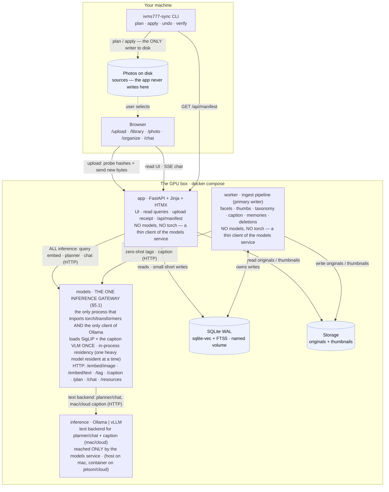
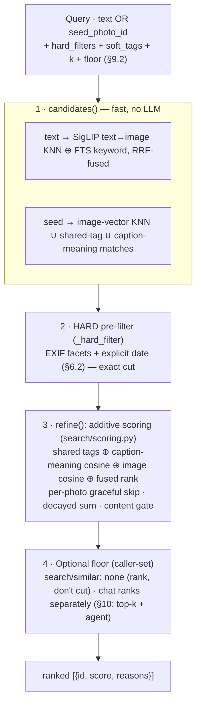
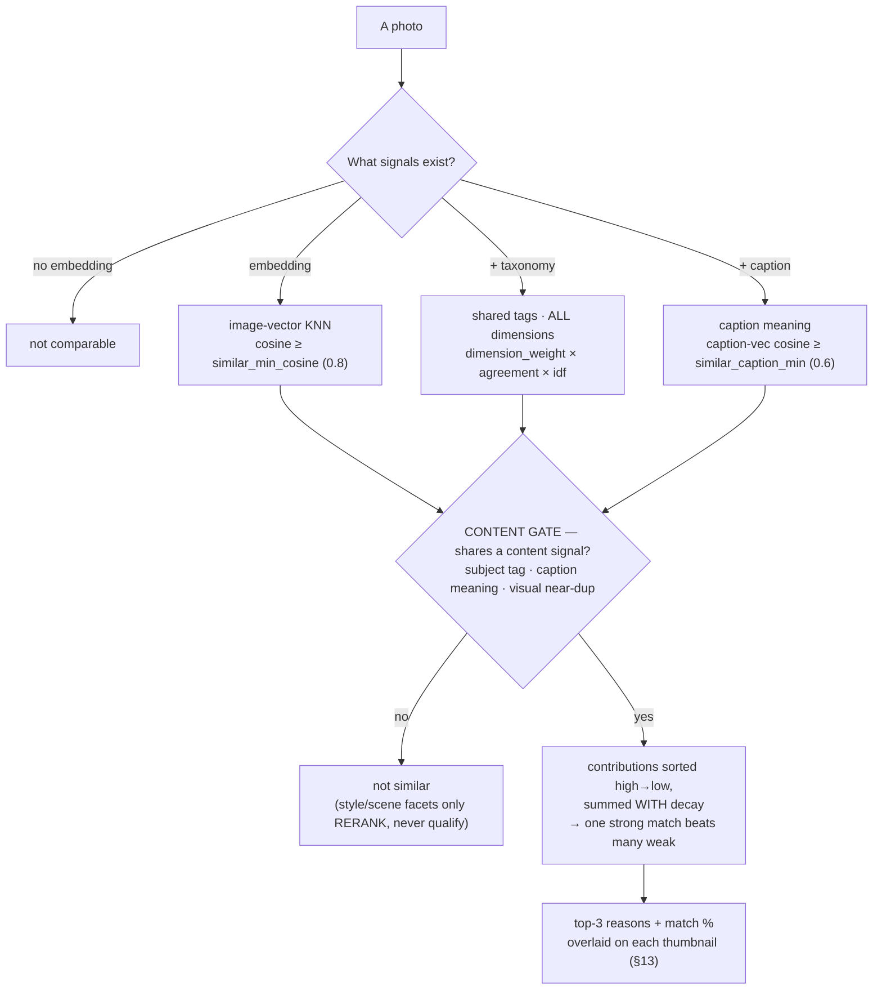
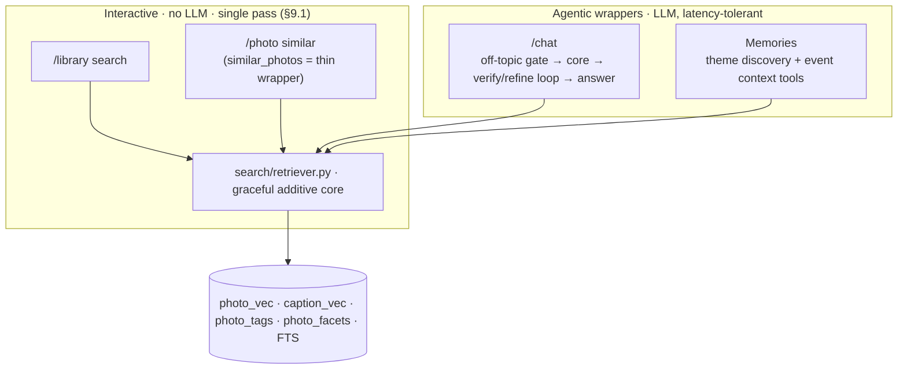
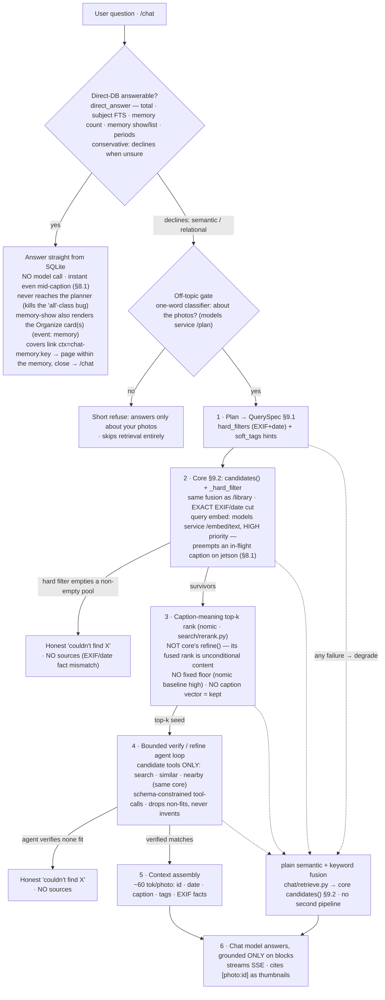
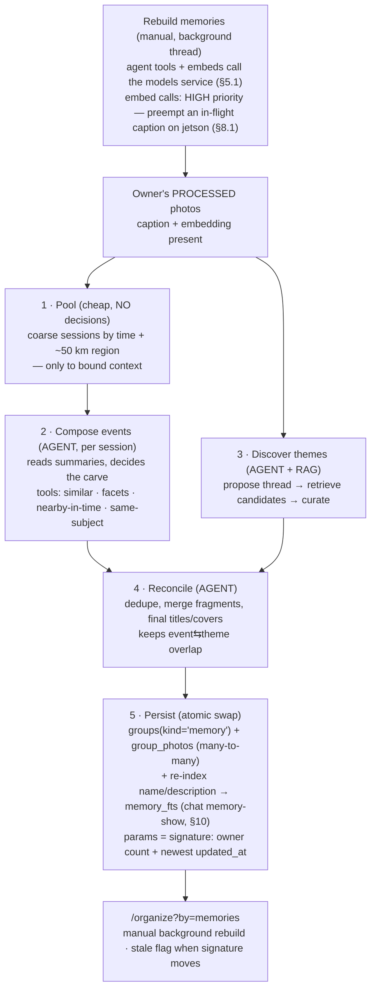

# Photo Library Organizer — Design

Status: approved design, ready for implementation planning
Date: 2026-08-13

## 1. Goal

A Python service with a simple web UI, deployed on a GPU box you control. It
works in two stages.

**Stage 1 — understand, in the cloud.** You select photos in the browser and
upload them. The service classifies every photo, writes a description and tags,
and lets you search, filter, find similar photos, browse suggested groups, and
ask questions about the collection in plain language.

**Stage 2 — reorganize, on your machine.** When the collection is fully
processed, `ivms777-sync` — a small standalone CLI that runs on the machine
holding the photos — downloads the collection state and applies it to disk: it
sorts files into a chosen folder layout, renames them consistently, and sweeps
redundant copies aside. It plans first and shows you every operation before it
touches anything.

The two stages share nothing but a manifest. The cloud never reaches into your
filesystem; the CLI never needs your library uploaded a second time.

All inference runs on hardware you control. Photos never go to a third-party
API.

## 2. Non-goals (v1)

- Face detection and person clustering. Deferred to v2.
- Authentication, signup, and per-user quotas. Deferred to v02; see section 3.2.
- Editing or rating photos in the cloud UI. The only thing that ever writes to
  your disk is `ivms777-sync`, and only on explicit confirmation.
- Cloud model APIs of any kind.
- Video files.

## 3. Constraints and targets

### 3.1 Deploy profiles

The same code runs in three places, selected by a base `compose.yaml` plus one
per-profile overlay (`compose.mac.yaml` / `compose.jetson.yaml` / `compose.cloud.yaml`).
The differences are which inference service is active, which model name is in
config, and — on `jetson` only — which app image is built (see "Jetson image"
below). Ingest is identical everywhere — photos always arrive by upload
(section 3.2b), so no profile depends on a host bind mount.

| Profile | Inference | Caption model | Planner / chat model | Embed device |
|---|---|---|---|---|
| `mac` | Ollama on the **host** | `qwen2.5vl:7b` | `qwen2.5:3b` | `cpu` |
| `jetson` | Ollama in a container (text only, see below) | Qwen2.5-VL-3B, 4-bit, **in-process** | `qwen2.5:3b` (Ollama) | `cuda` |
| `cloud` | vLLM in a container, `--gpus all` | `qwen2.5vl:7b` | `qwen2.5:3b` | `cuda` |

The caption model must be **vision-capable**. On `mac`/`cloud` the tags above are
the shipping defaults in `config.py` — real, currently-pullable Ollama models —
overridable with `IVMS777_CAPTION_MODEL` / `IVMS777_PLANNER_MODEL`. On `jetson`
the caption model is instead a Hugging Face repo id (`caption_model_id`, default
`Qwen/Qwen2.5-VL-3B-Instruct`), since it loads in-process rather than through
Ollama — see below. The "Gemma 4" family named in the rationale below (§4) is the
intended target once it is available on Ollama; until then Qwen2.5-VL is the
working default.

**Why Ollama runs on the host under `mac`.** Docker Desktop on macOS boots a
Linux VM, and Apple exposes no GPU to Linux guests — there is no Metal in a
container, and no configuration changes that. Apple's own `container` project
does not support GPU passthrough either. Containerised inference on a Mac falls
back to CPU and runs 3-6x slower. Ollama installed natively gets full Metal, and
the containerised app reaches it at `host.docker.internal:11434`.

On Linux this problem does not exist. Under `jetson` and `cloud` everything,
including inference, runs in containers with real GPU access via the NVIDIA
container runtime.

**Why Ollama and not vLLM on Mac and Jetson.** vLLM's Metal backend does not
support vision models, which is the entire workload here, and Docker's own
benchmarks put it 1.2-1.3x behind llama.cpp on Apple Silicon with far more
variance. On Jetson, vLLM's aarch64 build is a maintenance burden. vLLM earns
its place only under `cloud`, where continuous batching genuinely helps with
concurrent users.

**Jetson sizing.** The Orin Nano Super has 8 GB shared between CPU and GPU at
102 GB/s (~7.4 GB usable after firmware). A **fixed ~1.5 GB baseline is gone
before we load anything** — measured on an idle board (JetPack 7.2, no
containers): ~1.1 GB kernel + iGPU/firmware carveout reserved by L4T at boot,
~155 MB kernel slab, ~230 MB system daemons (dockerd, containerd, systemd). This
baseline is **not reclaimable** — it is set in the device tree, not held by any
process, so killing services claws back only tens of MB (headless mode a few
hundred at most; not worth chasing). That leaves roughly **5.8 GB** as the real
model budget, so the 26B A4B model does not fit and a small (3–4B-class) model is
used instead. This works only because **at most one heavy in-process model is
resident at a time** inside the `models` service (§5.1) — SigLIP and the
caption VLM are never both loaded, and an interactive embed call is never left
waiting behind a long caption. That invariant is enforced by the `models`
service's own **in-process residency manager (§8.1, `modelsvc/residency.py`)**,
not by luck of stage ordering: every SigLIP call goes through
`use("siglip", HIGH)` and every caption call through `use("caption", LOW)`, and
on Jetson it evicts whichever of the two is not needed before loading the
other. There is no runtime RAM-budget check the way an arbitrary model-set
would need one — since only ever one heavy model is resident, the swap always
fits by construction (each model's standalone footprint was sized against the
budget above at design time, §8.1). Expect roughly 6-8 s/photo, so about 8-11
hours for 5,000 photos at 25 W. Residency is **config-driven, one
implementation for every profile** — this exclusive swap-on-demand mode runs
only where `caption_backend == "inprocess"` (jetson); on mac/cloud SigLIP is
CPU/ample-RAM and captioning is external Ollama, so there is nothing to swap
(§8.1).

**Jetson device facts (`lockbox-nv`) — verified on the live board 2026-08-16.**
The one target device, for tuning reference:

| Field | Value |
|---|---|
| Board | Jetson Orin Nano **Super** (Engineering Reference Dev Kit) |
| SoC / GPU | Ampere iGPU, **compute capability `sm_87`**, 1024 CUDA cores, 32 tensor cores; GPU clock max **918 MHz** |
| CPU | 6-core Arm Cortex-**A78AE**, max **1.728 GHz** (L1 384 KiB, L2 1.5 MiB, L3 4 MiB) |
| AI perf (spec) | **67 INT8 TOPS** — relevant to *prefill / batched / vision* (compute-bound), **not** single-stream chat decode |
| Memory | **8 GB** 128-bit LPDDR5, **102 GB/s** peak (EMC max **3199 MHz**); ~7.4 GB usable, **~5.8 GB** model budget after the fixed baseline |
| Storage | NVMe **Crucial P310** (`CT1000P310SSD8`) 1 TB; `/` on a 915 GB ext4, ~22% used |
| OS | **Ubuntu 24.04.4 LTS** (noble) |
| L4T / JetPack | **L4T r39.2** (`nvidia-l4t-core 39.2.0`) = **JetPack 7.2** |
| Kernel | **6.8.12-1021-tegra** aarch64, PREEMPT |
| CUDA on host | **runtime only** — `libcuda.so.1` from `/opt/nvidia/l4t-gpu-libs/nvgpu`; **no toolkit, no `nvcc`, no `cmake`/`g++`**. All CUDA/toolchain (cu132) is per-container. |
| Container CUDA | **CUDA 13.2** (cu132) inside images |
| Docker | **29.6.2**, `default-runtime = nvidia` (so `runtime: nvidia` is implicit), overlay2, cgroup v2 |
| Python (host) | 3.12.3 |
| Power modes | `nvpmodel` IDs: **`0`=15W, `1`=25W, `2`=MAXN_SUPER**. `jetson_clocks` then locks max clocks. |
| Access | `lockbox@192.168.100.8` (`lockbox-nv.local`); **passwordless SSH**, but **`sudo` needs a password** |

**Power mode is the single dominant lever — set MAXN_SUPER.** The board ships in
**`25W` (ID 1)**, which throttles the GPU to ~306 MHz and the memory controller
(EMC) to ~2133 MHz (~68 GB/s), even though thermals are cool (~49 °C).
`sudo nvpmodel -m 2 && sudo jetson_clocks` switches to **MAXN_SUPER**: GPU locks
to **1020 MHz** and EMC to **3199 MHz** (full 102 GB/s). The `nvpmodel` mode
persists across reboot; **`jetson_clocks` does not** — a small boot service must
re-apply it. Fix this before blaming any stack.

**Benchmark (verified 2026-08-16, `qwen2.5:3b` 4-bit, single-stream decode,
server-reported tok/s):**

| Engine / config (single-stream) | 25 W | **MAXN_SUPER** | scaling |
|---|---|---|---|
| **vLLM `0.22` tuned — AWQ-Marlin + CUDA graphs** | — | **36.3** | winner |
| **`gemma4:e2b`** (Ollama stock, 1.8 GB resident) | — | **26.1** | — |
| **Ollama** `qwen2.5:3b` `Q4_K_M` (stock) | 3.0 | **23.5** | **7.8×** |
| Ollama `qwen2.5:3b` + flash-attn (f16 KV) | — | 23.5 | — |
| Ollama `qwen2.5:3b` + flash-attn + `q8_0` KV | — | 22.9 | — |
| vLLM `0.22` (bnb, `--enforce-eager`) | 5.7 | 7.0 | 1.2× |
| `models` image transformers (bnb-nf4) | 4.6 | 5.7 | 1.2× |

Ollama **config tuning does not add text speed**: `OLLAMA_FLASH_ATTENTION=1`
(23.5, unchanged) and `+OLLAMA_KV_CACHE_TYPE=q8_0` (22.9, slightly slower) only
cut attention/KV memory — a tiny slice of a batch-1 3B decode, which is bound on
reading the ~2 GB of weights per token. So stock Ollama is already at its
single-stream ceiling; those knobs are **memory savers, not speedups**. Going
faster needs a **smaller model** (`gemma4:e2b` = 26.1) or a **different engine**
(tuned vLLM = 36.3), not Ollama flags.

Two independent findings:

- **Power mode is the ~8× lever.** Ollama scales 3.0 → 23.5 with MAXN because
  llama.cpp's *fused* GGUF kernels are **memory-bandwidth bound**, so unlocking
  EMC clocks lifts it straight to **~40% of the ~56 tok/s ceiling** (4-bit 3B ÷
  102 GB/s) — *usable* chat, no code change. The earlier "Ollama kernels are
  unoptimized" guess was wrong; it was throttled.
- **Engine tuning is the second lever.** The bnb + `--enforce-eager` vLLM/
  transformers rows are **software-overhead-bound** (per-token dequant + Python
  dispatch, GPU mostly idle), so the clock unlock barely helps them (1.2×). Swap
  bnb → **AWQ-Marlin** and turn **CUDA graphs on** and vLLM becomes hardware-
  bound too: **36.3 tok/s, ~1.5× Ollama** (verified; AWQ-Marlin + CUDA graphs
  both run on Orin `sm_87`, no error). transformers stays slow — torch-2.13's
  Triton-eager routing (the `sm_87` note below) — and is a dead end for text.

**But speed is not the only axis on 8 GB.** vLLM reserves VRAM *statically* and
has a hard floor: at `--gpu-memory-utilization 0.45` (~3.3 GB) it still runs full
speed (**35.8 tok/s** with CUDA graphs), but **0.40 (~3.0 GB) and below OOM** —
weights + the CUDA-graph pool + minimum KV do not fit. You **cannot** trade that
graph memory back for footprint: `--enforce-eager` at the same util drops it to
**16.6 tok/s**, so graphs *are* the speed. **vLLM's fast floor is ~3.3 GB and it
cannot reach Ollama's ~2.1 GB.** That still **fights the one-heavy-model-resident
budget** (§8.1): the caption VLM peaks ~2.7 GB, and a *continuously* resident
3.3 GB vLLM + 2.7 GB caption + ~1.5 GB baseline ≈ 7.5 GB blows the ~5.8 GB budget
when both are live. Ollama holds a smaller (~2.1 GB), *evictable* footprint
(keep-alive) that fits the swap design far more comfortably. So the standing
recommendation is **MAXN_SUPER + keep Ollama for text** (23.5 tok/s, fits memory,
zero change); tuned vLLM (35.8) is the upgrade path *iff* a memory-co-existence
test confirms it fits alongside SigLIP + caption in the ~5.8 GB budget. Single-stream decode is
bandwidth-bound, so 4-bit (fewer bytes/token) is the *fast* choice and the 67
INT8 TOPS does not help chat latency; an `sm_87`-native build is **not** the
first lever — power mode is.

**GPU vision IS achievable — via a source-built `sm_87` llama.cpp (verified
2026-08-16).** Stock Ollama runs the vision projector (CLIP/`mmproj`) on **CPU**
(~190–211 s/image — the reason captioning went in-process). But a `llama.cpp`
built `-DGGML_CUDA=ON -DCMAKE_CUDA_ARCHITECTURES=87` (inside the
`ghcr.io/nvidia-ai-iot/ollama:…cu130` image, which carries nvcc/cmake; the cu130
binary runs on the cu132 driver, no crash), run with the projector **on GPU**
(default offload) + `-ngl 99 --flash-attn on --jinja -c 4096`, measures — one
GGUF serving **both** text and vision:

| Model (`sm_87` llama.cpp, GPU, MAXN) | Text tok/s | Vision (image encode) |
|---|---|---|
| **`gemma4-E2B`** (Q4_K_M + f16 mmproj) | **30.0** | **0.57 s/img** |
| `Qwen2.5-VL-3B` (Q4_K_M + Q8 mmproj) | 23.5 | 13.8 s/img |

`gemma4-E2B` wins on **both** axes: faster text than Ollama (30 vs 26.1) and
**~24× faster vision** than Qwen (0.57 s vs 13.8 s — Qwen emits ~2048 image
tokens, gemma far fewer). CPU projector (`--no-mmproj-offload`) is ~149 s for
Qwen, so GPU offload is ~10–370×. `gemma4` **requires `--jinja`** (its chat
template aborts otherwise — the cause of the earlier Ollama "empty caption").
This is the basis of plan `16` (single Gemma on a `llama-server`, text + vision on
GPU, replacing qwen-text + the in-process VLM, and dropping Ollama on jetson).

The shipping default is `qwen2.5:3b` for the planner — an **Ollama tag**, pulled
into the in-container Ollama — and Qwen2.5-VL-3B for captioning, an **in-process**
Hugging Face model (`config.py`'s `caption_model_id`,
`Qwen/Qwen2.5-VL-3B-Instruct`), fetched from Hugging Face on first use and never
an Ollama tag on jetson. Both fit the 8 GB budget. `gemma4:e4b` is the intended
captioner alternate once the Gemma 4 family lands on Ollama with working Orin
vision (§4); until then Qwen2.5-VL is the working default. `IVMS777_PLANNER_MODEL`
overrides the planner tag — `make run-jetson` passes it through and pulls it into
the in-container Ollama, so what runs matches what was pulled. `IVMS777_CAPTION_MODEL`
still exists (`config.py`'s `caption_model`, used for the resource bar's display
label, §8.1) but on jetson names no Ollama pull — the real in-process weights come
from `caption_model_id`, downloaded from Hugging Face into the mounted cache the
first time a caption runs, not by `make run-jetson`. Published benchmark scores do
not settle the captioner choice on their own — the phase 1 bake-off decides it on
real photos.

**Jetson image.** Only the `models` service needs GPU/torch on Jetson —
`app`/`worker` build from the same generic `Dockerfile` as every other profile
(`python:3.12-slim`, CPU-only PyPI `torch`), and never import it: they are thin
HTTP clients (§5.1). The `models` service instead builds from a dedicated
**`Dockerfile.models.jetson`** (repurposed from the old `Dockerfile.jetson`,
which used to build `app`/`worker` directly, back when SigLIP ran in-process
there) — which, on **JetPack 7** (L4T r39, CUDA 13.2), is the *same*
`python:3.12-slim` image as the mac/cloud `Dockerfile.models` with **one
change: `torch` + `torchvision` come from the CUDA-13.2 index**
(`https://download.pytorch.org/whl/cu132`) instead of the CPU PyPI wheel.
JetPack 7 exposes the Orin as **SBSA**, so those upstream CUDA-13.2 wheels run
on the iGPU directly, and the NVIDIA container runtime (`runtime: nvidia`)
hands that iGPU to the two containers that need it — inference (Ollama) and
`models`; `app`/`worker` declare no GPU access at all. The `models` container
must also declare `NVIDIA_VISIBLE_DEVICES=all` + `NVIDIA_DRIVER_CAPABILITIES=all`:
unlike the Ollama image, the `python:3.12-slim` base does not set them, and
without them the runtime injects no driver libs, so `libcuda` is absent and
`torch.cuda.is_available()` is `False`. There is **no jetson-containers, no
dusty-nv base image, and no `autotag`**: JetPack 7 ships system Python 3.12,
matching `pyproject.toml`'s `>=3.12` floor, so the image runs the normal `uv
sync --extra models` from `pyproject.toml` and then reinstalls
`torch`/`torchvision` from the cu132 index over the CPU torch that `uv sync`
brought. `numpy` stays on `pyproject`'s `>=2.5.2` — the cu132 wheels are built
against NumPy 2.x, so no Jetson-specific numpy pin is needed.

**Captioning runs in-process on jetson; text stays on Ollama.** Ollama's CUDA
build ships no Orin `sm_87` vision kernels, so on JetPack 7 a vision request
silently falls back to running CLIP on the CPU — roughly 20x slower than the GPU
path, and the reason captions used to stall out or hang indefinitely. Rather than
chase a matching NVIDIA JetPack-7 Ollama build, `jetson` moves captioning
**in-process, inside the `models` service**: `Dockerfile.models.jetson` loads
**Qwen2.5-VL-3B in 4-bit** directly via `transformers` (`captioning.VLMCaptioner`,
§4, wrapped by `modelsvc.backends.caption_backend.CaptionBackend`) onto the same
cu132 GPU that already serves SigLIP — never co-resident with it, at most one of
the two is ever loaded (§8.1) — resident at roughly **2.7 GB**, well inside the
~5.8 GB Jetson budget. This needs three extra image dependencies, jetson-only,
never installed on the mac/cloud `Dockerfile.models`: `gcc` (Triton JIT-compiles
the `bitsandbytes` quantization kernels at import time, and the slim base ships
no C compiler), `bitsandbytes` (the 4-bit quantization), and `accelerate`
(device placement for `from_pretrained`). Text inference — the query planner,
chat, and the caption-embedding call — is unaffected and keeps running on
Ollama in the generic `ollama/ollama:latest` image, reached only through the
`models` service (§5.1); only the vision path moved off it.

> **NOTE — Orin `sm_87` (confirmed 2026-08-16, see the device-facts block in
> §3.1).** This is no longer a "maybe": the generic cu132 wheels **do not** ship
> `sm_87` cubins, so kernels JIT from PTX or fall back — the root cause of the
> uniformly slow (~3–6 tok/s) text decode measured on the board. Worse, the
> **unpinned `uv pip install --reinstall torch torchvision --index-url .../cu132`
> below now resolves to `torch 2.13.0+cu132`, whose build explicitly EXCLUDES
> `sm_87`** (warns "8.0 … except {8.7}") and routes Qwen2's forward through a
> Triton JIT kernel that needs C headers the slim base lacks (`stdlib.h` missing
> → `libc6-dev`). Fix direction: **pin `torch` to a version that carries `sm_87`
> cubins** (or use an NVIDIA Jetson wheel index), and ship an `sm_87`-native
> inference build (`TORCH_CUDA_ARCH_LIST=8.7`). Because the base is Python 3.12
> everywhere, the source no longer has a Python-3.10 compatibility constraint.

### 3.2 Multi-tenancy

v1 ships as a single-user product with multi-user bones. There is **no auth, no
login, no user table, no admin role, no signup, and no quotas**. There is one
implicit owner, and `owner_id` is a constant. Deploy it behind a private URL or
a reverse proxy that requires a password.

But three things are cheap now and expensive to retrofit, so they are in from
the start:

- `owner_id` on every user-scoped row and in every query.
- Photo bytes reached through a `Storage` interface (local filesystem now,
  object storage later).
- Inference reached through one HTTP client, so swapping Ollama for vLLM is a
  config change.

v02 adds accounts, signup, and quotas on top of this. Because upload is already
the only ingest path and every row is already owner-scoped, that is an additive
change: no data migration, no rewrite of every query.

### 3.2b Getting photos in — upload

Photos arrive by browser upload. There is no host bind mount, no server-side
folder picker, and no path the server walks. The server never sees your
filesystem; it sees the bytes you chose to send.

The upload screen accepts a whole directory (`<input webkitdirectory>`) or a
drag-and-drop selection, and runs in three steps:

1. **Hash locally.** A Web Worker computes each file's SHA-256, one file at a
   time, off the main thread. WebCrypto has no incremental digest, so a file is
   read whole — handling them one at a time bounds memory to the largest single
   photo rather than the size of the selection. Nothing is sent yet.
   `crypto.subtle` exists only in a *secure context* (HTTPS or `localhost`), but
   the app is normally reached over plain HTTP on the LAN (`http://<jetson>:8000`)
   where it is `undefined`; so the worker falls back to a pure-JS SHA-256 there.
   The fallback digest is byte-identical to the server's `hashlib.sha256`, which
   step 2's probe and step 3's server-side verification both depend on.
2. **Ask what is new.** The client POSTs each hash *with the path it came from*
   to `/api/upload/probe`, which answers with the subset whose bytes the server
   has never seen. Paths for content it already holds are recorded on the spot —
   that is what keeps duplicate detection correct when no bytes move.
   Re-uploading a folder you already sent transfers nothing.
3. **Send the new bytes.** Files upload in bounded concurrent batches with a
   per-file progress row. The relative path from the selected root travels
   alongside each file and is recorded, because that path is what stage 2 needs
   to find the file again on disk.

Interruptions are cheap: closing the tab loses only in-flight files, and
restarting the upload re-probes and resumes with what is still missing. The
server verifies the hash of every received file before storing it, so a
truncated transfer is rejected rather than indexed.

Originals are kept. They are written through the `Storage` interface under a
content-addressed key and are needed for full-resolution viewing and for
re-processing the library when a better model arrives.

**Why upload rather than a host mount.** A mounted folder is faster and copies
nothing, but it only works when the app runs on the same machine as the photos.
That constraint defeats the point of a hosted GPU. Upload costs disk and a first
transfer; in exchange, ingest is one code path on every profile, the container
boundary needs no holes, and the same deployment serves a user who is nowhere
near it.

**Why not have the browser reorganize files directly.** The File System Access
API can write to a user-picked directory, but only on Chromium desktop — Firefox
has no directory picker, Safari is read-only, and mobile has neither. Stage 2 is
a CLI instead, which works on every OS and has no browser to disagree with.

### 3.2c The upload folder list, and deleting a folder

The library is organised as a **list of folders** — one per distinct
`uploads.root_label` — persisted in the database, so it survives restarts (the
browser file picker cannot remember a selection). `/upload` shows every folder
with its live photo count; a directory-only picker adds a new one and uploads its
photos into the library.

**Deleting a folder removes it from the LIBRARY, never from disk.** The source
folder on the user's machine is a *source* and is never read, moved, or deleted by
the app (§3.2b) — deletion only removes the library's uploaded copies and their
derived state. It removes: the folder's `uploads` rows, every photo sourced only
from that folder, and *all* of each deleted photo's metadata — `photo_vec`,
`caption_vec`, tags, facets, FTS row, jobs, group memberships, thumbnails, and the
stored original. A photo whose identical bytes still belong to another folder is
kept; only that folder's `photo_sources` path is dropped.

A memory (§11) whose photos all lived in the deleted folder is left with no
`group_photos`; the cascade prunes that now-empty `groups(kind='memory')` row and
its `memory_fts` entry, so a memory the delete emptied disappears from Organize and
chat search in lockstep — never lingering as a coverless, crash-prone orphan.

**Deletion runs through an outbox + worker**, never inline. `POST
/upload/folder/delete` records the intent in `folder_deletions` and returns
immediately; the folder shows "deleting…". The worker drains the outbox each pass
(`process_folder_deletions`) and does the cascade, so a delete is reliable across
restarts and never blocks the UI. This is the Outbox pattern.

### 3.3 Scale

- Collection: 1,000-5,000 photos for the first user.
- First upload of 5,000 photos is a background transfer measured in tens of
  minutes; the first full index may run overnight. Both must be resumable and
  observable.
- The cloud never modifies an uploaded original. Only `ivms777-sync` writes to
  your disk, only after you confirm a plan, and every operation it performs is
  journaled and reversible (section 12).

## 4. Models

**All of these run inside the one `models` service (§5.1), loaded once — never in
`app`/`worker`.** The "where it runs" column is the *service's* backend for each.

| Role | Model | Backend (inside the `models` service) |
|---|---|---|
| Image and text embeddings, zero-shot tags | SigLIP 2 `so400m-patch14-384` | in-process `transformers` — CPU (mac) / CUDA (jetson) |
| Captions and structured tags | per profile: Ollama VLM `qwen2.5vl:7b` (mac/cloud) **or** Qwen2.5-VL-3B 4-bit (jetson) | mac/cloud: proxied to Ollama · jetson: in-process (`transformers`, cu132 GPU) |
| Query planning, chat answers | `qwen2.5:3b` (Gemma 4 E4B intended) | proxied to Ollama |
| Caption text embeddings (§9 similar) | `nomic-embed-text` (dedicated text embedder) | proxied to Ollama (mac + jetson) |

Captioning goes through a **`captioning.Captioner` adapter** (a `caption()` /
`load()` / `release()` / `footprint_mb()` protocol), not a hardcoded HTTP call,
because the two profiles use fundamentally different transports: `OllamaCaptioner`
wraps today's OpenAI-compatible HTTP path (mac/cloud, byte-identical to before),
and `VLMCaptioner` runs Qwen2.5-VL-3B 4-bit in-process via `transformers` on the
Jetson's cu132 GPU (§3.1). Both return the same `CaptionResult`, so the `models`
service's `CaptionBackend` (`modelsvc/backends/caption_backend.py`, §5.1/§8.1) —
the one place that now constructs and calls a `Captioner` — is written once
against the protocol and never branches on profile; the ingest `caption` stage
(§8) itself never touches a `Captioner` at all, it just calls the service's
`/caption` over HTTP. `config.py`'s `caption_backend` setting (`"ollama"` vs
`"inprocess"`) selects which adapter `modelsvc/backends/__init__.py` constructs.

The caption text is embedded by a **dedicated text embedder, `nomic-embed-text`**
(`config.text_embed_model`), served by Ollama on mac and jetson alike, with the
model's required `search_query:` / `search_document:` task prefixes
(`embedding/caption_text.py`). NOT the planner (a chat model has no embedding head —
Ollama returns `501`) and NOT SigLIP (its text tower is trained image↔text, so
text↔text has no separation — measured). `nomic` was chosen by a benchmark on real
captions (below); it ties the alternatives on recall while being the smallest and
fastest, which decides it for the 8 GB Jetson. The resulting `caption_vec` is a
**text-meaning retrieval index**, consumed as **top-k KNN** (never a fixed cosine
floor — see §10 and the decision box).

> **DECISION — caption embeddings are the scalable semantic-retrieval index; do not relitigate.**
> `caption_vec` exists to **vector-search meaning-similar captions** (top-k KNN) so a query
> pulls a handful of candidates out of a library of millions **without the LLM ever looping
> over rows**. It is NOT an LLM "read each caption and decide" step, and NOT a rerank
> guardrail — it is the retrieval index. Consequences, settled and measured:
>
> 1. **Embedder = a dedicated text embedder (`nomic-embed-text`), with the required
>    `search_query:` / `search_document:` prefixes.** SigLIP's text tower was tried and
>    **measured inadequate**: it is trained for *image↔text*, so *text↔text* cosines collapse
>    into a ~0.2–0.45 band with no separation (an ideal "red jacket" match scored 0.41 vs an
>    irrelevant "police car" 0.32). nomic ranks the ideal match clearly on top. **Do not go
>    back to SigLIP for caption text.** SigLIP stays for image↔text search and visual similarity.
>    Benchmarked on the real caption corpus, `nomic` / `mxbai-embed-large` / `bge-m3` **tie on
>    retrieval** (recall@5 0.80, recall@10 0.93, MRR ~1.0); `nomic` wins on **size (274 MB)** and
>    **latency (~46 ms/cap)**, decisive for the 8 GB Jetson — so it is the default.
> 2. **Consume as top-k KNN, NOT a fixed cosine floor.** nomic has a high baseline cosine
>    (unrelated captions ≈ 0.4–0.5), so a fixed floor like `RERANK_FLOOR = 0.4` is meaningless
>    here — rank by similarity and take the nearest k; let the agent/LLM verify that shortlist.
> 3. Served by Ollama on mac and jetson via the inference client (`InferenceClient.embed`,
>    the same Ollama text backend as `/plan` and `/chat`). On the 8 GB jetson it is a second
>    small resident model that swaps with the planner in Ollama; the split caption/embed
>    stages (§8) keep it off the caption VLM's residency slot. (Routing it, like text
>    generation, fully through the models service is the remaining plan-15 gateway work.)
>
> Status: **implemented** — write (`backfill_caption_vectors`, pipeline group 2c) and read
> (chat top-k rerank, §10) both embed with `nomic-embed-text`; benchmarked on real captions.

Gemma 4 is the *intended* default family on `mac` and `cloud` once it lands on
Ollama; **today all profiles run Qwen2.5** (`config.py` — captioner `qwen2.5vl`,
planner `qwen2.5:3b`), and the Jetson profile runs a 4B-class model that may be
Qwen3-VL. Caption and planner prompts therefore live
in a per-model template registry in `inference/prompts.py`, keyed by model name,
with a shared JSON schema all templates must satisfy. Adding a model means
adding a template, not touching the pipeline.

Gemma 3 is dominated on every axis — Gemma 4 12B beats Gemma 3 27B by roughly 20
MMMU-Pro points at a third of the memory — and is not used.

SigLIP 2 outperforms OpenCLIP on zero-shot and retrieval. It stays in-process
rather than behind the inference service because neither Ollama nor vLLM exposes
an image-embedding endpoint. On `mac` it runs on CPU inside the container:
roughly 1 s/photo, so about 1.5 hours one-time for 5,000 photos, and about 30 ms
per search query. That one-time cost is the price of containerising the app on a
Mac.

**Model download.** On `mac`/`cloud`, caption and planner models are pulled by
the inference service on first use (`ollama pull`, or vLLM's Hugging Face fetch)
— nothing to script. On `jetson`, that only covers the **planner**: the
**caption** model is not an Ollama tag there — it is a Hugging Face repo fetched
**in-process** by the caption adapter (`VLMCaptioner`, §3.1) on the first caption
call, into the same mounted HF cache SigLIP uses. SigLIP itself is fetched from
Hugging Face into a mounted cache volume by a startup step that checks free disk
first and reports progress. All these caches survive container restarts.

**Bake-off gate.** Phase 1 includes a script that runs candidate caption models
over the same 50 real photos and reports seconds per photo, memory high-water
mark, and side-by-side captions. On `mac` the candidates are pulled by Ollama
(`gemma4:26b-a4b` against `gemma4:12b`); on `jetson` the candidates (`qwen3-vl:4b`
against `gemma4:e4b`) are fetched from Hugging Face and run **in-process**
exactly like the shipping default (§3.1) — jetson's Ollama container serves the
planner only, never the caption candidates. Because published benchmarks for
these pairs are either close or not directly comparable, the bake-off is how the
default is actually chosen. The winner becomes the default in config, not in
code.

## 5. Architecture

Three containers and one SQLite file in the cloud. One standalone binary on your
machine.

This diagram is the **canonical architecture picture** — keep it in step with the
components and flows described in this section (CLAUDE.md § "docs/design.md is the
source of truth").



`app` serves the UI, read queries, upload receipt, and the manifest endpoint.
`worker` owns the ingest pipeline and is the primary writer. Both open the same
SQLite file in WAL mode with a busy timeout — SQLite permits one writer at a
time, and `app`'s writes are small and short (recording a received upload,
accepting a group, editing vocabulary), so contention stays negligible at this
scale. If public traffic ever makes that false, the fix is Postgres, and the
repository layer is the only thing that changes.

**All model work lives in one process — the `models` service (§5.1).** `app` and
`worker` never import torch/transformers or load a model; they call the `models`
service over HTTP. This is the hard rule (CLAUDE.md § "One model process"): a model
or AI library is loaded **once**, in one process, never duplicated across
containers. It is what makes the 8 GB Jetson viable — a SigLIP loaded in both `app`
and `worker`, each with its own torch CUDA context, is exactly what exhausted the
unified memory.

**One implementation, both platforms.** The `models` service is the same code on
mac and jetson; only its *internals* switch by profile: SigLIP runs on **CPU** on
mac and **CUDA** on jetson, and captioning uses the **host Ollama** on mac (Metal
vision works) versus the **in-process VLM** on jetson (Ollama's CUDA vision is
broken on JP7, §3.1). The service picks these from config; `app`/`worker` and the
whole request flow are identical across platforms.

`ivms777-sync` is not part of the deployment. It talks to `app` over HTTP,
reads one endpoint, and is the only component that ever writes to your disk.

Vector search uses `sqlite-vec`, which ships prebuilt wheels for arm64 and
x86_64, so the same code works on Mac, Jetson, and cloud. At 5,000 photos a
brute-force scan would also be fine; `sqlite-vec` is there so growth to 100k+
needs no new component.

### 5.1 The `models` service — the one inference gateway

**Every model, LLM, embedder, and heavy AI library lives in exactly one process:
the `models` service.** It is the only process that imports `torch`/`transformers`,
the only one that loads SigLIP or the caption VLM, and the only client of Ollama.
`app`, `worker`, and the CLI hold **no models and no torch** — they are thin HTTP
clients of this service (CLAUDE.md § "One model process"). Loading the same model
in two processes is forbidden; on the 8 GB unified-memory Jetson a duplicated
SigLIP plus two torch CUDA contexts is exactly what exhausted memory.

**HTTP surface** (the whole app's inference vocabulary):

- `POST /embed/image` — SigLIP image embeddings (ingest `embed`, "similar").
- `POST /embed/text` — SigLIP **text** embeddings for search/chat query vectors
  (same joint space as the image vectors).
- `POST /tag` — SigLIP zero-shot scoring against `vocab.yaml` (ingest `taxonomy`).
- `GET /embed/calibration` — SigLIP's zero-shot calibration (`logit_scale`,
  `logit_bias`); `RemoteEmbedder` fetches and caches this once so taxonomy
  scoring (§9) can stay client-side (ingest keeps computing tag probabilities
  itself, over `embed_text` + this calibration — nothing server-side changes).
- `POST /caption` — a caption + structured tags for one image.
- `POST /plan`, `POST /chat` — text generation (query planner, chat answers).
- Caption-meaning text embeddings (§9) use the **dedicated text embedder
  `nomic-embed-text`** over Ollama (`InferenceClient.embed`, the same Ollama text
  backend as `/plan` / `/chat`) — NOT `/embed/text` (that is SigLIP, image↔text only).
  Consumed as top-k KNN (§10). Routing this through the models service is pending
  plan-15 gateway work.
- `GET /resources` — what is resident + memory + **GPU load** (this is the only
  process with GPU access, so it is the one that reads it), for the resource bar (§13).

**Backends, chosen by profile inside the service (one implementation, both
platforms):**

- **SigLIP** in-process — `embed_device=cpu` on mac, `cuda` on jetson/cloud.
- **Captioning** — mac/cloud proxy to Ollama's vision model (Metal/GPU vision
  works there); **jetson runs the caption VLM in-process** (Qwen2.5-VL-3B 4-bit via
  `transformers`, because Ollama's CUDA build has no Orin `sm_87` vision kernels —
  §3.1).
- **Text** (`/plan`, `/chat`, and the `nomic-embed-text` caption embedder) — proxied to
  Ollama (host on mac, container on jetson/cloud). SigLIP/caption/tag already go **only**
  through the `models` service; text generation and the caption embedder still reach Ollama
  via a shared `InferenceClient` in `app`/`worker` (transitional — Ollama is the single
  loader, so no model is duplicated; consolidating text behind the gateway is the remaining
  plan-15 work).

**Residency is coordinated in-process here** — there is no cross-process DB lease.
On the 8 GB Jetson the service keeps at most **one heavy in-process model resident
at a time** (SigLIP ~1.6 GB **xor** the caption VLM ~2.7 GB), loading/freeing on
demand within a RAM budget; an interactive request (a chat/search query embed)
**preempts** an in-flight caption via a simple in-process priority, then the worker
resumes captioning. Because all model memory now lives in this single process, the
budget is real and local — no second process can hold a hidden copy.

This **retires the earlier cross-process model lease** (`model_lease`) and the
two-process `ModelCoordinator`: with models in one process, residency is an
in-process concern (§8.1, `modelsvc/residency.py`), and `app`/`worker` need no
coordination because they hold nothing to coordinate. `models/coordinator.py`
keeps only a torch-free no-op stub (`NoopCoordinator`) so `app`/`worker` call
sites need no edit; it never loads, refuses, or leases anything.

## 6. Data model

```sql
-- one row per distinct image, keyed by its bytes
photos (
  id              INTEGER PRIMARY KEY,
  owner_id        INTEGER NOT NULL,
  content_hash    TEXT NOT NULL,      -- sha256 of file bytes; the identity
  storage_key     TEXT NOT NULL,      -- where the original lives in Storage
  phash           TEXT,               -- perceptual hash, near-duplicate groups
  bytes           INTEGER,
  width           INTEGER,
  height          INTEGER,
  shot_at         TEXT,               -- EXIF DateTimeOriginal, ISO-8601
  camera          TEXT,
  lens            TEXT,
  gps_lat         REAL,
  gps_lon         REAL,
  thumb_key       TEXT,
  caption         TEXT,
  caption_model   TEXT,
  caption_vec     BLOB,               -- caption text embedding, for §9 similarity
  embedding_model TEXT,
  exif_json       TEXT,               -- full EXIF as captured, for reference
  created_at      TEXT NOT NULL,
  updated_at      TEXT NOT NULL,
  UNIQUE(owner_id, content_hash)
);
CREATE INDEX photos_owner_shot ON photos(owner_id, shot_at);

-- every local path these bytes arrived from; >1 row means a duplicate on disk
photo_sources (
  id          INTEGER PRIMARY KEY,
  photo_id    INTEGER NOT NULL REFERENCES photos(id) ON DELETE CASCADE,
  upload_id   INTEGER NOT NULL REFERENCES uploads(id) ON DELETE CASCADE,
  rel_path    TEXT NOT NULL,          -- path relative to the selected root
  filename    TEXT NOT NULL,
  mtime       REAL,
  UNIQUE(photo_id, rel_path)
);
CREATE INDEX photo_sources_photo ON photo_sources(photo_id);

-- EXIF-derived facets: exact, queryable, never model-guessed
photo_facets (
  photo_id   INTEGER NOT NULL REFERENCES photos(id) ON DELETE CASCADE,
  key        TEXT NOT NULL,           -- camera_make, iso, year, time_of_day, ...
  value_text TEXT,                    -- set for categorical facets
  value_num  REAL,                    -- set for numeric facets, enables ranges
  PRIMARY KEY (photo_id, key)
);
CREATE INDEX photo_facets_lookup ON photo_facets(key, value_text);
CREATE INDEX photo_facets_range  ON photo_facets(key, value_num);

-- sqlite-vec virtual table; rowid joins to photos.id
CREATE VIRTUAL TABLE photo_vec USING vec0(
  embedding float[1152]
);

tags (
  id        INTEGER PRIMARY KEY,
  dimension TEXT NOT NULL,
  label     TEXT NOT NULL,
  UNIQUE(dimension, label)
);

photo_tags (
  photo_id INTEGER NOT NULL REFERENCES photos(id) ON DELETE CASCADE,
  tag_id   INTEGER NOT NULL REFERENCES tags(id),
  score    REAL NOT NULL,             -- 0..1
  source   TEXT NOT NULL,             -- siglip | vlm | exif | pixel | user
  PRIMARY KEY (photo_id, tag_id, source)
);
CREATE INDEX photo_tags_tag ON photo_tags(tag_id);

jobs (
  photo_id   INTEGER NOT NULL REFERENCES photos(id) ON DELETE CASCADE,
  stage      TEXT NOT NULL,           -- thumbnail | embed | taxonomy | caption
  status     TEXT NOT NULL,           -- pending | running | done | failed
  attempts   INTEGER NOT NULL DEFAULT 0,
  error      TEXT,
  updated_at TEXT NOT NULL,
  PRIMARY KEY (photo_id, stage)
);
CREATE INDEX jobs_pending ON jobs(stage, status);

groups (
  id          INTEGER PRIMARY KEY,
  owner_id    INTEGER NOT NULL,
  kind        TEXT NOT NULL,          -- event | cluster | duplicate | memory
  name        TEXT NOT NULL,          -- AI-written title for a memory
  description TEXT,                   -- AI-written story for a memory
  params      TEXT,                   -- JSON, how it was generated; carries the
                                      -- library signature a memory was built from
  status      TEXT NOT NULL,          -- suggested | accepted | dismissed
  created_at  TEXT NOT NULL
);

group_photos (
  group_id INTEGER NOT NULL REFERENCES groups(id) ON DELETE CASCADE,
  photo_id INTEGER NOT NULL REFERENCES photos(id) ON DELETE CASCADE,
  rank     REAL,
  PRIMARY KEY (group_id, photo_id)
);

uploads (
  id            INTEGER PRIMARY KEY,
  owner_id      INTEGER NOT NULL,
  root_label    TEXT NOT NULL,         -- the folder name the user picked
  started_at    TEXT NOT NULL,
  finished_at   TEXT,
  files_offered INTEGER DEFAULT 0,     -- hashes probed
  files_sent    INTEGER DEFAULT 0,     -- bytes actually transferred
  files_failed  INTEGER DEFAULT 0
);

-- Persisted chat transcript (§10). A session groups a conversation; "New
-- session" starts a fresh one. The current session is the owner's latest.
chat_sessions (
  id         INTEGER PRIMARY KEY,
  owner_id   INTEGER NOT NULL,
  created_at TEXT NOT NULL
);

chat_messages (
  id         INTEGER PRIMARY KEY,
  session_id INTEGER NOT NULL REFERENCES chat_sessions(id) ON DELETE CASCADE,
  question   TEXT NOT NULL,
  answer     TEXT NOT NULL,
  sources    TEXT,                     -- JSON array of cited photo ids
  created_at TEXT NOT NULL
);
```

Plus an FTS5 virtual table `photo_fts(caption, tags_text)`, its rows keyed by
`photos.id` and refreshed by the taxonomy and caption stages. Because `tags_text`
is derived from many `photo_tags` rows, the stage rebuilds the row explicitly
(delete-then-insert) rather than through per-row triggers.

`tags` is a shared vocabulary and deliberately has no `owner_id`; ownership
comes from the joined photo. Every user-scoped query filters on `owner_id`, and
a repository-layer helper makes omitting it awkward.

Storing every tag with a `score` and a `source` lets the UI show why a tag is
present, and lets thresholds be tuned per dimension without re-running models.

## 6.1 Exact duplicates

The same image bytes often sit in several folders under different names. Because
a photo is identified by its `content_hash`, this needs no detection pass at
all: the second copy simply adds a row to `photo_sources` against the photo that
already exists. An image stored in five places is one `photos` row with five
sources, so it is embedded, scored, and captioned exactly once, and its bytes
are stored once.

This is what makes upload the cheaper ingest model in practice. The client
probes hashes before sending (section 3.2b), so redundant copies cost one hash
comparison each and no transfer.

There is no separate duplicates screen. A photo with more than one source wears
an `×N` badge in the grid, and its detail page lists every path the bytes were
found at, with the disk space the redundant copies occupy on **your** machine.
Reclaiming that space is stage 2's job, and only after you approve a plan
(section 12).

The earlier design detected duplicates by walking a mounted filesystem, which
required a two-pass scan to tell a move from a copy. Nothing walks a filesystem
now, so that distinction disappears: the client sends what exists, and paths
that stop appearing in later uploads are simply stale sources, marked rather
than deleted.

This is exact, byte-level matching. Visually similar but not identical shots are
near-duplicates and are handled by perceptual hashing in section 11.

## 6.2 EXIF facets — external filters

Model output is a guess. EXIF is a fact. The two are kept in separate tables so
the UI can be honest about which is which, and so a filter on "shot at ISO 3200"
is never diluted by a model's opinion.

Every photo's full EXIF is stored verbatim in `exif_json`. From it, a fixed set
of **facets** is derived into `photo_facets`, each either categorical
(`value_text`) or numeric (`value_num`, so ranges work):

| Group | Facets |
|---|---|
| Camera | `camera_make`, `camera_model`, `lens`, `software` |
| Exposure | `iso`, `aperture`, `shutter_speed`, `focal_length`, `exposure_bias`, `flash`, `exposure_program`, `metering_mode`, `white_balance` |
| Time | `year`, `month`, `weekday`, `hour`, `time_of_day` (night/dawn/morning/afternoon/evening), `is_weekend` |
| Place | `has_gps`, `gps_lat`, `gps_lon`, `place_city`, `place_country` (reverse-geocoded, §11) |
| Image | `megapixels`, `orientation`, `aspect` (portrait/landscape/square) |

Facets are used four ways:

- **Filtering** — sidebar controls on `/library`, with counts. Categorical
  facets are checkboxes; numeric facets are ranges.
- **Sorting** — any numeric facet is a sort key, in addition to capture date.
- **Search** — facet predicates narrow the candidate set before semantic and
  keyword ranking (section 9).
- **Chat** — the query planner emits facet predicates, and retrieved photos
  carry their facts into the answer context, so "what lens did I use most in
  Italy?" is answered from data rather than from captions.

Facets are also a cheap quality signal the models never see: a photo at ISO
12800 with a 1/8 s shutter is probably a noisy handheld night shot, and that is
knowable without inference.

`time_of_day` uses local clock hour from EXIF, which is what a photographer
means by "evening shots". It is not recomputed from GPS and UTC.

## 7. Taxonomy

Ten dimensions, defined in an editable `vocab.yaml`. Users add or remove labels
without touching code. Re-scoring a changed dimension only re-runs the SigLIP
stage, which is cheap.

| Dimension | Example labels |
|---|---|
| `subject` | portrait, group of people, pet, food, architecture, nature, vehicle, document, artwork |
| `setting` | indoor, outdoor, beach, mountain, forest, city street, restaurant, home, office, water, snow |
| `vibe` | cozy, energetic, serene, moody, festive, nostalgic, dramatic, minimal, chaotic, romantic |
| `emotion` | joyful, sad, tense, affectionate, playful, contemplative, neutral |
| `light` | golden hour, blue hour, night, harsh midday, overcast, backlit, neon, candlelit |
| `season_weather` | summer, autumn, winter, spring, rain, snow, fog, clear sky |
| `composition` | close-up, wide shot, aerial, shallow depth of field, symmetry, silhouette, leading lines |
| `palette` | warm, cool, pastel, vivid, monochrome, dark, bright, high contrast |
| `occasion` | birthday, wedding, travel, hike, concert, holiday, everyday, work |
| `quality` | sharp, blurry, noisy, overexposed, underexposed |

Sources per dimension:

- `palette` and `quality` come from cheap pixel statistics first (mean
  saturation, Laplacian variance, histogram clipping). SigLIP refines them.
- All ten get SigLIP zero-shot scores against prompt templates
  (`"a photo with a {label} mood"`). SigLIP is a **per-dimension classifier**,
  not an absolute detector: its raw sigmoid probabilities are tiny (~1e-4) and
  the same across every label, so an absolute floor tags nothing. Instead each
  dimension is scored by a **softmax over its own labels**, and the winning
  label (plus any runner-up within `select_ratio` of it, capped at
  `max_per_dim`) is kept with that softmax probability as its score. Every
  dimension therefore contributes its best guess, and the stored score is a real
  0..1 confidence comparable within the dimension.
- The caption model (Qwen2.5-VL today, §4) returns a JSON object with a caption
  plus its own picks from the same vocabulary, stored with `source='vlm'`.
- `shot_at`, `camera`, and GPS come from EXIF with `source='exif'`.

`max_per_dim` and `select_ratio` live in `vocab.yaml`. They start at permissive
defaults (top label always, runners-up within half the top's probability, three
labels max) and are tuned against a small hand-labeled dev set of ~100 photos
built during phase 2.

### 7.1 Vocabulary mining

The starting vocabulary cannot anticipate one particular library. A batch job
reads every caption, extracts recurring noun phrases, and drops any that an
existing label already covers (cosine similarity between SigLIP text embeddings
above a threshold). What remains is ranked by frequency and offered in the UI as
"suggested tags", each with the photos that triggered it.

Accepting a suggestion appends the label to `vocab.yaml` and queues a re-run of
the taxonomy stage for that dimension only. That stage is SigLIP-only, so a new
label costs seconds across the whole library, not hours. This is how the tag
vocabulary grows into the collection instead of being guessed up front.

## 8. Ingest pipeline

Stages run per photo, each recorded in `jobs`. The worker drains pending jobs
stage by stage. Killing the container and restarting resumes exactly where it
stopped.

0. **receive** — `app` accepts an uploaded file, verifies its SHA-256 against
   the hash the client declared, stores the original under a content-addressed
   key, reads EXIF, and inserts the `photos` row plus its `photo_sources` row.
   A hash that already exists adds only the source row and queues nothing. This
   stage runs in `app`, synchronously with the request, and is the only work not
   driven by the job queue — everything after it is.
1. **facets** — derive queryable facets from the stored EXIF (section 6.2).
2. **thumbnail** — two sizes (320 px grid, 1600 px detail) written to storage.
   HEIC via `pillow-heif`.
3. **embed** — SigLIP 2 image embedding, batched, written to `photo_vec`.
4. **taxonomy** — SigLIP zero-shot scoring against `vocab.yaml`, plus pixel
   statistics. Fast, runs immediately after embed.
5. **caption** — the `worker` calls the `models` service's `POST /caption`
   (§5.1) with one photo's thumbnail; the service's `CaptionBackend` runs
   whichever `captioning.Captioner` adapter (§4) the profile selects —
   `OllamaCaptioner` over HTTP on mac/cloud, `VLMCaptioner` in-process on
   jetson — entirely inside itself, and returns a caption sentence and a JSON
   tag object, written straight to the DB. Slowest stage by two orders of
   magnitude, runs last.

   The caption's §9 text embedding is a **separate step, not part of this stage**
   (pipeline group 2c): `backfill_caption_vectors` embeds every captioned photo that
   still has no vector, in ONE batch, with the dedicated text embedder
   (`nomic-embed-text`, §4) into `photos.caption_vec`. It is its own step because that
   embedder is a different model/backend (Ollama) from both SigLIP and the caption VLM,
   so it shares no residency slot with them and is never interleaved per-photo with the
   VLM. A caption written this pass gets its vector this pass or the next; a library
   captioned before the column existed backfills the same way — no re-caption needed.

**Stages are drained in order across the whole library, not per photo.** Every
photo is embedded and scored before any photo is captioned. This is what keeps
the Jetson profile viable: the SigLIP-using stages (`embed`, `taxonomy`) call
`/embed/image` and `/tag`, and the `caption` stage calls `/caption` — two calls
that **never hold the GPU at once** inside the `models` service, so 8 GB never
has to hold both SigLIP and the captioner. Draining embed/taxonomy first means
search and "show similar" work across the entire collection within minutes of
the upload finishing, while captions fill in over the following hours. Which
model is resident when is no longer a property of *this* loop's ordering — it
is decided by the `models` service's **in-process residency manager (§8.1)**,
the single place that loads and unloads models.

### 8.1 In-process residency — one heavy model at a time

All model work lives in the one `models` service (§5.1), so deciding which
heavy model is loaded right now is an **in-process** concern —
`modelsvc/residency.py::Residency` — not a cross-process DB lease. The earlier
`model_lease` table and `models/coordinator.py::ModelCoordinator` (a DB row,
heartbeat thread, and stale-reclaim logic that coordinated the separate `app`
and `worker` processes, back when each loaded its own SigLIP) are gone.
`models/coordinator.py` keeps only a torch-free no-op stub — `RefusedError`
and `LeaseBusyError` (kept only so existing `except (...)` clauses need no
edit) and `NoopCoordinator.require()`, a nullcontext — so `app`/`worker` call
sites (`ctx.make_coordinator(...).require("CHAT")`, `.require("SEARCH")`,
`.require("MEMORY_REBUILD")`, `_lease(coordinator, "INGEST_EMBED")`, §10/§11)
need no edit even though there is nothing left for them to coordinate: `app`
and `worker` hold no models, so `require()` now loads nothing, refuses
nothing, and never raises.

On the unified-memory Jetson the shared RAM is one pool: SigLIP (~1.6 GB) and
the caption VLM (~2.7 GB) resident together, on top of the fixed ~1.5 GB L4T
baseline (§3.1), would eat deep into the ~5.8 GB budget for no benefit —
ingest never embeds and captions the same photo at the same instant. The rule
that prevents it is blunt: **at any instant, at most one heavy in-process
model is loaded.**

That rule lives in one component inside the `models` service —
`Residency` — the **single decision point**. A sub-backend never loads its
model directly; it wraps its call in `residency.use(name, priority=...)` and
the residency manager does the rest:

```python
with residency.use("siglip", priority=HIGH):
    ...            # SigLIP is resident; the caption VLM is not
```

Two models are registered, one per heavy sub-backend. `SiglipBackend` wraps
every `/embed/image`, `/embed/text`, `/tag`, and `/embed/calibration` call in
`use("siglip", priority=HIGH)` — search, chat, memory rebuild, and ingest
embed/taxonomy all look identical from here, an HTTP request against the same
endpoint, so there is no more per-caller workload taxonomy the way the old
coordinator needed one (`CHAT`, `SEARCH`, `INGEST_EMBED`, …). `CaptionBackend`
wraps every `/caption` call in `use("caption", priority=LOW)` — ingest only.
Text (`/plan`, `/chat`, and the `nomic-embed-text` caption embedder — `TextBackend`,
proxied to Ollama) is a **separate backend and is never registered with `Residency`**:
it carries no eviction cost, so a chat/planner/caption-embed request never contends
with SigLIP or the captioner for anything, and never evicts either one. (Ollama runs
its own one-model-at-a-time swap between the planner and `nomic` internally.)

**Config-driven, one implementation, two modes** — `Residency(exclusive=...)`
is constructed once at service startup, selected by
`settings.caption_backend == "inprocess"` (`modelsvc/backends/__init__.py`):

- **Exclusive** (jetson). SigLIP and the caption VLM share one CUDA device and
  must not be co-resident. On `use(name)`, if the other model is the currently
  resident one, `Residency` releases it first (`release_siglip_embedder` for
  SigLIP; the VLM adapter's own `.release()` drops it and empties the CUDA
  cache) and only then loads the one just asked for — a **swap**, not a
  budget check, since at most one of the two is ever resident by
  construction. A `HIGH`-priority caller (an interactive embed) waiting on a
  `LOW`-priority holder (a background caption) sets `should_preempt()`; the
  caption backend threads that flag into the VLM's own generation loop via a
  `transformers` `StoppingCriteria` (`captioning/vlm_adapter.py`), which
  raises `inference.client.InferenceCancelled` the moment it fires — caught by
  `CaptionBackend.caption` and re-raised as `modelsvc.residency.CaptionPreempted`;
  the `/caption` route maps that to HTTP **503**; `ModelsClient.caption()` on
  the `worker` side raises `ModelsCaptionPreempted`; `ingest/caption.py::caption_handler`
  catches that and raises `ingest.worker.Preempted`, which returns the claimed
  photo to `pending` (`requeue_running`) rather than a failed attempt — never
  a burnt retry, the same guarantee the old cross-process hard-preempt gave,
  now entirely inside one process with a `threading.Condition` instead of a
  DB row + heartbeat thread. So chat/search wins the GPU within one
  `StoppingCriteria` check, not a whole caption.
- **Non-exclusive** (mac/cloud, `caption_backend == "ollama"`). SigLIP is
  CPU-resident with ample RAM headroom, and captioning is external Ollama —
  nothing in-process contends for anything. `use()` is then just an
  idempotent ensure-loaded: load once on the first call, never evict, never
  preempt (`should_preempt()` always returns `False`) — mac/cloud behave
  exactly as they did before this refactor. `OllamaCaptioner`'s
  streaming/watcher-thread preemption path is still wired (same code as
  jetson's `CaptionBackend.caption`) but never fires, since nothing ever sets
  `should_preempt`.

What is actually resident (`residency.resident()` — `["siglip"]`,
`["caption"]`, or `[]` on jetson; every model ever ensure-loaded, on
mac/cloud), the models-process RAM, the **GPU load**, and the **current in-flight
op** (`active` — `embedding` / `tagging` / `captioning` / `planning` / `chat`, or
`null` when idle; tracked by `modelsvc/activity.py` since the service is the one
place that sees every call) are all reported by `CompositeBackend.resources()` on
`GET /resources`, which `/api/resources` proxies for the **resource bar (§13)**.
The `active` step replaces the removed cross-process lease *workload* that the old
bar displayed (§8.1) — it is ground truth of what the GPU is doing, not a declared
intent.

Failed jobs retry up to 3 times with the error recorded, then stay `failed` and
are listed in the UI. One bad file never stalls the queue.

**A backend outage never blocks the GPU-free stages, and never fails an upload.**
A drain pass (`ingest/pipeline.py::drain_pass`, shared by the `worker` loop and the
app's inline drain) runs in two groups: first the **GPU/inference-free** stages —
thumbnail, EXIF place facets, folder deletions — then the **embedder/inference**
stages (embed, taxonomy, caption). The embedder (`RemoteEmbedder`, an HTTP
shim over the `models` service, §5.1) is built **inside the pass**, not
eagerly at process start; if a call through it fails — e.g. the `models`
service is unreachable, or its own CUDA init fails on jetson (the previously
observed `RuntimeError 801`, now inside that service rather than the worker) —
the model group is skipped for that pass and retried on the next, while
thumbnails still run. So an uploaded photo
**appears in the library** (the grid shows photos with a `thumb_key`) even while the
GPU is down, and the `worker` keeps looping instead of crashing on startup. For the
same reason the **upload receipt is decoupled from processing**: `/api/upload/finish`
records the upload and returns even if its best-effort inline drain fails — the
bytes are stored, the jobs are queued, and the `worker` drains them regardless
(§5). The receipt succeeding is not a claim that processing is done.

A file rejected at **receive** — hash mismatch, unreadable image, unsupported
format — never becomes a `photos` row. It is counted in `uploads.files_failed`
and reported to the client, which lists it on the upload screen so a failed
transfer is visible rather than silently missing.

**Reprocessing.** Originals are kept (§3.2b), so the derived state — thumbnails,
embeddings, tags, captions — can be rebuilt without re-uploading. `POST
/reprocess` resets a **range** of stages (`from_stage` through an optional
`to_stage`, inclusive) to `pending` for the owner's photos; the `worker` re-runs
them in `STAGES` order on its next poll. The `/upload` UI puts a **Reprocess**
button on **every stage row** — `thumbnail`, `embed`, `taxonomy`, `caption` —
and each re-runs **only that one stage** (`from=to=stage`). So re-tagging after a
`vocab.yaml` change never rebuilds thumbnails, and re-embedding never
re-captions; each stage is re-run in isolation, exactly when it is the one that
changed. The `caption` button is styled as a destructive action and confirms
first ("can take hours"), since it alone re-runs the slow vision model.

The endpoint still accepts any range, so a multi-stage re-run — `from=embed`
`to=taxonomy` for a new embedding model — is one POST away.

**Per-photo reprocess.** `POST /photo/{id}/reprocess` re-runs a single model
stage for one photo — `taxonomy` (re-tag) or `caption` (re-caption) — resetting
just that photo's job to `pending`. It is exposed on the `/photo` page (§13) so a
single bad tagging or caption can be redone without touching the rest of the
library. Only the model-derived stages are offered; `thumbnail` and `embed` are
static (the bytes never change) and are not re-runnable per photo. It redirects
back to the photo with its collection query intact.
Every stage handler is idempotent — it
overwrites its own output — so a reprocess is safe to trigger at any time.
Self-healing backfills run automatically each drain: they queue `thumbnail` for a
photo still without one, `embed` for one missing a vector, `taxonomy` for an
embedded-but-untagged photo, and `caption` for a thumbnailed-but-uncaptioned one —
so a library predating a stage, or a photo whose thumbnail once failed, heals with
no manual action. A photo that genuinely can't be thumbnailed is skipped by the
later stages rather than crashing them.

**The manifest gate.** Stage 2 must not run against a half-processed library, so
`/api/manifest` reports the collection as `complete` only when no `pending` or
`running` job rows remain for the owner. It still serves a manifest while
incomplete, marked as such, and `ivms777-sync` refuses to `apply` one unless
`--allow-incomplete` is passed.

## 9. Retrieval

Retrieval is **one core, two stages** (`search/retriever.py`, plan 12 — see
§9.2 for the full interface). **`candidates()`** is fast and has no LLM: for a
seed photo it is the image-vector KNN unioned with shared-tag and
caption-meaning matches (the same union `similar_photos` has always used); for
text it is SigLIP semantic KNN fused with FTS5 keyword search. **`refine()`**
then applies the rule that governs the whole core:

**The ADR — hard filters gate, everything else scores.** EXIF facets and
explicit user/planner *facet*/*date* predicates (section 6.2) are **hard**: an
exact cut applied before ranking, and a photo that fails one is **out**, no
matter how well it would otherwise score. Every model-derived signal — shared
tags, caption-meaning cosine, image-vector cosine, the semantic/keyword fusion
rank — is **soft**: an additive **contribution**. A missing signal (no caption
vector yet, no tag) is *unavailable*, not zero, so it is skipped for that one
photo, never a kill switch. This is the rule `similar` always followed; §10
explains why chat needed it made structural too.

What used to be described as four separate mechanisms are now candidate
generation and contributions of the one core:

- **Semantic** — query text through the SigLIP text encoder, KNN via
  `sqlite-vec`, inside `candidates()`. Handles "dogs playing in snow" with no
  matching caption.
- **Keyword** — FTS5 BM25 over captions and tag text, fused into `candidates()`
  alongside semantic. Catches proper nouns, OCR'd text, and exact words
  embeddings smear over.
- **EXIF facets** — exact filters over `photo_facets` (section 6.2), now the
  core's hard pre-filter (`_hard_filter`, §9.2): applied to the candidate list
  before any scoring, since they are cheap and exact.
- **Tag facets** — model-derived tag filters are no longer a pre-ranking SQL
  narrow; a sidebar/planner tag hint is a **soft** contribution
  (`_soft_tag_contributions`, §9.2) scored by `refine()`, never a gate.

`/library` search calls `candidates()` directly for the fused ranking, then
narrows that list by the sidebar's EXIF/tag filters — the same
candidate-then-filter order the pre-core fusion always used, just generated by
the shared core now, with no per-click LLM latency (§9.1). `similar`, chat, and
memory call the fuller `refine(candidates())` for the graceful additive score.

**Retriever core flow.** Keep this diagram in step with `search/retriever.py`.



The query planner (§9.1) sits **outside** this core — it is an **input
adapter** that turns free text into `hard_filters` + `soft_tags` once, then
hands the core a `Query`. It is not part of the core itself: keeping it outside
is what keeps the core LLM-free and single-pass, honouring §9.1's
interactive-latency rule.

**Similar photos** — a photo's whole character, from three signals fused, and it
**degrades gracefully with the pipeline** so it is useful the moment a photo is
embedded and richer once it is tagged and captioned. This scorer now *is* the
core's `refine()` (§9.2) — `similar_photos` is a thin wrapper over
`refine(candidates(Query(seed_photo_id=...)))` — so what follows describes the
core's seed-query scoring, not a separate mechanism:

| A photo has… | Similar is computed from… |
|---|---|
| no embedding yet | nothing — it can't be compared |
| embedding only | image-vector KNN (cosine ≥ `similar_min_cosine`, default 0.8) |
| + taxonomy | ⊕ shared **tags across every dimension**, each weighted by that dimension's importance |
| + captions | ⊕ **caption meaning** (caption text-embedding cosine) |

Every matching facet is a scored **contribution**:

1. **Shared tags — all dimensions, per-dimension weighted.** A photo is more than
   its subject, so `vibe`/`emotion`/`setting` all count — but not equally. Each
   shared tag contributes `dimension_weight × agreement × idf`, where the
   **per-dimension weight** lives in `vocab.yaml` (`similar_dimension_weights`:
   `subject` 3.0, `setting`/`occasion` 1.5, mood/light ~1.0, `palette` 0.5,
   `quality` **0 — ignored**). `agreement` is the weaker of the two confidences and
   `idf` (0–1) damps common tags. This is what stops a rare `palette=earthy` from
   outweighing the actual subject.
2. **Caption meaning.** SigLIP tagging is single-label and picks the *dominant*
   subject, so a dog riding in a car is tagged `vehicle` and never shares
   `subject=dog` with a dog on a rooftop. So each caption is embedded with a text
   model (§4) when it is written, and similarity is the **cosine between caption
   embeddings** — the *whole sentence's* meaning: "a dog on a rooftop" ≈ "a dog in
   a car", while "a small teddy bear" ≠ "a small domino tile". This replaced a
   crude single-shared-word match that let a generic word like "small" fake a
   match. Contributes above `similar_caption_min` (default 0.6) at a high weight.
3. **Image-vector cosine.** Contributes a mild look-alike signal (cosine ≥
   `similar_min_cosine`, default **0.8**) — how alike the two photos *look*
   (scene/colour/framing), not what they are — and is the sole signal before
   taxonomy exists. The floor is high because SigLIP image cosines have a high
   baseline: any two photos sit ~0.5–0.65, so a lower floor admits noise (a teddy
   bear "looks alike" a selfie at 0.63 — both warm, indoor, close-up), while
   genuinely-alike photos are 0.85–0.98.

**Content gate.** A candidate is "similar" ONLY if it shares a **content** signal:
a `subject` tag, a caption that means the same, or a genuine visual near-dup.
Style/scene facets (composition, vibe, palette, light, season, occasion, setting,
emotion, quality) **only rerank** content matches — they never make two photos
similar on their own. Two photos both shot top-down in cool overcast light are not
"the same thing".

A candidate's score is its contributions **sorted high-to-low and summed with a
decay** (each further facet counts less), so **one strong match — a shared
`subject` — beats a pile of weak ones**. This replaced an earlier flat sum that
let quantity of weak facets win, and a `caption × 3` hack that papered over it.
Each result carries the **reasons** it was chosen, each with a match percentage
(the *weaker* of the two photos' confidences — a 0.71 close-up matching a 1.00
close-up agree at 71%, never the candidate's raw score). The UI shows the **top 3**
reasons **sorted by relevance** (contribution = importance × rarity × match, so a
generic `composition: top-down` sinks below a subject/caption match even at a
higher raw %), overlaid on each enlarged thumbnail (§13). Pure image-vector KNN as
the *primary* signal was rejected: it matches overall scene/composition, so a dog
on a rooftop returned other rooftops rather than the other dog. An LLM reranker
was also rejected for this interactive path — it reintroduces per-click latency
that §9.1 forbids.

**Similar-photo flow.** Degrades with the pipeline; the content gate is mandatory.



### 9.1 Query planner

The planner model (Qwen2.5-3B today, §4) converts a natural-language query into a
`QuerySpec` in one call:

```
"moody shots of the dog at the beach last summer, shot wide open at night"
  -> {"semantic": "dog on a beach",
      "date_from": "2025-06-01", "date_to": "2025-08-31",
      "tags": {"vibe": ["moody"], "setting": ["beach"]},
      "facets": {"time_of_day": ["night"], "aperture": {"lte": 2.0}}}
```

The `facets` block maps directly onto `photo_facets` — categorical keys take a
list of accepted values, numeric keys take `gte`/`lte` bounds. Because these are
exact, a wrong facet guess is visible and removable as a chip rather than
silently skewing the ranking.

Concretely, a free-text query is planned once and its predicates are
materialized into the same filter params the sidebar uses (`f_`/`n_`/`t_`, plus
`date_from`/`date_to` over `shot_at`); the chips are those params, so removing a
chip simply drops a predicate and re-runs the ordinary filtered search — the
planner does not run again until a new query is typed.

A single structured-output call, not an agent loop. A multi-step tool-calling
agent would cost seconds per step to query one SQLite table, which is a bad
trade. This applies to *interactive* retrieval only. The Memories organizer
(section 11) does run an agent loop, because it is a batch, offline job whose
per-step latency is paid once at build time, not on every keystroke.

**Chat is the one interactive exception (§10).** The user accepted the latency of
an agent loop for chat specifically — a wrong answer there is worse than a slow
one — so chat may run a bounded multi-round retrieval loop. `/library` search
stays a single call; chat does not.

The planner is strictly an enhancement. If it fails, times out, or returns
invalid JSON, the raw query goes straight to semantic + keyword fusion. The UI
shows the parsed filters as removable chips, so the interpretation is always
visible and correctable.

### 9.2 The retriever core

`search/retriever.py` is the **one** retrieval pipeline (plan 12). Every
consumer — `/library` search, `/photo` similar, chat, memory — is a caller of
it; nothing else in the codebase scores, fuses, narrows, or floors photos.

```python
Query = {
  text: str | None            # NL query — search, chat, theme discovery
  seed_photo_id: int | None   # a photo — similar, memory "more like this"
  hard_filters: dict          # EXIF facets + explicit date — EXACT, gates (§6.2)
  soft_tags: dict             # {dimension: [label, ...]} — planner hints, SCORE only
  k: int
  weights: dict[str, float] | None   # per-dimension importance, vocab.yaml
  floor: float | None         # caller-set relevance floor; None = rank, don't cut
}
```

Exactly one of `text` / `seed_photo_id` is set. The core exposes its two
stages separately so an interactive caller can paint fast, then refine:

```python
candidates(conn, embedder, owner_id, query) -> [id]                 # phase 1 — FAST
refine(conn, embedder, client, owner_id, query, ids) -> [{id, score, reasons}]  # phase 2 — graceful
retrieve(...) = refine(candidates(...))                              # synchronous convenience
```

**Two tiers, one core.** The **fast tier** — `/library` search and `/photo`
similar — calls the core directly, no agent, no per-click latency (§9.1): search
uses `candidates()`'s fused ranking, similar uses the full `refine(candidates())`.
The **agentic-RAG tier** — chat (§10) and memory (§11) — is layered *on top* of
the same core: it calls `candidates()`/`refine()` as its retrieval tool (to seed
the loop, and again mid-loop for `search`/`similar`/`nearby`), then adds
judgement (verify, curate, decide membership) that the core itself never
performs. Neither tier re-implements ranking, fusion, or a floor — the agent
loop's job is judgement over what the core already returned, not a second
retrieval pass.



**The single-pipeline invariant.** If a code review ever finds a second place
that scores, fuses, narrows, or floors photos, that is a bug against this
design — `candidates()`/`refine()` are the only two stages, everywhere.

**Shipped: `/photo` paints instantly, the similar strip loads async (plan 12,
task 3b).** `/photo/{id}` no longer waits on `similar_photos` to render — the
image, EXIF, tags, sources, and collection collage are all cheap and render on
the first response. The "Similar photos" section ships as an HTMX placeholder
(`hx-trigger="load"`) that fires a follow-up `GET /photo/{id}/similar` the
moment the page loads; that route runs the full `similar_photos` (i.e.
`refine(candidates())`, with the same collection-member exclusion as the main
route) and returns the strip as a fragment, which swaps into place. First paint
never waits on the full-library scan.

**Still future: splitting that fragment into KNN-paint-then-refine.** The
`/photo/{id}/similar` route above still runs the *whole* `refine(candidates())`
in one call — it does not yet separate phase-1 instant KNN order from a
phase-2 reasoned reorder. The core's `candidates()`/`refine()` split exists to
make that finer two-phase (KNN list first, reasons swapped in a second later
request) possible without a new code path; that split has not landed.

## 10. Ask-your-library chat

Retrieval is **agentic RAG**, not a one-shot dump. The old path fused the top-30
neighbours and force-fed them to the model, which then invented matches ("a dog
on the dashboard" with no dog) because a semantic KNN always returns *k*
neighbours — there was no "nothing matches". The path is now precise, cheapest
layer first — and the deterministic questions never touch the model at all:

0. **Direct-DB layer — answer everything structural before touching a model.** Every
   question the DB can answer *unambiguously* — the whole-library total, a subject
   FTS count, the memory count, the month/year span, and **showing a memory or all
   memories** — is answered straight from SQLite by `direct_answer`, with **no
   model call at all**: it replies instantly even while ingest is captioning
   inside the `models` service (§8.1), and the phrasing **never reaches the weak
   planner**. Each matcher is
   **conservative** — it fires only when confident and otherwise returns `None` to
   fall through to the agent, so an unrecognised phrasing degrades to the agent,
   never to a confidently-wrong answer. This is the rule that kills the "all" class
   of bug (a matcher that fired *and* answered wrong): quantifiers (`all`/`every`/
   `my`) are never search terms, and the whole boundary is pinned by a routing
   matrix (`tests/test_chat_routing.py`) of every class × many adversarial phrasings
   (typos, negatives like "show me sunset pictures" that must **not** read as a
   memory-show, relational counts that must decline). A relational count ("how many
   *similar to this dog*?") the DB cannot compute is declined here and answered by
   the agent — never the meaningless library total. A memory-show turn also renders
   the matched memory (or, for a plural/all request, **every** memory) as the same
   Organize memory card — re-derived from the question (deterministic, so history
   reload needs no stored state), each cover linked with `ctx=chat-memory:<key>`
   (§13.1) so opening one pages **within that memory** and "close" returns to the
   conversation.
1. **Plan** the question into a `QuerySpec` (§9.1): a `hard_filters` dict (EXIF
   facets + explicit date, §6.2) and `soft_tags` hints, the same split the core
   uses everywhere. "a photo with a dog" becomes a `subject: dog` tag hint, not
   a vibe.
2. **Generate candidates via the core, then hard-filter.** `search/retriever.py`'s
   `candidates()` (§9.2) — the same semantic+keyword fusion `/library` search
   uses — produces the pool; `_hard_filter` then cuts it **exactly** by the
   planner's EXIF/date predicates (a photo failing one is out, no exceptions).
   If that empties a non-empty pool, chat answers honest-empty right there — an
   EXIF/date mismatch is a fact, not something to second-guess.
3. **Rank by caption meaning, take top-k — deliberately *not* the core's `refine()`.**
   Candidates are ranked by caption-meaning cosine (`search/rerank.py`) — the question
   and each caption embedded by the dedicated text embedder (`nomic-embed-text`, §4) —
   and the top-k are kept as the **seed** for the verify loop. There is **no cosine
   floor**: a text embedder's absolute cosines are not calibrated to a fixed cut
   (nomic's baseline is high, so any fixed floor is meaningless — §4), so the shortlist
   is a pure **top-k KNN** and honest-empty is the **agent's** job (step 4), which reads
   the shortlisted captions and answers `[]` when none fit. A photo whose caption vector
   is not computed yet is **kept** (sunk below the scored matches): the caption signal is
   *unavailable*, not *weak*, exactly as `similar` degrades (§9). Chat calls
   `candidates()` + `_hard_filter` directly and ranks itself instead of the core's
   `refine()`, because `refine()` folds the fusion/KNN rank in as an **unconditional**
   content contribution (`fusion_rank_contribution`, §9.2) — right for `/library` search
   where a semantic neighbour *is* a result, wrong for a chat seed. Planner `soft_tags`
   travel on the `Query` for parity but never score here (chat doesn't call `refine()`).
   So chat works from the moment photos are embedded and sharpens as caption vectors
   backfill (§8). The deliberate trade vs the old fixed floor: the deterministic
   honest-empty guard is gone; honest-empty now rests on the agent, whose prompt forbids
   inventing a match and returns `[]` when the shortlist has none.
4. **Bounded verify/refine loop** (the §9.1 interactive exception). Seeded with
   those candidates, an agent verifies each match and, for questions one
   retrieval cannot answer, pulls more via read-only tools (`search`, `similar`,
   `nearby`) over a few rounds before returning the **verified** id set — these
   tools call the same core (`search_photos`/`similar_photos`, §9.2), never a
   private fetch. It never invents a match; a candidate that does not fit is
   dropped, not narrated.

   The loop's tools are **only** the candidate-pullers — `search`, `similar`,
   `nearby` — because every count / memory / period question was already answered
   by the direct-DB layer (step 0), before any model was touched, so the loop
   only ever sees an open-ended *photo* question. Tool-calls are
   **schema-constrained**
   (`chat/agent.py::_TOOL_CALL_SCHEMA`, strict structured output): the model can
   only emit a valid `expand`/`answer` object naming a tool that exists, so the
   "malformed JSON / made-up tool" failure mode is gone on the weak planner. The
   system prompt also forbids stating any number it did not actually count, so the
   old "8 photos" confabulation cannot return for the rare relational count that
   reaches the agent. `agent_retrieve` returns the **verified** id set (`<= k`), or
   `[]` when nothing fits — no facts, no cards; those belong to step 0.
5. **Context assembly** builds a compact block per verified photo: id, date,
   caption, top tags, and its EXIF facts — camera, lens, ISO, aperture, shutter,
   focal length, coordinates when present. ~60 tokens each. The facts let "what
   lens did I use most on that trip?" be answered from data, not captions.
6. **The chat model answers** (the planner model, Qwen2.5 — §4), grounded only on
   those blocks, citing photos as `[photo:123]`. The UI **streams** tokens over SSE
   and renders each citation inline as a clickable thumbnail. The loop drives
   *retrieval* only; the answer still streams — it is not produced inside the loop.

**Agentic RAG flow.** Direct-DB first (no model); the semantic tail degrades to
plain fusion at every stage.



**Off-topic guard.** Before retrieving anything, a one-word classifier
(`chat/retrieve.py::is_photo_question`, prompt in `inference/prompts.py`)
decides whether the question is actually about the photo collection — broadly:
any question about the photos, the collection's totals/counts, its memories or
other organizers, dates/periods, cameras, places, or a follow-up about a number
the app already showed ("why do I see over 800?"). Only a question that is
clearly unrelated to the library — general life advice, math, coding, world
trivia, chit-chat — is refused with a short "I can only answer questions about
your photos" reply, skipping retrieval entirely so unrelated questions never
dump the library as false evidence. Any classifier error, or an unexpected
reply, defaults to on-topic — a gate that occasionally lets an off-topic
question through is far better than one that blocks a real question. Only
questions that pass the gate reach retrieval.

The answer is grounded only in the verified matches' captions and tags. When the
agent verifies that none of the top-k caption-nearest candidates fit, the model is
instructed to say so rather than invent an answer, and no sources are shown. Captions are model-generated and
imperfect, so the chat view always shows its sources — the thumbnails are the
evidence. Shown and stored sources are the ids the answer actually **cites** (a
subset of the verified matches), never the raw candidate set.

**Degrade, never crash.** Any planner, rerank, embed, or loop failure falls back
to the plain semantic + keyword fusion, so chat always answers. That fallback is
itself the core's `candidates()` stage (§9.2) — it re-implements no ranking of its
own, so fusion lives in exactly one place (plan 12 single-pipeline invariant).

The view reads like a normal chat: each question and its grounded answer are kept
on the page as a running conversation, a processing indicator shows while the
model works, and the input stays pinned at the bottom.

**History is persisted.** Each answered turn (question, full answer, cited photo
ids) is written to `chat_messages` under the owner's current `chat_sessions` row
(§6). On load, `/chat` renders the current session's turns server-side as static
history, so switching away and back — or restarting the app — keeps the
conversation. A **New session** button opens a fresh, empty session; older
sessions stay in the database. Persistence is the visible transcript only: each
question is still answered independently against freshly retrieved photos, not
against prior turns — there is no multi-turn model memory.

Chat and indexing share one inference service. The chat route calls the planner
model directly, which is small and stays loaded, so a question during indexing
does not evict the captioner.

## 11. Organize — albums by principle

The **Organize** tab groups the library into albums by a principle the user
picks from a dropdown. Most organizers recompute their albums live — the grouping
is a view over the current data, so it is always up to date, with no
accept/dismiss step and nothing persisted. **Memories** is the one exception: it
runs an agent, is far too slow to recompute per view, so it is built in the
background and stored (below).

An **organizer** is a function from the library to a list of albums. Each album
has a title, a description, a cover, and its photos. The organizers live in
`albums/` behind an `Organizer` protocol, so a new principle is one module and
one dropdown entry.

**By date.** A `grain` sub-selector picks the calendar bucket — `day`, `month`
(default), or `year`. It is a query parameter on `/organize` alongside the
organizer name and needs only EXIF, no model. Title is the period ("14 Jun 2025",
"June 2025", "2025"); description is the photo count and dominant camera — "140
photos, mostly Canon EOS R6."

Day, month, and year are the **same axis at three zooms** — a real hierarchy. There
is deliberately no "events" grouping here: time-gap clustering is a different
principle, not a zoom level of the calendar, so it never sits in this sub-selector.
It lives on only as an internal seeding step for Memories (below).

**By camera / device.** Group by EXIF camera model. Exact, trivial.

**By place.** Group photos by where they were taken and title each album with a
**real place name** — "Kyiv", "Rome", "Toronto" — from offline reverse geocoding
of the GPS, **never raw coordinates**. A bundled GeoNames dataset (`reverse_geocoder`)
resolves each point on the box, with no network, so one city is one album. Only
photos carrying GPS appear. Coordinates are a technical detail, shown only on
`/photo` (§13) and never in Organize — bare lat/long is not a place a person
recognizes. The library also filters by place: the facets stage reverse-geocodes
GPS into `place_city`/`place_country` facets (§6.2), shown as a "Place" group in
the `/library` sidebar.

**Memories.** The interesting one, and the reason the Organize tab needs the LLM.
It composes the library into named, described *memories* — "A day at Borjomi",
"Family night in Ontario" — not sets of look-alike photos.

**The governing principle: the LLM decides every membership; heuristics only make
the problem tractable.** How photos combine into a memory is a judgement call — it
needs a model that has read what is *in* the photos, not a distance formula. So no
heuristic ever decides a memory's contents. Time/place/retrieval are used *only*
to hand the agent a small, relevant working set (897 photos will never fit one
context); within and across those sets the **agent alone** decides what is one
memory, what splits, what merges, and which photos belong — including the **same
photo in several memories**.

**Two kinds of memory, and why overlap is the point.**

- **Event** — a time-and-place-bounded happening: "A day at Borjomi, 1 Dec 2023."
- **Theme** — a thread across time: "Waterfalls", "With grandma", "Autumn 2023".

A single photo naturally belongs to **one event and several themes** — the
waterfall shot is in "A day at Borjomi" *and* "Waterfalls" *and* "2023 in
Georgia". Memories are therefore **overlapping sets, not a partition**. The data
model already supports this for free: `group_photos` is a many-to-many junction, so
a photo id may appear in any number of `groups(kind='memory')` — **no schema
change**. Overlap is a feature to embrace, not a conflict to resolve.

**The composition pipeline (all decisions are the agent's):**

1. **Pool (cheap, no decisions).** Group the owner's **processed** photos (caption
   + embedding present) into coarse *sessions* by time and ~50 km region purely to
   bound context size — this is not the memory boundary, just a tractable batch the
   agent can read at once. Only processed photos participate, so composition is run
   **after** captioning/embedding.
2. **Compose events (agent, per session).** For each session the agent reads
   compact per-photo summaries (date, place, caption, tags) and **decides the
   carve** — one memory, or several chapters, or skip — pulling extra context on
   demand via bounded tools (similar photos, facet lookups, photos nearby in time,
   same-subject retrieval) so it can reach *across* sessions when an event spans a
   pool boundary. It returns each memory as `{title, description, photo_ids[]}`,
   grounded only in the data.
3. **Discover themes (agent + RAG).** Separately, an agent proposes recurring
   threads — a subject that appears often (the dog), a place, an occasion, a season
   — and for each **retrieves** candidate photos (semantic + tag + facet) then
   curates the set. This is retrieval-augmented: the theme is the query, the agent
   judges membership. Themes deliberately pull photos already in events → overlap.
4. **Reconcile (agent).** A final pass dedupes near-identical memories, merges
   fragments the pooling split, and writes final titles/covers. It merges
   *memories*, never collapses the overlap between an event and a theme.
5. **Persist.** Each memory → `groups(kind='memory')` + `group_photos`; a photo may
   land in many. `params` records how it was built (kind, seed, model). The swap
   is atomic (`albums/memory_store.py::replace_memories`) and, in the same
   transaction, re-indexes each memory's name/description into `memory_fts` — the
   index chat's memory-show searches (`find_memories`, §10). Rebuilding memories rebuilds that
   index in lockstep, so a memory is findable in chat the moment it exists and a
   dropped memory disappears from search with it.

The event-composition agent's `similar` expand tool (`albums/compose.py`) now
goes through the one retriever core — `similar_photos` is a core wrapper (§9.2)
— so how candidates reach the agent changed, but the agent still decides every
membership itself, unchanged.

**Memory composition flow.** The agent decides every membership; heuristics only
bound context. Runs only over processed photos.



**Cost is bounded, per §9.1** (this is the batch, offline exception to the
one-call rule): per-session and per-theme agent loops are capped at a few rounds
and tool calls; the whole build is signature-guarded and run only on demand.

**Rebuilding.** Manual only ("Rebuild memories"), on a **background thread**, one
build at a time per process, signature-guarded (owner photo count + newest
`updated_at`, stored in each memory's `params`) so opening the tab never silently
re-runs the agent; the tab flags **stale** when the signature moves. Because only
processed photos participate, **rebuild after captioning/embedding completes**.

> The earlier heuristic seed→curate (one time/place run → one memory, minus
> outliers) is superseded by the above: it let a distance rule, not the model,
> decide contents, could not produce overlapping or thematic memories, and
> fragmented one outing across nearby spots. The coarse time/region seeder is kept
> **only** as the step-1 pooling that bounds context — never as the decider.

The `groups`/`group_photos` tables — reserved and unused in the earlier design —
now back Memories. They remain available for a future "save this album" action on
the live organizers.

## 12. Stage 2 — the local sync tool

Stage 1 learns what the photos are. Stage 2 acts on it, on the machine that
holds them. The whole contract between the two is one JSON document.

### 12.1 The manifest

`GET /api/manifest?layout=date` returns, for every photo the owner has, its
content hash, the path the chosen layout says it belongs at, and every local
path it was uploaded from.

```json
{
  "manifest_version": 1,
  "generated_at": "2026-08-13T09:12:44Z",
  "layout": "date",
  "complete": true,
  "photo_count": 4812,
  "files": [
    {
      "hash": "9f2c1a…",
      "target": "2024/2024-06 June/2024-06-14_183012_IMG_4471.jpg",
      "sources": ["Pictures/iphone dump/IMG_4471.jpg",
                  "Desktop/to sort/IMG_4471 copy.jpg"],
      "bytes": 3841122
    }
  ]
}
```

`complete` is false while any job row is still pending or running (section 8).
`sources` carries every path this content arrived from; the first entry is the
copy the plan will keep, chosen as the shallowest path and then the
lexicographically smallest, so the result is stable across runs.

The manifest is derived state. Regenerating it with a different layout produces
a different `target` for every file and nothing else changes.

### 12.2 Layouts

A layout is a pure function from a photo's facts to a relative path. It sees
EXIF facets, tags, captions, and group membership, and it may use none of them.

```python
class Layout(Protocol):
    name: str
    def target(self, photo: PhotoView) -> PurePosixPath: ...
```

Three ship in v1. `date` is the default.

**`date`** — a year/month tree, filenames prefixed with capture time.
Depends only on EXIF, so it is completely stable: re-running it after new
captions or a retrained model produces byte-identical output.

```
2024/2024-06 June/2024-06-14_183012_IMG_4471.jpg
2025/2025-01 January/2025-01-03_101533_DSC_0088.jpg
_undated/9f2c1a3e_scan012.jpg
```

**`date-tags`** — the same tree holds every real file, plus an `_albums/`
directory of symlinks grouped by the strongest tags. One copy of the bytes,
many ways in. Where symlinks are unavailable the tool reports it and writes the
date tree alone rather than duplicating files.

```
2024/2024-06 June/2024-06-14_183012_IMG_4471.jpg
_albums/beach/2024-06-14_183012_IMG_4471.jpg -> ../../2024/2024-06 June/…
```

**`flat`** — one directory, every file named by capture time. For people who
search rather than browse and want no tree at all.

Photos with no usable capture date go to `_undated/`, named by a short hash
prefix so the name is stable. When two photos would land on the same path, the
later one gains an `_<hash8>` suffix; the choice is deterministic, so a re-run
does not shuffle names.

Layouts live server-side in `ivms777/organize/`. Adding one is a new module
and a new option on `/export` — the CLI needs no change, because it only
executes paths it is handed.

### 12.3 The CLI

```
ivms777-sync plan   --url https://photos.example --root ~/Pictures \
                      --layout date -o plan.json
ivms777-sync apply  plan.json
ivms777-sync undo   .ivms777-sync/journal-20260813T091244Z.jsonl
ivms777-sync verify --url https://photos.example --root ~/Pictures
```

**`plan`** fetches the manifest, walks `--root`, hashes every file it finds, and
matches by hash — never by path or filename, so a library reorganized since
upload still matches perfectly. It writes `plan.json` and prints a summary:

```
  4,812 photos in manifest
  4,796 matched on disk
     16 in manifest but not found locally      (left alone)
    241 files on disk not in manifest          (left alone)

  3,104 to move          e.g. Pictures/iphone dump/IMG_4471.jpg
                           -> 2024/2024-06 June/2024-06-14_183012_IMG_4471.jpg
  1,692 already in place
    387 redundant copies -> _duplicates/       (reclaims 4.1 GB)
      0 conflicts

  nothing has been changed. run: ivms777-sync apply plan.json
```

**`apply`** executes that plan and nothing else. It re-hashes each file
immediately before touching it and skips any that changed since planning.

**`undo`** replays the journal backwards, returning every file to where it was.

**`verify`** hashes the root and reports how it differs from the manifest,
changing nothing. It is `plan` without the output file.

### 12.4 Safety

The tool moves other people's photographs, so its defaults are paranoid.

- **Nothing is deleted, ever.** Redundant copies move to `_duplicates/` under
  their original relative path. Reclaiming the space is a folder the user
  deletes when they are satisfied.
- **Nothing outside the manifest is touched.** Files the manifest does not know
  are counted and reported, never moved.
- **Every operation is journaled before it runs.** `.ivms777-sync/journal-<ts>.jsonl`
  gets one record per operation with its status updated after. A crash mid-run
  leaves a journal that `undo` can replay.
- **Moves prefer `os.rename`.** Within one filesystem a move is atomic. Across
  filesystems it is copy, fsync, verify the hash, then unlink — the original
  goes only after the copy is proven good.
- **Conflicts stop the plan, not the apply.** If a target path is occupied by a
  file that belongs elsewhere, `plan` orders the moves so the occupant leaves
  first, routing through a temporary name when the moves form a cycle. A
  conflict it cannot order is reported and that file is skipped.
- **Plans expire.** A plan records the manifest's `generated_at` and the root it
  was built against. `apply` refuses a plan built for a different root, and
  warns when the manifest has since changed.

## 13. UI

- **Persistent app shell** — the nav is a **full-width fixed header**; the content
  region **below it is the only scroll container** (the window never scrolls), so the
  page scrollbar starts under the menu and never crosses it. The four nav links
  (Upload/Library/Chat/Organize) are **HTMX-boosted** and swap **only `<main>`**, so
  the nav and its resource-bar polling stay resident across top-level navigation — the
  menu never re-renders and the resource bar never blanks. Boost is **scoped to these
  links only**: every grid↔leaf drill-down (photo, similar, prev/next) is a full
  navigation, so §13.1's bfcache-based `history.back()` is unaffected.
- **Resource bar** — live status at the **right of the nav row** on **every** page. It polls
  `GET /api/resources` (~2 s) and shows **RAM used / total** and **CPU load %**,
  read locally in `app` with `psutil` (profile-agnostic, `models/resources.py::snapshot`
  — `app` itself, not the `models` service), plus **GPU load %**. GPU load
  comes from the `models` service — the only process with GPU access (§5.1) —
  read per profile from the tool that box already ships: `tegrastats`
  (`GR3D_FREQ`) on jetson, `nvidia-smi` on cloud, and nothing on mac (the
  `models` container has no GPU there, and Ollama exposes no utilization
  number). `snapshot()` fetches `gpu_pct` best-effort through
  `ModelsClient.resources()` (the `models` service's own `GET /resources`,
  §5.1), so the bar keeps showing RAM/CPU when the `models` service is down,
  and simply **omits the GPU field** where no GPU is readable. Since
  `app`/`worker` hold no models (§8.1), there is no cross-process lease left
  to show here — model residency (which of SigLIP/the caption VLM is loaded
  right now) is an internal concern of the `models` service, observable on
  its own `/resources` (§8.1), not on this bar.
- `/upload` — leads with the **folder list**: every folder in the library
  (§3.2c) with its photo count and a confirm-guarded **Delete from library**
  button (a folder mid-deletion shows "deleting…"). Below it, a **directory-only**
  picker adds a new folder; watch client-side hashing, the transfer, then live
  processing progress per stage with counts, **per-stage throughput** (`done/sec`,
  measured from recent `jobs.updated_at` so it is derived — not stored — and the
  last speed **survives a restart**), and failed files (Web Worker for
  hashing/upload, HTMX polling for processing). Every stage row
  carries its own **Reprocess** button that re-runs just that stage over the
  already-uploaded library without re-uploading — `thumbnail`, `embed`, `taxonomy`
  (re-tag), and a confirm-guarded `caption` (re-caption, the slow one); the worker
  drains the reset jobs.
- `/export` — choose a layout, preview the folder tree it would produce, and
  download the manifest. Shows whether the collection is fully processed, and
  the exact `ivms777-sync` command line to run next.
- `/library` — infinite-scroll thumbnail grid. Hover shows caption and top
  tags; an `×N` badge marks photos with exact duplicates. Left sidebar has two
  filter groups with counts: model-derived tags per dimension, and EXIF facets
  (camera, lens, ISO and aperture ranges, year, time of day, orientation). A
  sort control offers capture date or any numeric facet. Filters and sort
  **apply on change** — no Apply button — swapping only the grid via HTMX so the
  sidebar and its scroll position stay put; a single **Clear all filters** button
  at the top resets them. Top bar has the search box and parsed-filter chips.
- `/photo/{id}` — a full-screen view of one photo, always shown **inside the
  collection it was opened from** (the library with its filters/search/sort, an
  Organize album, or a memory). `‹`/`›` buttons and the ← / → arrow keys page to
  the previous/next photo **within that collection**, in its order (owner-scoped;
  the arrows are absent at the ends) — never leaking into another album or the
  wider library. The collection travels in a `ctx` URL parameter, which the route
  resolves to the ordered id list. The panel leads with the **collection's
  identity** — its title, description, and `N / M` position — shown on every photo
  of it, and only then the photo's own data. Closing returns to the collection's
  top-level grid (the album/memory/filtered library) with state and scroll intact
  via the browser's history; every in-photo nav (paging, similar) uses replace, so
  close always lands on the grid, never on a prior photo. The per-photo panel
  carries everything known about it: an **AI-written title and
  description**, the caption, tags grouped by dimension with scores and source
  badges (the "AI data"), the full EXIF panel — including GPS **coordinates**,
  which live here as a technical detail and nowhere else — every local path the
  file arrived from with the wasted-space total when there is more than one, and a
  "similar photos" strip. The photo itself and everything above render on first
  paint; the similar strip is the one expensive part (a full-library scan), so it
  loads **asynchronously** — the page ships a placeholder that fires
  `GET /photo/{id}/similar` on load and swaps in the finished strip (§9.2) — so
  opening a photo is never delayed by it. When the photo was opened within an album or memory, a
  **collage of that whole collection** — every photo in it, the current one
  highlighted — sits between the photo and the similar strip; each thumbnail opens
  in place (`replace`, §13.1) so paging stays within the collection, and the
  collage uses the **same tile size as the similar strip** so the two read as one
  gallery. The similar strip then **excludes any photo already in that collection**,
  so a member never appears twice. Each similar
  thumbnail is **enlarged and labelled with
  why it matched** — its top-3 reasons (shared tags / caption words / "looks
  alike") with confidence percentages, one per line, sorted highest-confidence
  first, overlaid on the image — so similarity is never a black box (§9). Opening a
  similar photo opens in a **"Similar to <this photo>"** layer (`ctx=similar:<id>`)
  that shows the base photo's thumbnail (clickable, to jump back to it) and pages
  within this photo's similar set. **A photo is always exactly one level below a
  grid** (CLAUDE.md navigation rules): every photo→photo move — prev/next, opening
  a similar, the origin thumbnail — **replaces** history, so it stays `[grid,
  photo]` and **close always goes up to the grid** (the library for `library`/`q`/
  `similar:*`, the album for `album:*`), never replaying the chain of photos
  visited. The layer panel leads with a **"Why similar — base vs this"** table:
  every shared facet (tag, caption meaning, visual), both photos' values side by
  side and their match %, sorted high-to-low — so a weak match is visibly weak
  (mostly "visual" with faint generic tags) rather than a mystery. The panel also offers **per-photo reprocess** — *Re-tag* and a
  confirm-guarded *Re-caption* — that re-run just this photo's model stages (§8);
  thumbnails and embeddings are static and are not offered. The AI title/description and tags fill
  in with the caption and planner phases (3–4); until then the panel shows EXIF,
  sources, and embedding status. This is where duplicate paths are seen, since
  there is no separate duplicates screen.
- `/organize` — a dropdown of organization principles (date, memories, camera,
  place) over a list of album cards, each with a cover, title, description, and a
  strip of its photos. `date` shows a grain sub-selector (day / month / year,
  default month). Live principles recompute on selection; `memories` reads stored rows and
  offers a "Rebuild memories" control that queues the background build, showing a
  live `done/total (%)` indicator (HTMX polling) while it runs and reloading to the
  finished albums when it completes. The **last-opened organizer and grain are
  remembered** (a per-owner cookie), so loading `/organize` from the nav returns to
  the view you last used — memories, place, or a specific date grain — rather than
  snapping back to the default date view ("never lose the user's place").
- `/chat` — a normal chat view: a running **conversation history** of questions
  and their grounded answers, a text **input** at the bottom, a **processing
  indicator** while the model works, streamed answer tokens, and inline thumbnail
  citations. History is **persisted** (`chat_sessions`/`chat_messages`, §6) and
  re-rendered server-side on load, so it survives navigation and restarts; a **New
  session** button starts a fresh conversation. Each question is grounded
  independently — retrieval runs per question, and the persisted history is the
  transcript, not multi-turn model memory. A cited thumbnail opens the photo as a
  **leaf of the chat grid** (`ctx=chat`, §13.1), so closing it returns to the
  conversation, not the library. A **"show me a memory"** answer additionally
  renders that memory as the **same Organize memory card** below the reply; opening
  a photo from it pages **within the memory** (`ctx=chat-memory:<key>`) and closes
  back to the conversation (§10, §13.1).

The nav order is **Upload → Library → Chat → Organize**: bring photos in, browse
and search them, ask about them to understand the collection, then — last, once
you know what you have — group and reorganize them. Organize is the final stage
of the process (it feeds stage 2, the on-disk reorg); chat is a
review-and-understand tool, so it sits before it.

### 13.1 Navigation model (STRICT — every drill-down obeys this)

The UI is **grids** and **leaves**. A *grid* is a browsable list — the library
(with its filters/search/sort), an Organize album, a memory. A *leaf* is a detail
view (`/photo/{id}`). The rules below are absolute; every current and future
drill-down follows them exactly.

**The persistent shell does not touch this model.** Only the four top-level nav
links are HTMX-boosted (§13); every grid↔leaf move here is a plain `<a href>` full
navigation, so the `history.back()` + bfcache behaviour rules 3–4 rely on is
unchanged. Never boost a drill-down link — doing so would put htmx's history cache
in front of bfcache and break the `[grid, leaf]` invariant.

1. **A leaf is always exactly ONE level below a grid.** There is no photo-inside-a-
   photo nesting. A "similar" photo is still just a leaf one level under a grid.

2. **The leaf records its grid in a `ctx` URL parameter** — never guessed:
   - `ctx=library` (plus `q`/`f_`/`n_`/`t_`/`sort`/`date_*`) → the library grid.
   - `ctx=album:<by>:<grain>:<key>` → an Organize album grid.
   - `ctx=similar:<id>` → the library grid; the origin photo `<id>` is shown as
     clickable **context** (a thumbnail in the header), but it is **not** the
     parent — close still goes up to the library.
   - `ctx=chat` → the grid is the **conversation**; close returns to `/chat`. A
     cited thumbnail carries this ctx, and it pages within the photos the current
     chat session cited (its evidence set), never the wider library.
   - `ctx=chat-memory:<key>` → a **memory shown in chat**. The grid is that memory
     (resolved by the Organize album `<key>`), so it pages within the memory's
     photos and shows the whole-memory collage exactly like the Organize leaf — but
     close returns UP to `/chat`, the conversation it was surfaced in, not to
     `/organize`. It is the one ctx whose grid (a memory) and close-target (the
     chat) differ, because the memory is browsed *through* the conversation.

3. **History invariant: `[grid, leaf]` — depth two, always.** Grid→leaf (clicking
   a photo in a grid) is the ONE `push`. Every move at the leaf level —
   **prev/next paging, opening a similar photo, clicking the origin thumbnail** —
   uses `location.replace`, never a push. History therefore never accumulates a
   chain of visited photos.

4. **Close / Esc goes UP to the grid, once.** It is `history.back()` (so the grid's
   scroll and filter state restore via bfcache), with the computed grid URL
   (`origin_url`) as the deep-link fallback. Because history is `[grid, leaf]`, back
   always lands on the grid — it can never "replay" photos, because none are in
   history.

5. **Prev/next move only *within* the current layer's order** (owner-scoped),
   carrying `ctx` forward — never leaking into a sibling album/memory or the wider
   library.

6. **The grid keeps the user's place.** Filters, search, sort, and scroll survive
   the round trip (the "never lose the user's place" rule).

The recurring bug this prevents: pushing on a photo→photo move makes
`history.back()` walk backwards through every photo visited instead of returning
to the grid. If a drill-down ever "replays" photos on close, it pushed where it
must replace.

## 14. Code layout

The source uses a **flat layout**: each top-level package sits at the repo root,
so imports are `from web.app import ...`, `from ingest.receive import ...`. There
is no wrapping package directory — the repo is `ivms777`, the code is the root.

```
config.py              # pydantic settings, profile selection
db/
  schema.sql
  connection.py        # connect + versioned migrate
storage/
  base.py              # Storage protocol
  local.py
  keys.py              # content-addressed storage keys
inference/
  client.py            # OpenAI-compatible HTTP client (Ollama and vLLM)
  prompts.py           # caption, planner, chat templates
  fakes.py
embedding/
  base.py              # Embedder protocol, EMBED_DIM
  vectors.py           # (de)serialize + L2-normalize
  store.py             # photo_vec read/write + KNN
  siglip.py            # real SigLIP 2 (torch, runtime only)
  fakes.py             # deterministic hash-derived vectors for tests
ingest/
  receive.py           # verify hash, store original, create photo + source rows
  exif.py              # full EXIF capture
  facets.py            # EXIF -> queryable facets
  geocode.py           # offline reverse geocoding: GPS -> city/country

  thumbs.py
  embed.py             # embed stage + backfill
  taxonomy.py          # zero-shot + pixel stats           (plan 04)
  caption.py           #                                    (plan 05)
  worker.py            # job queue driver
  cli.py               # worker entrypoint (python -m ingest.cli)
organize/              # stage 2, server side                (plan 09)
  base.py              # Layout protocol
  date.py / date_tags.py / flat.py
  manifest.py
search/
  semantic.py          # text->vector KNN, similar photos
  facets.py            # EXIF facet filters + sidebar counts
  tags.py              # model-tag filters + sidebar counts   (plan 04)
  keyword.py / fusion.py                                       (plan 04)
  planner.py                                                   (plan 06)
albums/                # Organize tab — grouping into described albums
  base.py              # Album, Organizer protocol
  by_date.py           # day / month / year grains
  by_camera.py / by_place.py
  memories.py          # organizer: reads stored memory groups        (plan 07)
  memories_build.py    # agentic RAG builder + owner-level worker job  (plan 07)
  registry.py
chat/                  #                                     (plan 06)
  retrieve.py          # off-topic gate + fusion fallback (via core candidates)
  context.py           # photo ids -> compact grounding block
  history.py           # persisted chat sessions/messages + answer HTML render
web/
  app.py
  deps.py              # AppContext
  upload_api.py        # /api/upload/*
  templates/
  static/
    upload.js          # picker, batching, progress
    hash-worker.js     # Web Worker: SHA-256, one file at a time
vocab.yaml                                                    (plan 04)
ivms777_sync/          # stage 2 — separate package, separate entry point (plan 09)
  cli.py               # plan | apply | undo | verify
  client.py / scan.py / plan.py / apply.py / journal.py
compose.yaml
compose.mac.yaml       # profile overrides
compose.jetson.yaml
compose.cloud.yaml
tests/
docs/
```

Both Ollama and vLLM expose an OpenAI-compatible API, so one HTTP client covers
every profile. Only `base_url` and the model name differ.

`ivms777_sync` imports nothing from `ivms777`. It has no database, no
Pillow, no models — only the standard library plus `httpx` — so it installs on a
user's machine in seconds and runs anywhere Python does. The layouts in
`ivms777/organize/` run server-side to build the manifest; the CLI only
executes the paths it is given.

## 15. Testing

- Inference and embedding sit behind protocols with deterministic fakes. The
  fake embedder returns a hash-derived unit vector, so similarity is
  reproducible. The whole pipeline, search, grouping, and chat context assembly
  test in milliseconds with no model weights and no network.
- Fixture images are generated with PIL at test time, including EXIF, so the
  repository carries no binary test data.
- Integration tests run the full pipeline over ~20 generated images against a
  temporary SQLite file with `sqlite-vec` loaded.
- Repository tests assert that every user-scoped query filters on `owner_id`,
  including a test that a second owner's photos never appear in the first
  owner's results.
- One optional, explicitly-marked test loads the real SigLIP model and asserts
  that a picture of a beach ranks above a picture of a keyboard for the query
  "beach". Skipped by default.
- Route tests use FastAPI's `TestClient` and assert on rendered HTML fragments.
- Upload is tested end to end through `TestClient`: probe returns only unknown
  hashes, a body whose bytes do not match the declared hash is rejected, the
  same file sent twice creates one `photos` row and two `photo_sources` rows.
- Layouts are pure functions and test as such — a `PhotoView` in, a path out —
  including collision suffixes, undated photos, and characters illegal on
  Windows.
- `ivms777_sync` tests build a real directory tree in `tmp_path` and run
  `plan` and `apply` against a manifest fixture, then assert the tree matches
  the expected layout exactly. Every such test also runs `undo` and asserts the
  tree is byte-identical to how it started.
- Failure injection covers the paths that can lose data: a crash between
  journal write and rename, a target that already exists, a file modified
  between plan and apply, and a cross-filesystem move whose copy is truncated.

## 16. Phases

| Phase | Delivers |
|---|---|
| 0 | Skeleton, config and profiles, compose files, SQLite schema with `sqlite-vec` and FTS5, storage and inference interfaces, fakes, test harness |
| 1 | Upload — client-side hashing worker, probe endpoint, receive stage, full EXIF capture and facet derivation, thumbnails, `/upload` progress, `/library` grid with EXIF facet filters and sorting, `/duplicates`, caption model bake-off script |
| 2 | SigLIP embeddings, taxonomy scoring, semantic + facet + keyword + fusion search, similar photos, `/photo` detail |
| 3 | Captioning stage against the inference service, captions in the UI; the caption stage also emits a per-photo **AI title + description**, and `/photo` renders the full AI panel (title, description, caption, tags) |
| 4 | Query planner, parsed-filter chips, caption vocabulary mining with tag suggestions |
| 5 | Memories organizer — agentic RAG builder, persisted `groups(kind='memory')`, `/organize?by=memories` with rebuild (plan 07, done) |
| 6 | Ask-your-library chat with streaming and citations |
| 7 | Stage 2 — layouts, `/api/manifest`, `/export` preview, and the `ivms777-sync` CLI with plan, apply, undo, and verify |

Each phase leaves a working, useful application.

Phase 7 is last because the manifest is richer the more the library knows —
the `date-tags` layout needs taxonomy from phase 2 and captions from phase 3.
But it depends on nothing after phase 3, so it can be pulled forward if
reorganizing the disk matters more than chat does.

## 17. Risks

| Risk | Mitigation |
|---|---|
| SQLite single-writer contention under real multi-user load | WAL plus busy timeout is ample at v1 scale; the repository layer is the only thing that changes if Postgres becomes necessary |
| SigLIP on CPU makes the `mac` embed pass slow | ~1.5 h one-time for 5,000 photos, and it is a background stage; `cuda` on the other profiles |
| Jetson 8 GB cannot hold SigLIP and the captioner together | Stages drain library-wide in order, so the two are never resident at once |
| SigLIP zero-shot scores are poorly calibrated across dimensions | Per-dimension thresholds tuned against a ~100-photo hand-labeled dev set in phase 2 |
| Chat surfaces an irrelevant photo, or misses a real one | No fixed caption-cosine floor (nomic's baseline makes one meaningless — §4): candidates are a top-k caption-meaning KNN and the agent verifies the shortlist, dropping non-fits and answering empty when none fit. The embedder was chosen by recall/latency benchmark on real captions (§4); the weak agent is the remaining risk, bounded by schema-constrained tool-calls and a "never invent a match" prompt (§10) |
| Overnight indexing fails silently partway | Per-photo, per-stage job rows; resume on restart; failed files surfaced in the UI |
| HEIC and RAW files fail to open | `pillow-heif` for HEIC; RAW files are skipped in v1 and logged, not silently dropped |
| Captions are wrong and mislead chat answers | Chat always renders source thumbnails; captions display their model name |
| `sqlite-vec` behaves differently across arm64 and x86_64 | Integration tests run the real extension; it ships prebuilt wheels for both |
| Uploading 5,000 photos is slow and a tab close loses the transfer | Hashes are probed before bytes are sent, so a restart resumes with only what is missing; nothing already received is re-sent |
| Hashing thousands of files freezes the browser tab | Hashing runs in a Web Worker, one file at a time, never on the main thread |
| Storing every original fills the disk | Free space is checked before an upload is accepted and the upload is refused with a clear message rather than failing halfway |
| `ivms777-sync` corrupts or loses photos | Every operation is journaled before it runs and reversed by `undo`; moves are same-filesystem renames where possible and copy-verify-unlink otherwise; nothing is ever deleted, only moved to `_duplicates/` |
| The library changed on disk since upload, so the plan is stale | `plan` matches by content hash, not path; files whose hash is unknown to the manifest are reported and left untouched |
| Stage 2 runs against a half-processed library | The manifest carries a `complete` flag; `apply` refuses an incomplete manifest without `--allow-incomplete` |

## 18. Future work

- Authentication, signup, and per-user quotas for public access (v02).
- Face detection and person clustering.
- Object storage backend behind the existing `Storage` interface.
- Optional XMP sidecar export so other tools see the tags.
- Offline reverse geocoding place names — the "By place" organizer names albums
  by city and a `place_city`/`place_country` sidebar facet filters the library by
  place (plan 08, done). Future: sub-city neighbourhoods and user-editable labels.
- Agentic RAG + reranking for chat retrieval (plan 10, **done**). Chat routes the
  question through the query planner, ranks candidates by caption-meaning cosine
  (dedicated text embedder `nomic-embed-text`, §4) and takes the **top-k** — no fixed
  floor — then runs a bounded verify-before-answer agent loop that returns the verified
  matches or an honest "nothing found", the documented interactive exception to §9.1's
  "one call" rule (see §10). Still future here: multi-turn conversational memory and a
  learned reranker model.
- Postgres and pgvector if concurrent writes become a real constraint.
- Video support.
- A watch mode for `ivms777-sync` that uploads new files as they appear.
- **MCP server exposing the organized library, read-only (plan 11).** The
  counterpart to stage 2: instead of exporting a change plan to reshape the disk,
  expose the *organized* library over the Model Context Protocol so an external
  agent (Claude Desktop, a local agent) reads it live — `search`, ask-your-library,
  list memories/albums, get a photo with its metadata, get the export plan as a
  resource. Read-only and single-owner over stdio (no auth, matching §3.2); it
  goes through the app's read layer only (`app` serves reads, §5) and never writes
  disk or DB, so "source folders are sacred" (§3.2c) still holds. Hosted,
  multi-tenant MCP with per-owner tokens waits on the auth work above (v02).
- User-defined layouts, expressed as a path template over facets and tags.
- **Chat degradation now covers empty results, not only exceptions (done).** §10's
  rerank keeps a candidate whose `caption_vec` is not computed yet (signal-unavailable,
  not floored), so a partially-processed library no longer answers a false "no photos
  matching". An honest "no sources" now means the candidate pool truly has no caption
  match. The soft `_narrow` predicate this bullet originally shipped was superseded by
  plan 12's `hard_filters`/`soft_tags` split (§9.2) — see §10 steps 2–3.
- **One graceful retriever core shared by search, similar, chat, and memory
  (done, plan 12).** Retrieval used to be duplicated and inconsistent: similar
  degraded gracefully by scoring additively; chat's `_narrow` and rerank floor were
  hard gates that wiped everything when one signal was absent; `/library` search and
  memory each rolled their own fusion/retrieval calls. All four now sit on **one
  core**, `search/retriever.py` (§9.2): `candidates()` (fast, no LLM) then `refine()`
  (hard EXIF/date filter → additive graceful scoring, `search/scoring.py`). `/library`
  search and `/photo` similar call it directly, no agent, no per-click latency
  (§9.1) — `similar_photos` is now a thin wrapper over `refine(candidates())`. Chat's
  `retrieve()` (§10) calls the core's `candidates()` + hard-filter, then ranks the
  caption vectors itself and takes the top-k (no floor) rather than `refine()`, for the
  reason §10 explains (the core's fused rank is unconditional content, wrong for a chat
  seed; honest-empty is the agent's job); its outer
  "degrade, never crash" fallback (`chat/retrieve.py`) now also routes through the core's
  `candidates()`, so the last stray fusion is gone — fusion lives in exactly one place.
  Memory's event-composition `similar` tool (§11) also routes through the core. `/photo` (task
  3b, **done**) now paints instantly and loads the similar strip asynchronously via
  `GET /photo/{id}/similar` (§9.2, §13) — first paint never waits on the full-library
  scan. Still open: splitting that async fragment itself into **phase-1 KNN paint,
  phase-2 `refine()` swap** (§9.2) — today the fragment runs the whole
  `refine(candidates())` in one call; the finer two-stage split remains a follow-up.
