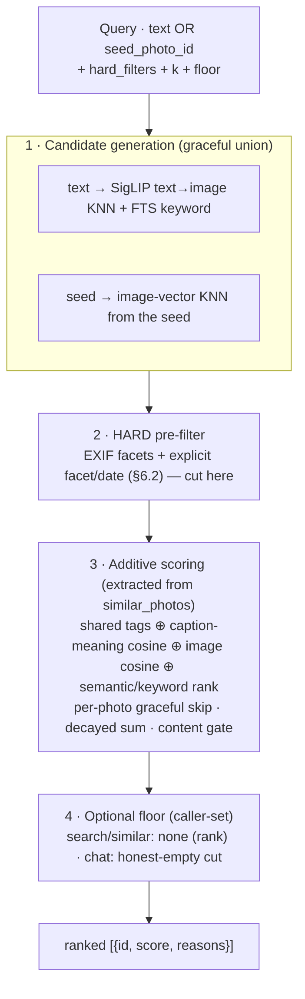
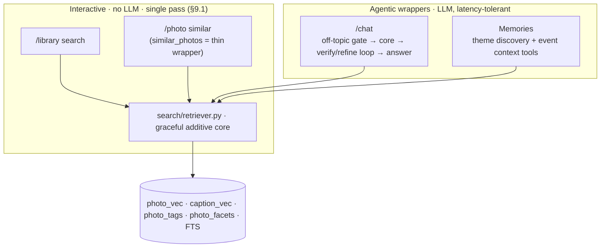

# Plan 12: One graceful retriever core (search · similar · chat · memory)

> **For agentic workers:** REQUIRED SUB-SKILL: use `superpowers:subagent-driven-development`
> (recommended) or `superpowers:executing-plans` to implement this plan
> task-by-task. Steps use checkbox (`- [ ]`) syntax for tracking. Every task is
> test-first (`superpowers:test-driven-development`).

**Goal:** Retrieve photos the **same way everywhere**. Today four features each
roll their own ranking: `similar` scores additively and degrades gracefully (works
before captions), while `chat` filters-then-floors and returns nothing when a
signal is missing; `/library` search is a third path (fusion + facets); memory a
fourth (ad-hoc semantic/tag/facet calls). Collapse them onto **one core** that
ranks like `similar` already does — additive contributions, per-photo graceful
skip — so a missing signal (no caption vector yet, no tag) drops only that
contribution, never the photo. `similar` stays fast; `chat`/`memory` wrap the core
with their agent.

**Architecture:** two layers, one entry point.

- **Retriever core** (`search/retriever.py`) — fast, single-pass, **no LLM**
  (honours §9.1). Input is a `Query` that is *either* a text query *or* a
  photo-seed, plus **hard filters** (EXIF facets + explicit user/planner
  facet/date predicates — exact, §6.2). Output is ranked `[{id, score, reasons}]`.
- **Agentic wrappers** (chat, memory) call the core as a read-only tool and add
  judgement (verify/refine, membership) on top. `/library` search and `/photo`
  similar call the core directly — no agent, no per-click latency.

**Tech Stack:** Python, `uv`, SQLite (+`sqlite-vec`, FTS5), FastAPI/SSE, pytest with
`FakeEmbedder`/`FakeInferenceClient`.

**Spec:** `docs/design.md` §9 (Retrieval) & §9.1 (planner), §10 (chat), §11
(memories), §6.2 (EXIF facets are exact). Task 1 rewrites §9 + adds §9.2 **before**
any code lands.

## Single-pipeline invariant (non-negotiable)

There is **exactly one** retrieval pipeline — `search/retriever.py`. Everything
else is a caller of it.

- `candidates()` and `refine()` are **two stages of that one pipeline**, not two
  pipelines. `retrieve() = refine(candidates())`. The two-phase `similar` UX just
  calls the *same* two stages at two moments (instant paint, then async refine) —
  it introduces **no** parallel code path.
- Search, similar, chat, and memory **all** go through the core. No feature keeps
  its own ranking, fusion, narrow, or floor logic. If a code review finds a second
  place that scores or ranks photos, that is a bug against this plan.
- The only things layered *on top* of the core are non-retrieval concerns: the
  planner (input adapter, text → `Query`), the chat agent loop (verify/refine over
  the core's output), and the memory agent (membership). None of them re-rank.

## The central decision (ADR): hard filters vs soft signals

The one rule the whole core turns on:

- **Hard (they gate):** EXIF facets and **explicit** user/planner *facet* and
  *date* predicates. EXIF is fact (§6.2); a filter on "ISO 3200" or "shot in 2024"
  must be exact, applied before ranking, and a photo that fails it is **out**.
- **Soft (they only score):** every **model-derived** signal — SigLIP tags,
  caption-meaning cosine, image-vector cosine, keyword/semantic rank. Each is an
  additive **contribution**; a missing one is *unavailable*, not *zero*, so it is
  skipped for that photo, never a kill switch.

Rationale: this is exactly why `similar` degrades gracefully and `chat` did not.
Making it the single rule fixes chat structurally and keeps EXIF honesty (§6.2).
Trade-off: planner tag predicates stop being hard filters (they were, and that is
the §10 bug this supersedes) — they become strong soft signals instead.

## The core interface (design-level)

```
Query = {
  text: str | None            # NL query — search, chat, theme discovery
  seed_photo_id: int | None   # a photo — similar, memory "more like this"
  hard_filters: Filters       # EXIF facets + explicit facet/date — EXACT, gate
  k: int
  weights: dict[str, float]   # per-dimension importance (vocab.yaml)
  floor: float | None         # caller-set relevance floor; None = rank, don't cut
}
retrieve(conn, embedder, client, owner_id, query) -> [{id, score, reasons[]}]
```

Exactly one of `text` / `seed_photo_id` is set. `reasons` is the existing
`similar` explanation (`{text, pct}`, top-3, contribution-sorted) so the `/photo`
UI (§13) is unchanged; callers that only want ids ignore it.

The core exposes its two stages separately so callers can paint fast, then refine:

```
candidates(conn, embedder, query) -> [id]              # phase 1 — FAST (KNN / semantic+keyword)
refine(conn, embedder, client, owner_id, query, ids)   # phase 2 — graceful additive scoring
        -> [{id, score, reasons}]                       #           (+ pluggable heavier rerank later)
retrieve(...) = refine(..., candidates(...))            # synchronous convenience (search/memory)
```

## Progressive two-phase for `similar` — instant paint, refine after

`similar` renders **phase 1 immediately** — the image-vector KNN list we have
today, in KNN order, so the strip appears with no perceptible delay. Then a
**second, async request** runs `refine()` over *those* candidate ids (the full
graceful scoring — shared tags ⊕ caption meaning ⊕ image cosine, with reasons) and
the UI **swaps in the reordered, annotated strip**. First paint never waits on the
richer stage, and the richer stage may grow heavier later (a cross-encoder / LLM
reranker — "reg") **without ever touching first-paint latency**, because it is off
the critical path by construction.


- **Refine is bounded to the phase-1 ids** — it never rescans the library, so it is
  cheap today and stays cheap; the only thing that grows is *quality*, not the
  candidate set.
- **Same pattern is available to `/library` search** (fast fused list first,
  refined order swapped in) but is optional there — apply it only if a heavier
  refine lands; the synchronous `retrieve()` is fine until then.
- **Chat/memory** use the synchronous `retrieve()` (they are already behind an
  agent loop, latency-tolerant), so two-phase is a UI concern for the interactive
  strips only.



Note the planner (text → `QuerySpec`, `search/planner.py`) is an **input adapter**,
not part of the core: it runs once to split the query into `hard_filters` (facet +
date) and soft hints (tags → scoring), then hands a `Query` to the core. It stays
outside so the core has no LLM dependency and no per-call latency.

## Layering



## Global Constraints

- **Doc is source of truth.** Task 1 rewrites §9 + adds §9.2 and adjusts §10/§11
  **before** code, per `CLAUDE.md`. The §5/§9/§10/§11 mermaid diagrams are
  canonical (CLAUDE.md) and update in the same tasks.
- **Behaviour parity for `similar`.** Migrating `similar_photos` to a wrapper must
  keep every existing `test_semantic.py` / similar test green — same ids, same
  reasons. The refactor is structural, not a ranking change for `similar`.
- **Search quality must not regress.** For a text query, the semantic + keyword
  fusion rank (today's RRF) is folded in as a **contribution**, not discarded, so
  `/library` results do not get worse. Guard with before/after tests on the dev
  set.
- **Two embedding spaces — do not mix.** SigLIP image/text (1152-d, `photo_vec`,
  `Embedder`) vs caption text (`caption_vec`, `InferenceClient.embed`). The core
  keeps them in separate contributions, exactly as `similar` does today.
- **Interactive stays single-pass.** No agent, no LLM inside the core (§9.1). Only
  chat/memory add an agent, outside the core.
- **`similar` stays incredible-fast — a hard budget, not a hope.** The seed path
  must be **no slower than today** after the refactor:
  - **Dispatch by query kind.** A `seed_photo_id` query runs the image-vector KNN
    path **only** — it must never touch the planner, the SigLIP *text* encoder, or
    FTS keyword (those are text-query machinery). The core branches at the top so a
    seed query pays for zero text/LLM work.
  - **KNN bounds the candidate set first;** scoring runs over that bounded set plus
    the tag/caption co-occurrence sets exactly as `similar_photos` does now — the
    extraction moves the *same* work, adding **zero** new per-candidate DB
    round-trips or model calls. Caption vectors are still read in one batch
    (`all_caption_vectors`), never one query per candidate.
  - **No text-embed on the seed path.** The seed's own caption vector is read from
    the row, not recomputed; no `InferenceClient.embed` call on similar.
  - **Guarded by a benchmark test** (Task 3): a realistic fixture library, assert
    similar returns within a set wall-clock budget **and** issues no more SQL
    queries than the pre-refactor baseline (count them). A regression fails the
    build, it is not left to notice in the UI.
- **Degrade, never crash.** Any sub-signal failure drops that contribution; the
  core never raises for missing data. Chat keeps its outer fusion fallback.

## File Structure

```
search/
  retriever.py     # NEW — Query, candidates() + refine() + retrieve(), dispatch by kind
  semantic.py      # similar_photos → thin wrapper over refine(candidates()); scorer moves out
  scoring.py       # NEW — contribution/decay/content-gate helpers, extracted from
                   #   semantic.py so both seed & text paths share them
chat/
  agent.py         # retrieve()/agent_retrieve() call the core; drop the private
                   #   narrow+rerank duplication (floor becomes a Query param)
albums/
  memories_build.py# theme-discovery + event-context tools call the core
web/
  app.py           # /library search builds a Query (planner → hard/soft) → core;
                   #   NEW GET /photo/{id}/similar/refine → phase-2 strip fragment
  templates/photo.html + static/  # phase-1 strip paints instantly, HTMX swaps in refine
```

## Task 1: Rewrite the design (doc-first)

- [ ] **Step 1 — Rewrite §9.** Describe retrieval as the single core: candidate
  generation → hard pre-filter → additive graceful scoring → optional floor.
  Fold the four §9 mechanisms (semantic, tag facets, EXIF facets, keyword) into
  "candidate generation + contributions", and state the hard/soft rule as the
  governing principle. Replace the §9 search diagram with the core flow (mermaid).
- [ ] **Step 2 — Add §9.2 "The retriever core".** The `Query` interface, the
  `candidates()`/`refine()`/`retrieve()` two-stage split, the two-phase similar UX
  (instant KNN paint → async refine swap), the layering diagram, and the "planner is
  an input adapter" note.
- [ ] **Step 3 — Adjust §10.** Chat = off-topic gate → core → verify/refine loop →
  answer. The floor is a `Query` param (honest-empty), not a hardcoded gate; narrow
  is gone (its facet/date part is now `hard_filters`, its tag part a soft signal).
  Update the §10 diagram.
- [ ] **Step 4 — Adjust §11.** Memory's theme-discovery and event-context tools
  call the core; the agent still decides membership. Update the §11 diagram.
- [ ] **Step 5 — §18.** Replace the "one graceful retriever core" future-work bullet
  with a "done (plan 12)" pointer once implemented; keep memory-multi-turn etc.
- [ ] **Step 6 — Commit** (doc-only).

## Task 2: The retriever core (`search/retriever.py`) — text + seed

- [ ] **Step 1 — Failing tests.** (a) text query returns candidates ranked by the
  additive score with reasons; (b) a photo whose `caption_vec` is missing is
  ranked (image/keyword contribution) not dropped; (c) a hard EXIF facet filter
  removes non-matching photos before scoring; (d) a soft planner tag on an untagged
  library does **not** empty the result; (e) `floor` cuts only when set.
- [ ] **Step 2 — Verify they fail.**
- [ ] **Step 3 — Extract the scorer.** Move the contribution / decay / content-gate
  logic out of `similar_photos` into `scoring.py`, parameterised by the source
  signals (tags, caption vec, image vec) so it serves *both* a seed photo and a
  text query. Implement the two stages — `candidates()` (fast) and `refine()`
  (scoring) — and `retrieve()` = `refine(candidates())`. `candidates()` for a seed
  query is image-KNN only.
- [ ] **Step 4 — Verify pass.** Commit.

## Task 3: Migrate `similar_photos` onto the core + two-phase UI

- [ ] **Step 1 — Tests:** existing similar tests are the spec — they must stay green
  unchanged (same ids + reasons). Add one asserting `similar_photos` now delegates
  to `refine(candidates(seed_photo_id=…))`.
- [ ] **Step 2 — Perf guard (write first, must pass before and after).** A benchmark
  test over a realistic fixture: assert phase-1 `candidates()` returns within a
  tight wall-clock budget; assert full `similar_photos` issues **no more SQL
  queries** than the pre-refactor baseline (count via a connection trace); assert a
  `seed_photo_id` query makes **zero** calls to the planner, the text encoder, and
  `InferenceClient.embed`.
- [ ] **Step 3 — Verify current green, then refactor** `similar_photos` to a thin
  wrapper over `refine(candidates())` (seed-path dispatch, no text machinery).
- [ ] **Step 4 — Two-phase UI.** `/photo` renders the phase-1 KNN strip immediately
  (ids only, KNN order). Add a small `GET /photo/{id}/similar/refine` that returns
  the refined, reason-annotated strip fragment; the template requests it (HTMX) and
  swaps it in. Test: the page paints a strip with no refine call; the refine
  fragment returns the scored order + reasons. Keep §13 close/nav behaviour intact.
- [ ] **Step 5 — Full similar suite + perf guard + web-photo tests green.** Commit.

## Task 4: Migrate `/library` search onto the core

- [ ] **Step 1 — Tests:** a sidebar EXIF facet still filters exactly; a text search
  still ranks the matching photo first; parity vs the old fusion order on a small
  fixture (fold semantic+keyword rank as a contribution so it does not regress).
- [ ] **Step 2 — Verify fail, implement** `web/app.py` search path to build a
  `Query` (planner splits hard filters vs soft hints) and call the core.
- [ ] **Step 3 — Green, full web suite.** Commit.

## Task 5: Migrate chat onto the core

- [ ] **Step 1 — Tests:** chat returns the keyword/semantic match with zero caption
  vectors (already fixed — now via the core); the off-topic gate and the
  verify/refine loop are unchanged; the honest-empty floor still yields no sources
  when fusion truly finds nothing.
- [ ] **Step 2 — Verify fail, implement.** `chat/agent.py::retrieve` calls the core
  with `floor=RERANK_FLOOR`; delete the private `_narrow` + the parallel rerank
  call (now the core's job). `agent_retrieve` + `is_photo_question` unchanged.
- [ ] **Step 3 — Green, web chat suite.** Commit.

## Task 6: Migrate memory tools onto the core

- [ ] **Step 1 — Tests:** theme discovery retrieves candidates via the core (text
  query); event context "more like this" via the core (seed). The agent still
  decides membership; composition output is unchanged on a fixture.
- [ ] **Step 2 — Verify fail, implement** the `albums/memories_build.py` tool calls
  to route through the core. **Step 3 — Green, memory build suite.** Commit.

## Task 7: Remove duplication + verify whole

- [ ] **Step 1 — Delete** the now-dead paths: `chat/retrieve.py` fusion duplicate if
  fully subsumed (keep only if still the documented outer fallback), any leftover
  standalone rerank floor logic folded into the core.
- [ ] **Step 2 — Full suite green**, and a manual check on the live library
  (`$IVMS777_HOME`): search, similar, chat, memories all return sensible
  results with `caption_vec` partially filled.
- [ ] **Step 3 — §18 "done (plan 12)".** Commit.

## Non-goals

- No new ranking *quality* work — this is a structural unification. Similar's
  ranking is the reference; search must not regress; chat inherits graceful
  degradation. Floor/weight tuning stays where it is (§17, plan 10 bake-off).
- No multi-turn chat memory, no learned reranker (still §18 future work).
- No schema change — `photo_vec`/`caption_vec`/`photo_tags`/`photo_facets`/FTS as-is.
- The planner stays a single structured call (§9.1); it is not folded into the core.

## Self-Review

- **One pipeline?** Search, similar, chat, memory all call `search/retriever.py`;
  no second place ranks/scores/fuses/narrows/floors photos. `candidates`+`refine`
  are stages of the one core, not a parallel path.
- Hard/soft split holds at every consumer? EXIF/date exact; model signals soft.
- `similar` output byte-identical after the wrapper refactor?
- `/library` search order not worse than fusion on the fixture?
- Chat still: gate → core → verify loop → grounded streamed answer; honest-empty
  only when fusion is truly empty?
- Core has zero LLM calls and no per-item agent (interactive latency, §9.1)?
- `similar` seed path runs image-KNN only — no planner, no text encoder, no
  `embed`, no extra SQL vs baseline — and passes the perf-budget benchmark?
- `similar` paints phase-1 (KNN) with **no** refine call, and the refine swap is a
  separate async request — so first paint is instant and a future heavier rerank
  can never regress it?
- Every §5/§9/§10/§11 mermaid diagram matches the new reality (CLAUDE.md)?
